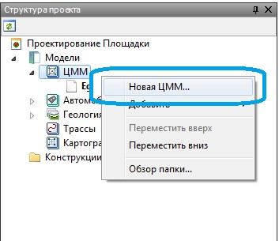
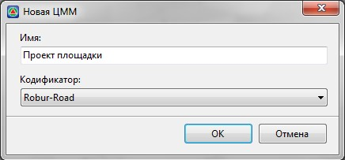
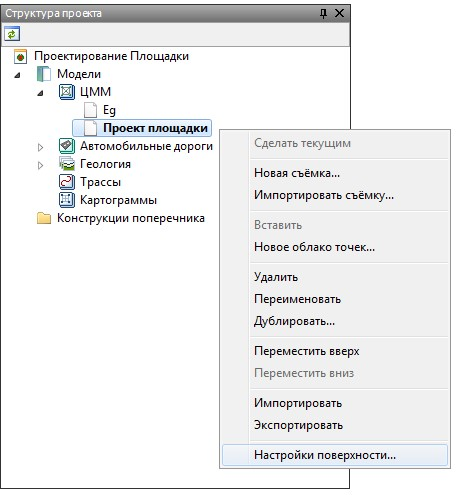
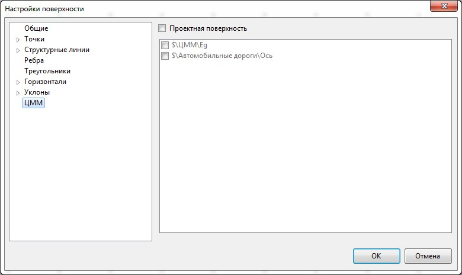

# Основные настройки

До начала проектирования горизонтальной или вертикальной планировки площадки рекомендуется сразу создать новую модель **ЦММ** и назначить необходимые настройки. Для создания модели площадки:

1. В окне структура проекта щелкните правой кнопкой мыши по группе моделей типа **ЦММ** и выберите из появившегося контекстного меню пункт Новая **ЦММ**:

   

2. В появившемся окне задайте наименование создаваемой модели площадки и нажмите **ОК**.

   

Созданная модель автоматически стала текущей, а ее наименование отобразилось в структуре проекта.

Для задания созданной модели необходимых настроек:

В окне **Структура проекта** щелкните правой кнопкой мыши по ее наименованию и выберите из появившегося меню пункт **Настройки поверхности**.

Откроется окно настроек текущей поверхности:

На вкладках данного окна задаются основные настройки отображения элементов текущей поверхности (стиль отображения точек, шаг горизонталей, тип освещения поверхности и т.п.).



 Большинство данных настроек подробно были описаны ранее.(см. [Работа с ЦММ, Создание и редактирование поверхности](../../../rb_survey/dtm/sfc/edit/setting_display_elements_surface.md)).



На вкладке **ЦММ** установите опцию **Проектная поверхность**, после этого станет доступен список поверхностей, которые содержит текущий проект.

Отметьте в списке ту поверхность, которая будет считаться “черной землей” для проектируемой площадки и нажмите **ОК**.



1. Назначение черной поверхности земли необходимо для многих функций моделирования площадки. К примеру, она используется для построения откосов с границы площадки, определения ее оптимальной отметки исходя из баланса объемов земляных масс и т.п.
2. Черных поверхностей может быть выбрано несколько. К примеру, при примыкании площадки к проектируемой дороге, для более точного подсчета объемов работ, проектная поверхность дороги также может быть назначена в виде черной земли для моделируемой площадки.


