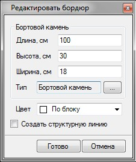
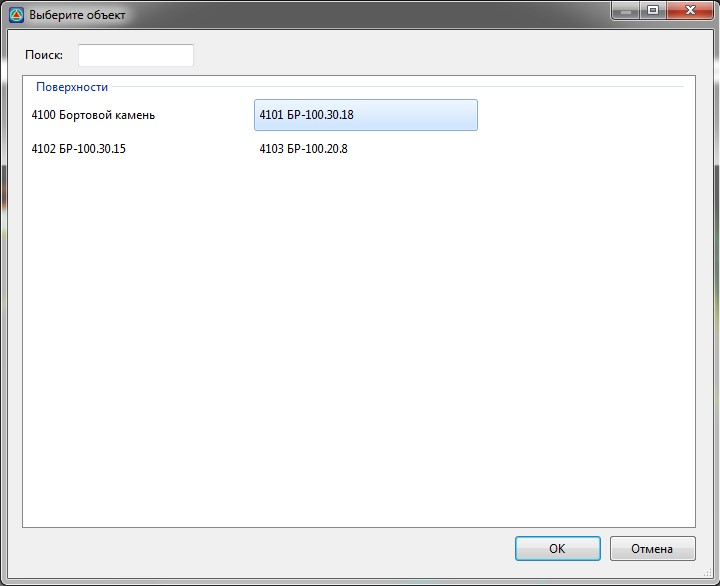

# Создание бордюров

Бордюр, аналогично выше описанным элементам, создается на основе исходного линейного объекта (полилиния, структурная линия и т.п.). Для создания бордюрного камня:

1. Выберите элемент меню **Задачи - Площадки - Площадки (Архив) - Добавить бордюр**.

2. Курсор принял форму прицела, левой кнопкой мыши укажите на плане контур, на основе которого будет создан элемент. Данный контур будет соответствовать положению низа бордюрного камня. Далее визуально левой кнопкой мыши укажите сторону относительно исходной линии, где будет расположен бордюрный камень.

3. В строке динамического ввода задайте величину оголения бордюра. В результате откроется следующее окно:

   

   В данном диалоговом окне задаются следующие параметры:

   * **Длина/Высота/Ширина**, см - в этих полях задаются размеры бортового камня. Эти поля могут быть заполнены автоматически при выборе марки бордюра из объектной библиотеки.
   * **Тип** - при выборе марки бордюрного камня из объектной библиотеки она будет отображена в данном поле. Для выбора марки бордюра:

   Нажмите кнопку  , откроется окно библиотеки объектов:

   

   В данном окне выберите требуемую марку бордюрного камня и нажмите **ОК**.

   В результате марка бордюра отобразится в поле **Тип**, а размеры бортового камня будут заданы согласно его марки, при этом данные поля станут не доступны для редактирования. Если же требуется задать самостоятельно размеры камня, в поле **Тип** необходимо выбрать марку с наименованием **Индивидуальный** (Объект «4100 Бортовой камень»). В этом случае поля с размерами снова станут доступны для редактирования.

   

   Марка бордюра и его размеры в дальнейшем будут использоваться для подсчета объемов работ.

   

   * **Цвет** - в данном поле задается цвет отображения создаваемого элемента на плане.
   * **Создать структурную линию** – при установлении данной опции по границе создаваемого участка будет автоматически создаваться дополнительная структурная линия. В последствии, она может служить базовой линией, для добавления нового участка (газон, тротуар и т.п.), рядом с уже предварительно созданным элементом.

4. Задайте необходимые параметры бортового камня и нажмите **Готово**.

В результате вдоль исходного контура будет создан данный элемент.
