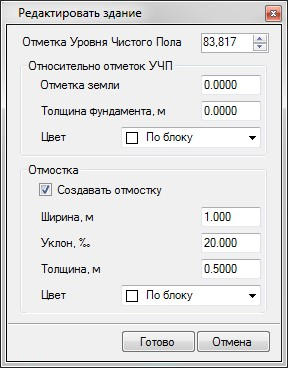
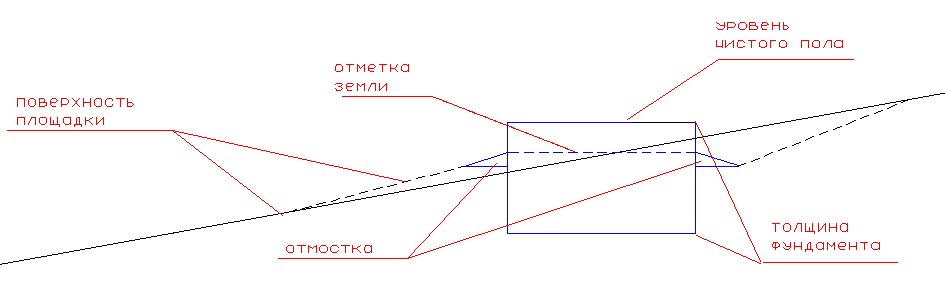
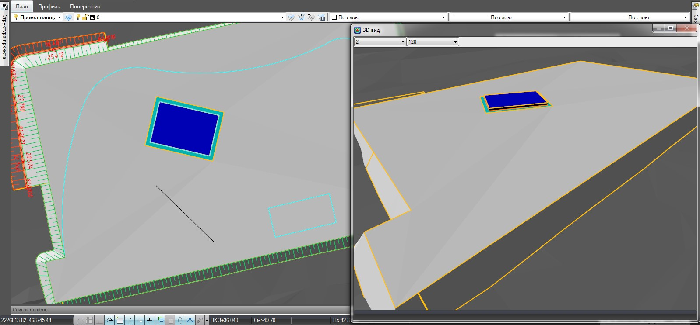

# Создание зданий

Данный функционал позволяет вставлять на проектируемую поверхность элементы зданий.

Для создания здания:

1. Здание создается на основе ситуационного контура. Если данный контур отсутствует, отрисуйте его предварительно на плане площадки.

2. Выберите элемент меню **Задачи - Площадки - Площадки (Архив) - Добавить здание**.

3. Курсор принял форму прицела, укажите левой кнопкой мыши исходный контур на плане. Откроется следующее окно:

   

   В данном окне задаются следующие параметры здания (они схематично представлены ниже):

   * **Отметка уровня чистого пола** - базовая отметка, относительно которой будут задаваться остальные элементы здания.
   * **Отметка земли** - расстояние до начала отмостки здания относительно уровня чистого пола.
   * **Толщина фундамента** - также задается относительно уровня чистого пола. Этот параметр используется для подсчета объемов работ под устройство площадки. В данном случае при задании этого параметра объемы насыпи и выемки будут считаться с учетом устройства конструкции фундамента здания.
   * **Создать отмостку** - если данная опция установлена, то станут активными ряд дополнительных полей, где можно задать параметры отмостки здания:
   * **Ширина,м** - значение ширины отмостки здания.
   * **Уклон, ‰** - значение уклона отмостки здания, в промилле.
   * **Толщина** - в данном поле может задаваться общая толщина конструкции отмостки Данный параметр используется для более точного определения объемов земляных работ под устройство площадки.

   При изменении отметки уровня чистого пола, отметки остальных элементов здания будут также пересчитываться. Данную отметку можно определять подбором с помощью соответствующих кнопок вверх и вниз, визуально контролируя посадку здания на поверхность с помощью окна **3d –вид**:

   

   

   Способы навигации в окне 3d-вид и настройки его отображения были описаны ранее (См. [Запуск и настройка Топоматик Robur, Запуск программы](../../../install_startup/startup/startup_program/working_with_window.md)).

   

4.Задайте необходимые параметры здания и нажмите **Готово**.

В результате, элементы здания будут добавлены в поверхность проектируемой площадки.
