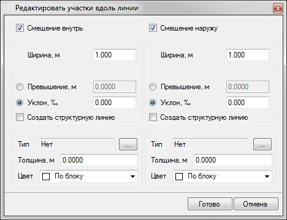
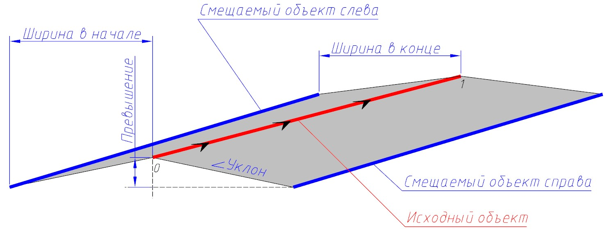

# Создание участков вдоль линии

Данная функция позволяет создавать на поверхности участки с заданными ширинами и уклонами/превышениями относительно заданной линии или контура. Это позволяет легко моделировать такие элементы как обочины, дорожки, тротуары, бордюры и т.п.

Для создания участка:

1. Выберите элемент меню **Задачи - Площадки - Площадки (Архив) - Добавить участки вдоль линии**.

2. Курсор принял форму прицела, левой кнопкой мыши укажите в окне **План** линейный объект (полилиния, структурная линия и т.п.), относительно которого будет создаваться участок. Откроется следующее окно:

   

   **Смещение влево/вправо** - установите в соответствующих полях опцию, указывающую с какой стороны относительно направления линейного объекта необходимо создавать участок. Участок может создаваться как с одной, так и с обеих сторон. Если исходный линейный объект является замкнутым, то данные поля будут называться Смещение внутрь и **Смещение наружу**.

   **Ширина, м** - в данном поле задается значение ширины создаваемого участка.

   **Ширина в конце, м** – если данная опция установлена, то станет активно дополнительное поле, где можно задать ширину в конце создаваемого участка. Это позволяет моделировать участки переходной ширины (отгоны).

   

   Данная опция будет доступна в случае выбора исходного объекта не замкнутого контура.

   

   **Уклон/Превышение** - в данных полях может быть задано соответствующие значение уклона или превышение границы создаваемого участка относительно его исходной (базовой) линии.

   Все параметры наглядно показаны на схеме:

   

   **Создать структурную линию** – при установлении данной опции по границе создаваемого участка будет автоматически создаваться дополнительная структурная линия. В последствии, она может служить базовой линией, для добавления нового участка, рядом с уже предварительно созданным элементом.

   **Тип** - при необходимости, создаваемому участку можно назначить дополнительную семантическую информацию из объектной библиотеки. К примеру - тип покрытия. Данная информация впоследствии, будет использована при визуализации проекта, а также формировании ведомости площадей покрытий.

   **Толщина** - задается значение суммарной толщины конструктивных слоев участка. Данный параметр впоследствии может использоваться для вычисления объемов земляных работ с поправкой на толщину этой конструкции.

   **Цвет** - для создаваемого участка может быть выбран соответствующий цвет отображения на плане.

3. Для применения назначенных параметров нажмите **Готово**.

В результате, в поверхность будет добавлен новый участок, созданный относительно заданной линии.



 Если после создания участка необходимо снова вернуться в режим редактирования его параметров, используйте для этого функцию **Задачи - Площадки - Площадки (Архив) - Редактировать объект**. Данная функция будет описана [далее](edit_elements.md).


