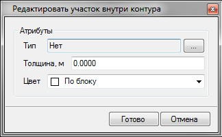

# Создание участков внутри контура

Данная функция позволяет создавать участки внутри выбранных замкнутых контуров. К примеру, это позволяет быстро создавать на исходной поверхности площадки новые элементы (газоны, тротуары и т.п.).

Для создания участка внутри контура:

1. Выберите элемент меню **Задачи - Площадки - Площадки (Архив) - Добавить участок внутри контура**.
2. Курсор принял форму прицела, левой кнопкой мыши укажите в окне План замкнутый линейный объект (полилиния, структурная линия и т.п.), внутри которого будет создаваться участок. Откроется следующее окно:

   

   * **Тип** - при необходимости, создаваемому участку можно назначить дополнительную семантическую информацию из объектной библиотеки. К примеру - тип покрытия. Данная информация впоследствии, будет использована при визуализации проекта, а также формировании ведомости площадей покрытий.
   * **Толщина** - задается значение суммарной толщины конструктивных слоев участка. Данный параметр впоследствии может использоваться для вычисления объемов земляных работ с поправкой на толщину этой конструкции.
   * **Цвет** - для создаваемого участка может быть выбран соответствующий цвет отображения на плане.

3. Для применения назначенных параметров нажмите **Готово**.

В результате, в поверхность будет добавлен новый участок, созданный внутри указанного линейного объекта.
