# Создание откосов

Данный блок функций позволяет строить откосы от заданного контура (преимущественно им является граница проектируемой площадки) до поверхности существующего рельефа. Откосы могут включать в себя водоотводные канавы.

Для создания откоса:

1. Выберите элемент меню **Задачи - Площадки - Площадки (Архив) - Добавить откос**.

2. Курсор принял форму прицела, левой кнопкой мыши укажите в окне План линейный объект (полилиния, структурная линия и т.п.), вдоль которого будет создаваться откос.

3. Курсор снова примет форму прицела и будет перемещаться с привязкой к контуру, от которого будет строиться откос. Левой кнопкой мыши последовательно укажите на исходном контуре начальную и конечную точку откоса, также для правильного определения положения участка необходимо указать произвольную промежуточную точку внутри откоса. Откроется следующие окно:

   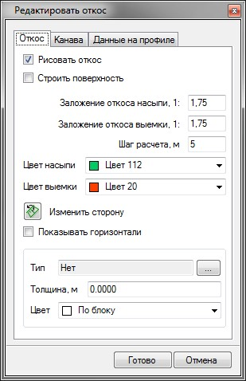

   

   Автоматически может быть выбран весь линейный объект вдоль которого требуется запроектировать откос, для этого нажмите правой кнопкой мыши, в контекстном меню выберите\*\* Вдоль всей линии\*\*.

   

   Данное окно содержит несколько вкладок. На вкладке Откос задаются общие параметры построения откоса. На вкладках **Канава** и **Данные на профиле** расположены функции создания водоотводной канавы, редактирования ее продольного профиля и настройки отображения отметок и уклонов по нему.

   Рассмотрим основные настройки вкладки **Откос**:

   * **Рисовать откос** - если данная опция установлена, то все элементы откосов и канав будут автоматически отрисовываться на плане примитивами чертежа, как на этапе задания его параметров, так и при выходе из данного режима.
   * **Строить поверхность** – если данная опция установлена, то по откосу автоматически будет строиться участок поверхности, как на этапе задания его параметров, так и при выходе из данного режима.
   * **Заложение откоса насыпи/выемки** - данные параметры задаются в соответствующих полях текущего окна.
   * **Шаг расчета** - откос строится вдоль выбранного контура линии с заданным шагом. Для более точного построения линии пересечения откоса с существующим рельефом шаг расчета необходимо уменьшить.

     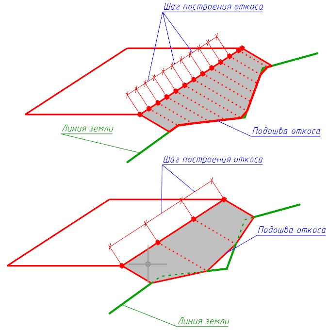

   * **Цвет насыпи/выемки** - для наглядности линиям откосов насыпи и выемки (или кювета) можно задать соответствующий цвет отображения на плане.
   * **Изменить сторону** - данный режим позволяет изменить сторону построения откоса относительно исходного контура. Для изменения стороны откоса нажмите кнопку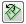
  * **Показывать горизонтали** - в зависимости от включении\выключении данной опции горизонтали на создаваемом участке поверхности (откос) будут показаны или скрыты.
   * **Тип** - при необходимости, создаваемому участку откоса можно назначить дополнительную семантическую информацию из объектной библиотеки. К примеру - тип поверхности. Данная информация впоследствии, будет использована при визуализации проекта, а также формировании ведомости площадей покрытий.
   * **Толщина** - при наличии укрепления откоса задается его суммарная толщина. Данный параметр впоследствии может использоваться для вычисления объемов земляных работ с поправкой на толщину укрепления.
   * **Цвет** - для создаваемого участка откоса может быть выбран соответствующий цвет отображения на плане.

   

   Все параметры задаваемые в данном диалоговом окне приводят к автоматическому изменению положения откосов и кюветов. Закрытие данного окна приводит к выходу из режима редактирования откосов. Если после создания откоса необходимо снова вернуться в данный режим редактирования, используйте для этого функцию **Генплан - Редактировать объект**. Данная функция будет описана [далее](edit_elements.md).

   

   Рассмотрим основные функции вкладки **Канава**:

   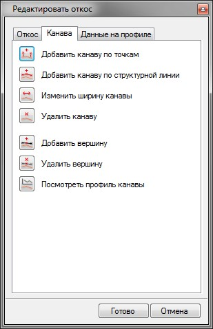

   **Добавить канаву по точкам** - нажмите кнопку 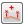 для создания участка канавы. Далее последовательно выполните следующие действия:

   * Левой кнопкой мыши последовательно укажите на исходном контуре начальную и конечную точку канавы, также для корректного построения необходимо указать произвольную промежуточную точку внутри создаваемого участка канавы.

   

   Границы канавы всегда должны находиться в пределах участка откосов. Если в процессе указания границы канавы она была задана не корректно, то программа выдаст предупреждения:

   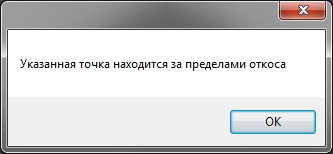

   После закрытия данного окна границы канавы необходимо задать еще раз.

   

   * Далее в строке динамического ввода задайте глубину канавы. Для подтверждения действия нажмите правой кнопкой мыши.

   В результате участок канавы будет отображен на плане:

   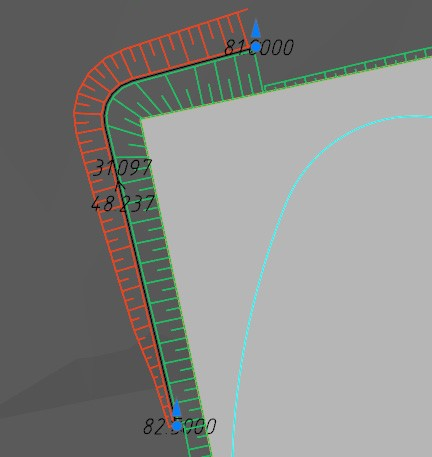

   

   Границы участков откосов и канав отображаются на плане в виде синих круглых грипов. Таким образом, находясь в данном режиме, положение границ можно изменять визуально, удерживая соответствующий грип левой кнопкой мыши.

   

   **Добавить канаву по структурной линии** - данная функция позволяет создать канаву, отметки дна которой будут соответствовать заданной структурной линии. Для этого нажмите кнопку 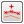 , затем левой кнопкой мыши укажите на плане структурную линию, профиль которой будет соответствовать продольному профилю канавы.

   **Изменить ширину канавы** - по умолчанию дно канавы задается шириной 0.5 м. Для изменения данного значения нажмите кнопку 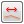 и задайте требуемую ширину в строке динамического ввода.

   **Удалить канаву** - для удаления канавы нажмите кнопку 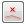 , после чего укажите ее левой кнопкой мыши на плане.

   **Добавить вершину/Удалить вершину** - данные функции позволяют редактировать профиль дна канавы на плане путем добавления или удаления заданных точек.

   Для добавления дополнительной точки по дну канавы:

   * Нажмите кнопку **Добавить вершину** 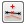 . Курсор примет форму прицела и будет перемещаться с привязкой к дну канавы.
   * Левой кнопкой мыши укажите положение добавляемой отметки. В дальнейшем положение данных вершин можно менять на плане визуально.

   Для изменения отметки точки канавы нажмите левой кнопкой мыши по синему маркеру в виде стрелки. В появившейся строке динамического ввода задайте требуемую отметку:

   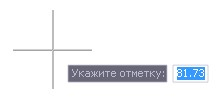

   Для удаления точки дна канавы нажмите кнопку 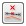 и укажите ее левой кнопкой мыши.

   При добавлении, удалении или изменении отметки точки канавы откосы перестроятся динамически.

   **Посмотреть профиль канавы** - для просмотра профиля канавы в отдельном окне нажмите кнопку 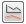 . Откроется следующее окно:

   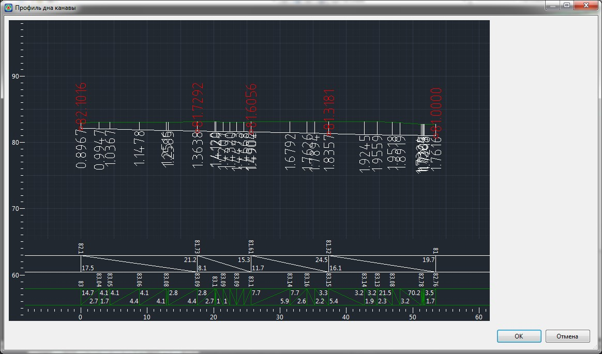

   В данном окне отображен профиль по дну канавы и профиль по линии черной земли (зеленым цветом). В нижней части окна указаны отметки, уклоны и расстояния по этим профилям. Данное окно является информационным. При необходимости редактирования продольного профиля водоотводной канавы закройте его и воспользуйтесь функционалом, который был описан выше.

   Рассмотрим основные настройки вкладки **Данные на профиле**:

   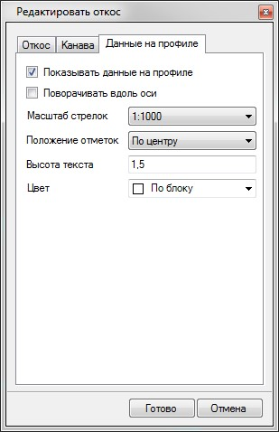

   * **Показывать данные на профиле** - если данная опция включена, то по дну канавы будут подписываться отметки в характерных точках , продольные уклоны и расстояния между ними.
   * **Поворачивать вдоль оси** – если данная опция включена, то подписи отметок точек и уклоноуказателей будут ориентироваться по линии дна канавы, в противном случае- горизонтально.
   * **Высота текста** - в данном поле задается размер шрифта для подписи отметок точек и уклоноуказателей.
   * **Положение отметок** - из данного выпадающего списка можно настроить необходимое расположение подписей отметок относительно их точек.

4. Для применения назначенных параметров откосов и кюветов нажмите **Готово**.
