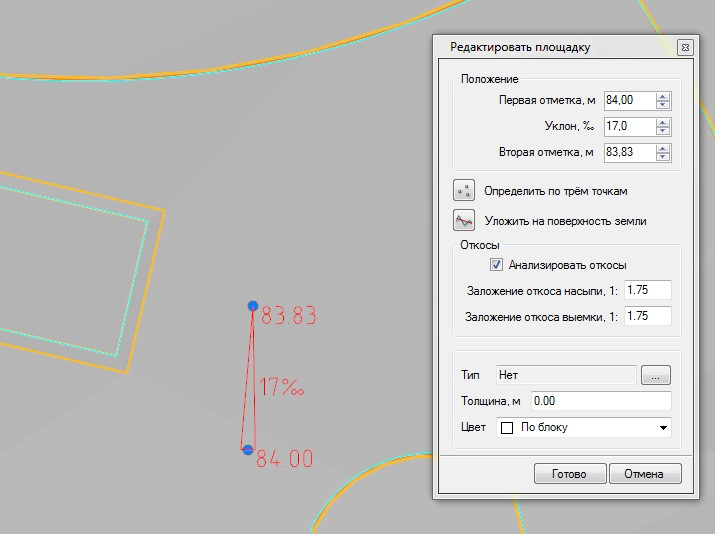
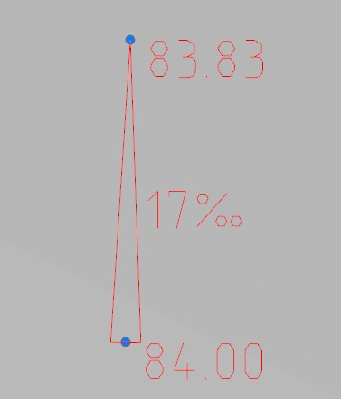
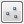
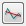

# Определение высотного положения площадки

В первом приближении высотное положение проектируемой площадки можно определить визуально. Предусмотрена специализированная функция, которая позволяет на основе исходного контура создать поверхность и подобрать для нее требуемую отметку и уклон.

Для этого:

1. Выберите элемент меню **Задачи - Площадки - Площадки (Архив) - Определить площадку**;
2. Курсор примет форму прицела, левой кнопкой мыши укажите на плане исходный замкнутый контур, являющийся границей проектируемой площадки. Откроется диалоговое окно:

   

   В данном диалоговом окне задаются следующие параметры площадки:

   **Первая отметка, Вторая отметка** - высотное значение двух точек определяющих ориентацию плоскости площадки:

   

   На плане эти точки отображены в виде грипов синего цвета. Направление уклона всегда показано от первой точки ко второй, значение уклона может быть положительным, либо отрицательным. Положение данных базовых точек на плане может быть произвольным. Т.е. они могут располагаться как в пределах площадки, так и вне ее. Если заданы отметки обоих базовых точек, то уклон между ними вычисляется автоматически. При задании уклона в соответствующем поле диалогового окна будет автоматически пересчитана отметка второй базовой точки.

   **Уклон** - в данном поле задается уклон между первой и второй базовой точкой плоскости площадки. Отметка первой точки остается неизменной, а вторая отметка будет пересчитана.

   **Определить по трем точкам** - положение плоскости площадки однозначно может быть определено по трем заданным точкам поверхности. Эти точки также могут располагаться за пределами площадки и принадлежать различным моделям, например поверхности рельефа и проектной поверхности дороги. Для выполнения данной функции нажмите кнопку  и последовательно укажите три исходных точки на плане.

   **Уложить на поверхность земли** - данная функция позволяет автоматически сориентировать плоскость площадки по рельефу таким образом, чтобы отклонение их отметок было минимальным.

   Для выполнения данной функции нажмите кнопку  расположенную в соответствующем поле.

   **Анализировать откосы** - если данная опция установлена, то с границ площадки будут строиться откосы, до пересечения с поверхностью черной земли. Это помогает более наглядно оценить положение площадки относительно рельефа местности (размер насыпей и выемок), а также выполнять проектирование в стесненных условиях. Заложение откоса насыпи и выемки задается в соответствующих полях диалогового окна. При изменении отметки или уклона поверхности площадки откосы перерисовываются динамически.

   **Тип** - при необходимости, создаваемой площадке можно назначить дополнительную семантическую информацию из объектной библиотеки. К примеру - тип покрытия. Данная информация впоследствии, будет использована при визуализации проекта, а также формировании ведомости площадей покрытий.

   **Толщина** - задается значение суммарной толщины конструктивных слоев площадки. Данный параметр впоследствии может использоваться для вычисления объемов земляных работ с поправкой на толщину конструкции дорожной одежды.

   **Цвет** - для создаваемого участка площадки может быть выбран соответствующий цвет отображения на плане

   

   1. Все параметры задаваемые в данном диалоговом окне приводят к автоматическому изменению положения площадки и ее откосов. Закрытие данного окна приводит к выходу из режима редактирования площадки.
   2. Откосы отображаются для наглядности только на время использования данной функции. Для создания откосов предусмотрена соответствующая функция, которая будет описана [далее](creating_slopes.md).
   3. Для подтверждения всех заданных параметров нажмите кнопку **Готово**.

   

В результате на основе исходного контура будет создана поверхность площадки, сориентированная по заданным отметкам или уклону.



 Если после создания поверхности площадки необходимо снова вернуться в данный режим редактирования ее положения, используйте для этого функцию **Генплан - Редактировать объект**. Данная функция будет описана [далее](edit_elements.md).


