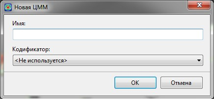
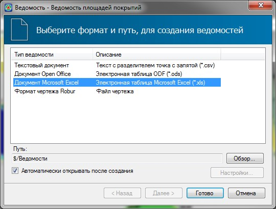
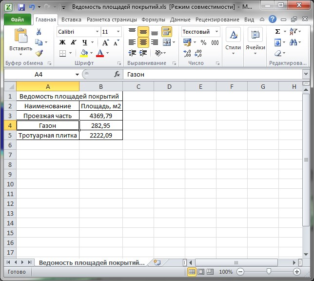

# Определение объемов основных работ

Объемы земляных работ рассчитываются между двумя заданными поверхностями. Как правило, это поверхность проектной площадки (с учетом толщин конструкций ее элементов) и поверхность существующего рельефа. Также можно сформировать ведомость площадей типов основных покрытий и длин элементов. Рассмотрим далее каждый способ более подробно.

### Расчет объемов между поверхностями

Объемы работ между двумя поверхностями могут быть подсчитаны различными методами. В случае проектирования площадного объекта наиболее удобно использовать построение картограмм по сетке квадратов.



 Последовательность действий по созданию площадных картограмм описана далее (См. [Общие задачи, раздел Создание площадных картограмм](../../../commons_tasks/cartogram/create_cartogram.md)).



Если при подсчете земляных работ необходимо сделать поправку на толщину конструкций площадки (толщина дорожной одежды на проездах, тротуарах, глубина фундаментов зданий и т.п.), то перед созданием картограммы необходимо сформировать данную поверхность. Для этого:

1. Выберите элемент меню **Задачи - Генплан - Создать поверхность по низу конструкций**.
2. Курсор принял форму прицела, левой кнопкой мыши укажите контур структурной линии, внутри которого будет создана поверхность, опущенная на глубину заданную в свойствах соответствующих участков. Откроется следующие диалоговое окно:

   

3. Задайте наименование создаваемой поверхности и нажмите **Ок**.

В результате, на основе поверхности по верху площадки и толщин всех ее элементов , будет создана новая “выдавленная” поверхность, построенная по низу конструкции всех ее элементов.

Далее полученную поверхность вы можете использовать в качестве проектной, при подсчете объемов земляных работ.



 В случае изменения высотных отметок по верхней (проектной) поверхности площадки, нижнюю поверхность (используемую для подсчета объемов земляных работ) необходимо перестроить заново.



### Определение площадей и длин элементов

Для формирования ведомости площадей покрытий и длин основных элементов:

1. Выберите элемент меню **Задачи - Генплан - Ведомости - Ведомости площадей и длин элементов**.
2. Откроется стандартный мастер создания ведомостей:

   

   Выберите формат формируемой ведомости и нажмите **Готово**.

В результате ведомость будет сформирована и открыта в соответствующем редакторе.

