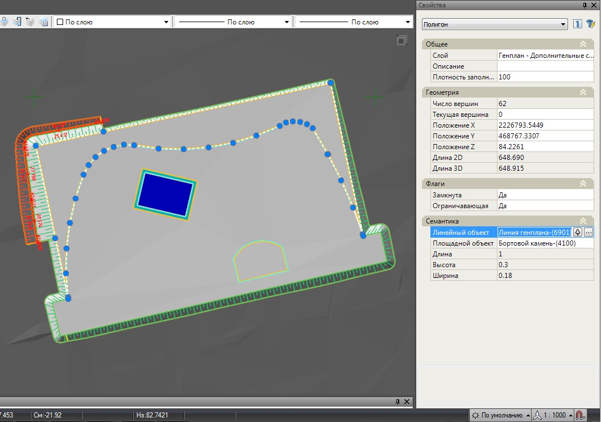
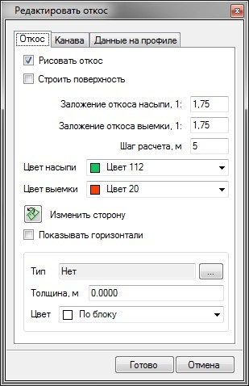

# Редактирование элементов

При создании вышеописанных элементов (площадка, откос, здание, бордюр и т.п.) вся информация о их параметрах сохраняется в определенных структурных линиях, которые добавляются в проектируемую поверхность вместе с самим элементом. Эти структурные линии по умолчанию находятся в слое **Площадки (Архив) - Структурные линии**. Информацию по данным системным контурам также можно получить в окне свойств выбранного объекта. В поле **Линейный объект** дана информация о принадлежности структурной линии характерному участку поверхности:

В определенных случаях, в поле **Линейный объект** будет задан объектный код - **Объект генплана** (системный). В любом случае менять данные объектные коды не следует, т.к. в данном случае будет утеряна информация о характеристиках элемента, и его нельзя будет использовать для дальнейшего редактирования.

Параметры отображения элемента на плане (цвет, скрытие горизонталей и т.п.) можно менять непосредственно через окно свойств выбранного объекта.

Для изменения базовых характеристик объекта и его последующего перестроения:

1. Выберите Элемент меню **Задачи - Площадки - Площадки (Архив) - Редактировать объект**;
2. Курсор принял форму прицела, левой кнопкой мыши укажите участок объекта, который необходимо отредактировать. Либо, можно выделить саму структурную линю, которая является базовой для редактируемого элемента и хранит его характеристики. В результате откроется соответствующие окно свойств выбранного объекта. Ниже, в качестве примера, показано окно **Редактировать откос**:

   

3. Далее, в открывшемся окне измените, необходимые параметры элемента и нажмите **Готово**.

В результате, на проектной поверхности будет обновлен редактируемый элемент с учетом его измененных характеристик.
