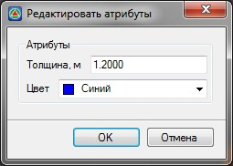

# Редактирование атрибутов элементов

При использовании функции **Редактировать объект** его геометрия перестраивается заново. Таким образом, не рекомендуется использование этой функции, если элемент после создания редактировался с помощью стандартного набора инструментов по работе с поверхностью, т.к. в данном случае все результаты редактирования будут удалены.

Если необходимо изменить характеристики элемента не влияющие на его геометрию (тип или толщина):

1. Выберите элемент меню **Задачи - Площадки - Площадки (Архив) - Редактировать атрибуты**.
2. Курсор принял форму прицела, левой кнопкой мыши укажите участок, который необходимо отредактировать. Откроется следующее окно:

   

3. Измените необходимые атрибуты объекта и нажмите **ОК**.
