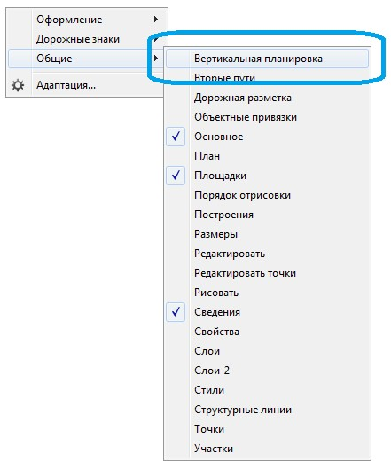
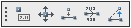
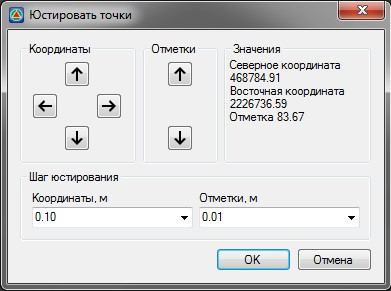
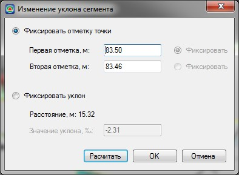

# Редактирование элементов с помощью стандартного набора инструментов

Выше был рассмотрен набор функций позволяющих быстро создавать определенные элементы проектируемой площадки. В дальнейшем, при необходимости, все они могут быть отредактированы с помощью стандартного набора средств по работе с поверхностью. Основные команды, используемые для редактирования вертикальной планировки площадки, вынесены на соответствующую панель. Откройте панель **Вертикальная планировка** и расположите ее в необходимом месте:

Рассмотрим основные функции, расположенные на панели **Вертикальная планировка**:

**Изменить отметку точки** - данная функция позволяет оперативно изменять отметки выбранных точек поверхности. Для этого выберите левой кнопкой мыши точку, отметку которой необходимо изменить и задайте ее значение в строке динамического ввода.

**Юстировать точку** - функция позволяет изменять горизонтальное и вертикальное положение точки с заданным шагом, и может использоваться при проектировании водоотвода с поверхности площадки. Для этого:

1. Левой кнопкой мыши укажите точку, параметры которой необходимо изменить, откроется диалоговое окно:

   

2. Используя кнопки расположенные в полях **Координаты** и **Отметки** подберите необходимое положение точки поверхности и нажмите **ОК**.

**Назначить уклоноуказатель** - данная функция позволяет отрисовать условный знак уклоноуказателя между двумя выбранными точками. Для этого:

Укажите на поверхности левой кнопкой мыши начальную и конечную точку уклоноуказателя. В результате межу этими точками будет создан линейный объект (структурная линия) отрисованная соответствующим условным знаком:

Уклоноуказатель является динамическим объектом, при изменении положения или отметки одной из его точек, значение уклона и расстояния автоматически пересчитывается.

Определенные параметры созданного уклоноуказателя можно изменить с помощью окна свойств выбранного объекта.



 Имеется возможность создания уклоноуказателя со своими параметрами, такими как стиль шрифта и форма стрелки. Для этого создайте необходимый условный знак в библиотеке линейных условных знаков, далее назначьте его для объекта 120 Укалоноуказатель в **Менеджере структуры семантики**. 



**Изменить уклон сегмента** - данная функция позволяет назначить предварительно созданному уклоноуказателю заданное значение уклона. Для этого:

Выберите левой кнопкой мыши уклоноуказатель, который необходимо отредактировать. Откроется диалоговое окно:

Задание уклона сегмента возможно следующими способами:

* Заданием отметок начальной и конечной точки. Для этого:
  * Установите опцию **Фиксировать отметку точки**.
  * В полях **Первая отметка, м** и **Вторая отметка, м** введите необходимые значения высот.
  * Для того, чтобы оценить полученное значение уклона, нажмите кнопку **Расчитать**, оно будет отображено в поле **Значение уклона**.
  * Нажмите **Ок**.
* Заданием уклона относительно предварительно зафиксированной точки (начальной или конечной). Для этого:
  *  Установите опцию **Фиксировать уклон**.
  *  Напротив поля **Первая отметка, м** или **Вторая отметка, м** установите опцию **Фиксировать**.
  * Задайте необходимое значение уклона относительно зафиксированной точки.
  * Нажмите **Ок**.

В результате уклоноуказателю будет присвоен требуемый уклон и пересчитаны отметки в его узлах.

**Интерполировать отметки по линии** - данная функция позволяет проинтерполировать отметки точек структурной линии между двумя заданными узлами этой же структурной линии.

Для этого:

1. Укажите левой кнопкой мыши структурную линию, которую необходимо отредактировать.
2. Укажите на ней левой кнопкой начальную точку и конечную точку, определяющие участок для интерполирования отметок. В результате отметки всех точек в пределах выбранного участка будут интерполированы.



 В данном разделе описаны лишь основные функции, используемые для проектирования вертикальной планировки площадки. Для данной задачи также может использоваться весь набор инструментов по редактированию поверхности. Подробно данные функции были описаны ранее (см. [Работа с ЦММ, Создание и редактирование поверхности](../../../rb_survey/dtm/sfc/edit/basic_terms_and_definition.md)).


