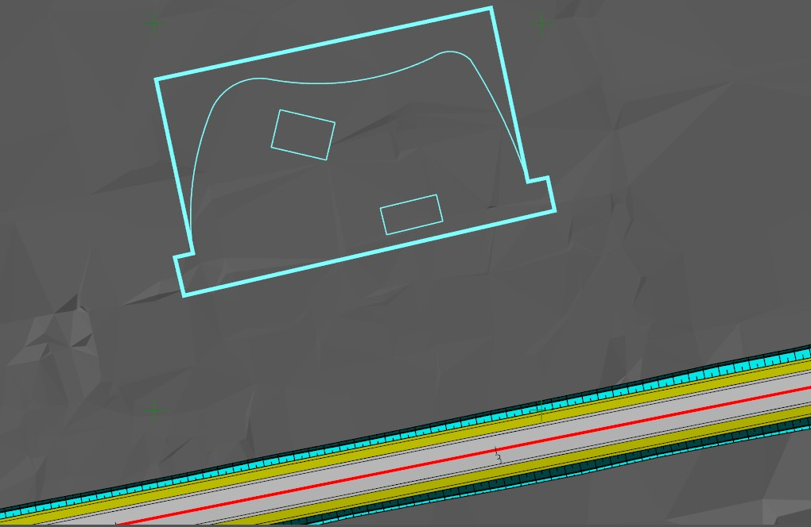

# Горизонтальная планировка

Для отрисовки контура площадки и ее основных конструктивных элементов (контуры зданий, газонов, тротуаров, дорожек и т.п.) может быть использован блок функций по работе с примитивами чертежа.



Данный функционал был подробно описан ранее. (см. [Работа с ЦММ, Работа с элементами чертежа](../../../rb_survey/dtm/dwg/types_primitives_drawing.md)).



План площадки также может быть импортирован из файлов чертежей созданных в других графических редакторов (АutoCAD). Для импорта всего чертежа из файла используйте функцию **Проект-Импортировать-Ситуация**, а для импорта отдельных элементов чертежа, уже открытого в другом графическом редакторе, используйте функцию **Рисовать-Внешний редактор - Импорт**.

В результате, на данном этапе в окне **План** должны быть примитивами отрисованы контуры проектируемой площадки:

