# Приложение Г. Создание и редактирование шаблонов выходных ведомостей



Начиная с **Января 2022г.** в программном комплексе **Топоматик Robur** появилась возможность формировать и редактировать выходные ведомости в специализированном редакторе. Основной функционал которого описан в разделе [Редактирование динамических выходных ведомостей](../../doc/dynamic_vedomosti/edit_vedomosti_and_pattern.md).

Описание представленное в данном архивном разделе, фактически, является устаревшим и временно оставлено для совместимости с предыдущими версиями программного комплекса **Топоматик Robur**.



Данный механизм позволяет настраивать внешний вид выходных ведомостей формируемых программой. К примеру, можно самостоятельно настроить форму шапки, наименование столбцов. А также, тип, стиль и формат данных записываемых в соответствующие ячейки ведомости при ее создании.

**Ведомость Площадей и объемов** и некоторые другие ведомости формируется программой с использованием шаблона, представляющего собой **xml-файл**.

Шаблоны для таких ведомостей хранятся на компьютере пользователя по следующему пути `…\ProgramData\Topomatic\Robur Road\14.0\Sht\Volumes`. Где **Robur Road** это наименование модуля программы (также могут быть **Robur** **Rail** или **Robur Edu**), а **15.0** это номер прошивки.



 В зависимости от используемой версии программы и ее конфигурации данный путь может незначительно отличаться.



При формировании ведомости с использованием шаблона **\*.xml**, например, ведомости **Площадей и объемов**. Программа выгружает данные по всем контурам и объемам которые есть на поперечниках, а затем, прочтя файл шаблона **(\*.xml)** начинает рассортировывать данные по столбцам согласно описанному в шаблоне правилу.

Общий вид шаблона ведомости:

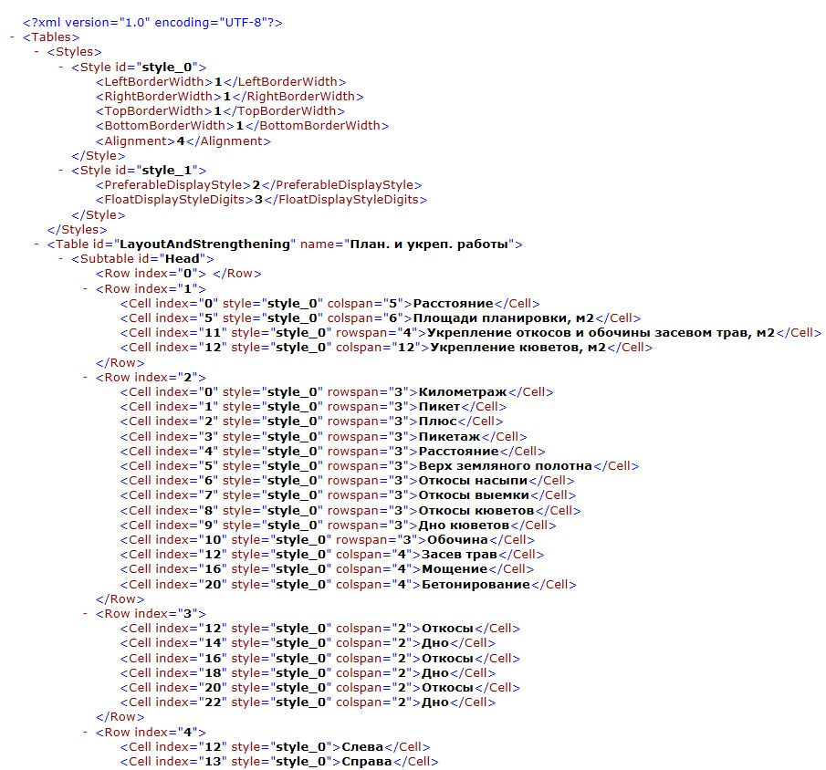

Далее рассмотрим состав шаблона ведомости **\*.xml**

В начале файла идет описание стилей отображения данных в ячейках.

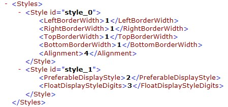

В этой части файла можно указать в каком формате будут заноситься данные в ячейку, как эти данные будут выравниваться по вертикали и горизонтали, будут ли показываться границы ячейки и т.д.

Затем при описании каждой ячейки указывается стиль, с которым будут отображаться данные в ячейке.

* **LeftBorderWidth** – толщина левой границы ячейки. Значение после оператора – толщина границы ячейки.
* **RigthBorderWidth** – толщина правой границы ячейки. Значение после оператора – толщина границы ячейки.
* **TopBorderWidth** – толщина верхней границы ячейки. Значение после оператора – толщина границы ячейки.
* **BottomBorderWidth** – толщина нижней границы ячейки. Значение после оператора – толщина границы ячейки.
* **Alignment** – выравнивание данных в ячейке. Значение после оператора – тип выравнивания в ячейке. Возможны 9 вариантов выравнивания данных в ячейке.

  

Данные в ячейки всегда формируются в виде строки и интерпретируются в зависимости от значения оператора **PreferableDisplayStyle**. Возможны 3 значения оператора.

* **0** значение в ячейке - текстовая строка
* **1** значение в ячейке – целое число
* **2** значение в ячейке - число с плавающей точкой

Если данные в ячейке является числом с плавающей точкой, то оператор **FloatDisplayStyleDigits** задает точность отображения данных в ячейке. Значение после оператора – количество знаков после запятой.

Далее рассмотрим описание вкладок.

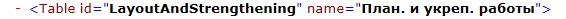

Условно таблица на первой вкладке состоит из трех частей. Заголовок таблицы, данные на поперечниках и данные между поперечниками (расчетные данные).

Например, на рисунке ниже показано описание заголовка таблицы:

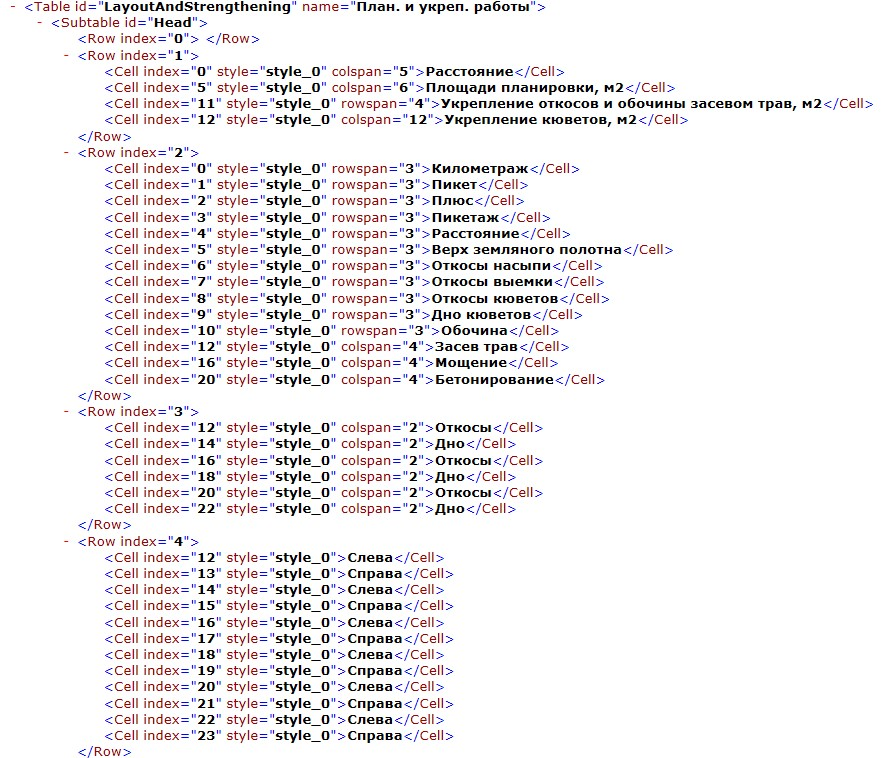

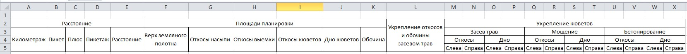



Нумерация строк и столбцов начинается с нуля.



Оператор **Row index** = “значение” – номер строки

Оператор **Cell index** = “значение” – номер столбца

Разберем подробнее описание заголовка таблицы

Первая строка данных не имеет:

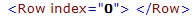

Вторая строка имеет 4 ячейки:

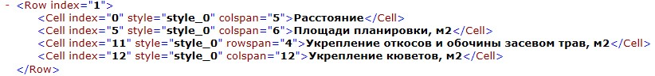

Первая ячейка заголовка таблицы начинается с первого столбца (нумерация начинается с 0), содержание ячейки отображается стилем 0, первая ячейка объединяет 5 столбцов, и имеет название **Расстояние**.

Вторая ячейка заголовка таблицы начинается с шестого столбца (нумерация начинается с 0), содержание ячейки отображается стилем 0, вторая ячейка объединяет 6 столбцов, и имеет название **Площади планировки**.

Третья ячейка заголовка таблицы начинается с двенадцатого столбца (нумерация начинается с 0), содержание ячейки отображается стилем 0, третья ячейка имеет один столбец и объединяет 4 строки, и имеет название **Укрепление откосов и обочин засевом трав**.

Четвертая ячейка заголовка таблицы начинается с тринадцатого столбца (нумерация начинается с 0), содержание ячейки отображается стилем 0, четвертая ячейка объединяет 12 столбцов, и имеет название **Укрепление кюветов**.

Оператор **colspan** = “количество столбцов” означает, что в табличном редакторе заданное количество столбцов объединяются в одну ячейку: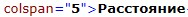

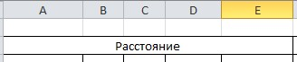

Оператор **rowspan** = “количество строк” означает, что в табличном редакторе заданное количество строк объединяются в одну ячейку: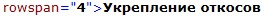

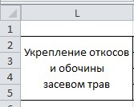



По умолчанию одна ячейка таблицы состоит из одной ячейки в табличном редакторе (одна строка в одном столбце). Поэтому если, например, ячейка таблицы объединяет несколько столбцов в одной строке:

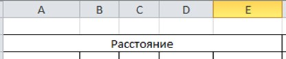

то **rowspan** = “1” не пишется.



Если ячейка таблицы состоит из одного столбца и нескольких строк:

то **colspan** = “1” не пишется.

Если ячейка таблицы состоит из одной строки в одном столбце, то операторы **rowspan** и **colspan** опускаются.

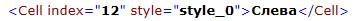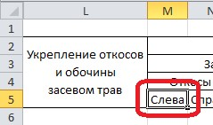

Далее в файле описываются данные, которые программа должна брать на каждом поперечнике.

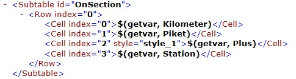

Оператор **getvar** – отвечает за получение данных с поперечника.

Далее в таблице в файле описываются данные, которые программа должна считать между поперечниками:

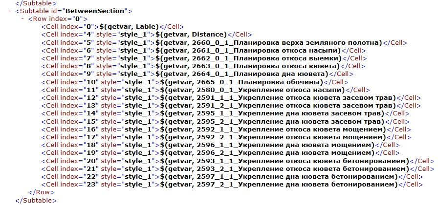

Рассмотрим формирование типовой строки

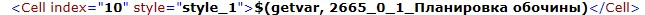

11 столбец таблицы нумерация столбцов начинается с нуля, имеет стиль отображения ячейки **style=”style\_1”**. Описание стилей в начале файла.

Оператор **getvar** говорит о том, что в данной строчке будут браться данные с поперечника.

2597 – код контура на поперечнике, с которого будет браться объем.

Следующая цифра (в данном случае 0) определяет сторонность взятия объемов. Может иметь три значения - 0, 1, 2

* **0** говорит о том, что объемы с заданным кодом (в данном случае 2597) слева и справа суммируется.
* **1** говорит о том, что программа берет только левый объем контура с заданным кодом.
* **2** говорит о том, что программа берет только правый объем контура с заданным кодом.

Следующая цифра (в данном случае 1) определяет то, как будут считаться объемы в ячейке.

Может иметь 2 значения - 0,1.

* **0** говорит о том, что в данную ячейку будет записано значение с поперечника
* **1** говорит о том, что в данную ячейку будет записан результат вычисления (объем на предыдущем поперечнике + объем на следующем поперечнике)/2\* на длину между поперечниками.

Следующие данные – наименование объема.
