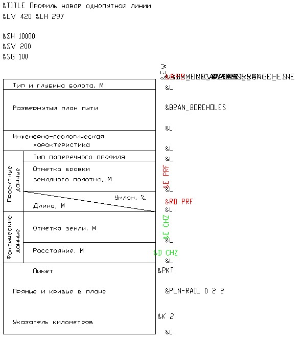

# Общие сведения



Начиная с **Января 2022г**. в программном комплексе Топоматик Robur появилась возможность редактировать динамические выходные чертежи в специализированном графическом редакторе. Основной функционал которого описан в разделе [Редактирование динамических выходных чертежей](../../../doc/edit_dynamic_drawing/general_information.md).

Описание представленное в данном архивном разделе, фактически, является устаревшим и временно оставлено для совместимости с предыдущими версиями программного комплекса Топоматик Robur.



Программа **Топоматик Robur** позволяет формировать чертежи продольного профиля по выбранному шаблону, с произвольной шапкой. По умолчанию, в программе уже присутствуют несколько вариантов шаблонов чертежей продольного профиля.

Имеется возможность создания и использования пользовательских шаблонов при формировании чертежа продольного профиля, а так же могут быть доработаны и приведены к требуемому виду стандартные шаблоны.

В зависимости от установленной конфигурации программы **Топоматик Robur** шаблоны чертежей продольного профиля имеют следующее размещение:

1. Шаблоны программы Топоматик Robur - Изыскания 1.х располагаются в `C:\ProgramData\Topomatic\Robur Survey\14.0\Plt\Prf\Srv`
2. Шаблоны программы Топоматик Robur - Железные дороги 4.х располагаются в `C:\ProgramData\Topomatic\Robur Rail\14.0\Plt\Prf\Rail`
3. Шаблоны программы Топоматик Robur - Автомобильные дороги 8.х располагаются в `C:\ProgramData\Topomatic\Robur Road\14.0\Plt\Prf\Road`



В зависимости от установленной версии программного комплекса **Топоматик Robur** пути расположения шаблонов могут не значительно отличаться от приведенных выше.



Стандартные шаблоны могут быть отредактированы во встроенном редакторе чертежей или среде AutoCAD.

Шаблон представляет собой файл в формате `*.dxf` и имеет следующий вид:



В зависимости от установленной конфигурации программы **Топоматик Robur**, шаблон может отличаться от выше приведенного вида.



Формирование данных в графах чертежа производится с помощью специальных кодов (Тэгов). Каждый тэг отвечает за формирование каких либо данных продольного профиля. Назначенный текстовый стиль, цвет, слой данным тэгам определяет аналогичные параметры у формируемых данных продольного профиля.