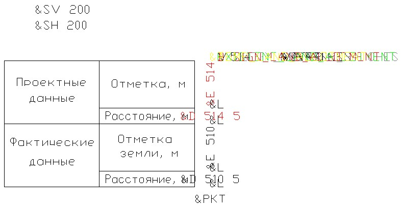

# Приложение В. Формат шаблона чертежа поперечного профиля



Начиная с **Января 2022г.** в программном комплексе **Топоматик Robur** появилась возможность редактировать динамические выходные чертежи в специализированном графическом редакторе. Основной функционал которого описан в разделе [Редактирование динамических выходных чертежей](../../doc/edit_dynamic_drawing/general_information.md).
   
 Описание представленное в данном архивном разделе, фактически, является устаревшим и временно оставлено для совместимости с предыдущими версиями программного комплекса **Топоматик Robur**.



Программа Топоматик Robur позволяет формировать чертежи поперечных профилей по выбранному шаблону, с произвольной шапкой. По умолчанию, в программе уже присутствуют несколько вариантов шаблонов чертежей поперечного профиля.

Имеется возможность создания и использования пользовательских шаблонов при формировании чертежа поперечного профиля, а так же могут быть доработаны и приведены к требуемому виду стандартные шаблоны.

В зависимости от установленной конфигурации программы Топоматик Robur шаблоны чертежей поперечного профиля имеют следующее размещение:

1. Шаблоны программы Топоматик Robur - **Изыскания 1.х** располагаются в `C:\ProgramData\Topomatic\Robur Survey\14.0\Plt\Crs\Srv`
2. Шаблоны программы Топоматик Robur - **Железные дороги 4.х** располагаются в `C:\ProgramData\Topomatic\Robur Rail\14.0\Plt\Crs\Rail`
3. Шаблоны программы Топоматик Robur - **Автомобильные дороги 8.х** располагаются в `C:\ProgramData\Topomatic\Robur Road\14.0\Plt\Crs\Road`



В зависимости от установленной версии программного комплекса Топоматик Robur пути расположения шаблонов могут не значительно отличаться от приведенных выше.



Стандартные шаблоны могут быть отредактированы во встроенном редакторе чертежей или среде **AutoCAD**.

Шаблон представляет собой файл в формате **\*.dxf** и имеет следующий вид:



 В зависимости от установленной конфигурации программы Топоматик Robur, шаблон может отличаться от выше приведенного вида.



Формирование данных в графах чертежа производится с помощью специальных кодов (Тэгов). Каждый тэг отвечает за формирование каких либо данных продольного профиля. Назначенный текстовый стиль, цвет, слой данным тэгам определяет аналогичные параметры у формируемых данных продольного профиля.

### Основные тэги для формирования данных по линиям поперечного профиля модели Автомобильные дороги:

1. **&EW** - рабочие отметки
2. **&RENEW** - слои фрезерования\выравнивания
3. **&EC «параметр»** - отметки по линии на выносках.
   * «Параметр» может принимать код любой линии на поперечном профиле.
4. **&VOLUME** «параметр» - формирует данные по элементам конструкции поперечника - объемам.

   * «Параметр» может принимать любые коды элементов конструкции поперечника - объемов.

### Общие тэги для формирования данных по линиям поперечного профиля моделей Железные дороги и Автомобильные дороги:

1. **&TITLE** - описание шаблона, отображаемое на первом шаге Мастера формирования чертежа поперечного профиля.
2. **&LV и &LH** - горизонтальный и вертикальный размеры листа, определяемые по умолчанию на Шаге 2 мастера формирования чертежа поперечного профиля.
3. **&SH, &SV и &SG** – горизонтальный масштаб, вертикальный и масштаб грунтов, определяемые по умолчанию на Шаге 2 мастера формирования чертежа поперечного профиля.
4. **&I «параметр»** - уклоны по линии.
5. **&E «параметр»** - отметки по линии.
6. **&D «параметр» «параметр 2»** - расстояния по линии.
7. **&ORD «параметр»** – ординаты по линии
   * «Параметр» может принимать код любой линии на поперечном профиле.
   * «Параметр 2» задает длину засечки.
8. **&EG** - формирование линии черного поперечника
9. **&PG** - формирование линии проектного поперечника
10. **&AG** - формирование линии интерполированного профиля
11. **&A** - отрисовывает в качестве штрих-пунктирной линии ось подобъекта
12. **&V** - формирование таблицы объемов
13. **&COM** - отображение коммуникаций
14. **&PKT** - формирование подписи поперечника (номер и пикет)
15. **&DESIGN\_LAND\_ALLOTMENT** - отображение проектного отвода земель
16. **&TEMP\_LAND\_ALLOTMENT** - отображение временного отвода земель
17. **&EXISTENT\_LAND\_ALLOTMENT** - отображение существующего отвода земель