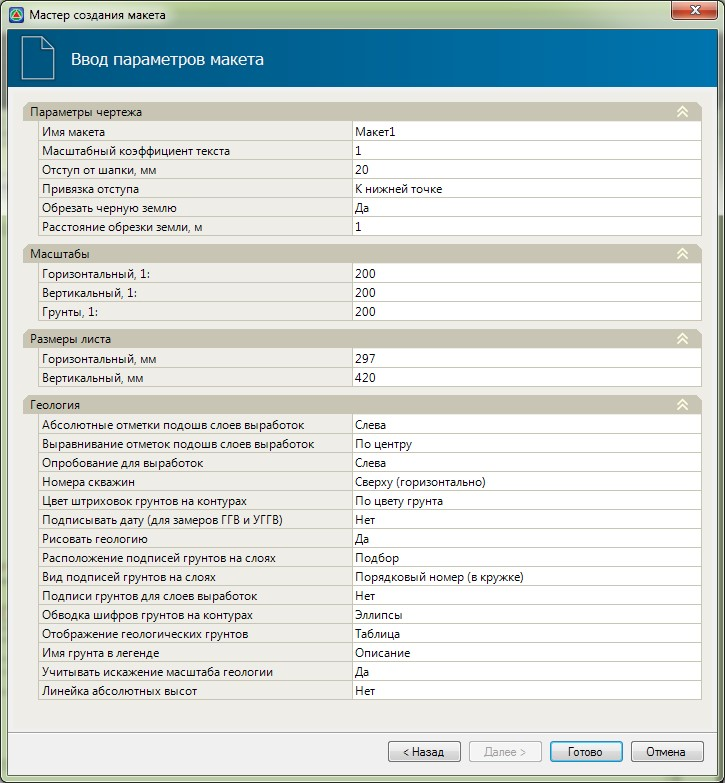
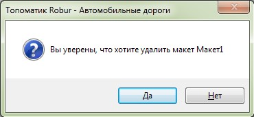

# Основные действия с созданным макетом чертежа

По умолчанию макет открыт в режиме просмотра чертежа.

Для перемещения по списку поперечников в режиме просмотра макета используется функционал, аналогичный реализованному в основном рабочем окне Поперечник. Т.е. также могут использоваться клавиши Page Up, Page Down, панель позволяющая листать поперечники или задавать их пикетажное значения.



Работа со списком поперечников была описана ранее ([см. Работа с трассой., Поперечные профили](../../../rb_survey/alg/track_crossection//createing_and_editing_black_diameters.md)).



Основные действия, которые могут быть произведены с ранее созданным макетом чертежа:

* Имеется возможность пересоздать макет с другими параметрами, например, задав другой отступ от шапки, масштаб и т.д. Для этого:

  1. Сделайте данный макет текущим, в случае если макетов было создано несколько.
  2. Выберите меню **Поперечник – Макет – Редактировать макет**.
  3. В открывшемся окне задайте необходимые параметры и нажмите **ОК**:

     

  В результате применяться новые заданные параметры макета.

  

  При изменении параметров макета с помощью данной функции, данные, относящиеся к его шаблону (вид боковика и сетки данных), остаются неизменными.

  

* Для удаления макета:

  1. Сделайте данный макет текущим, в случае если макетов было создано несколько.
  2. Выберите меню **Поперечник – Макет – Удалить макет**.
  3. В открывшемся диалоговом окне подтвердите данное действие:

     

  В результате вкладка с наименованием текущего макета будет удалена.

* Имеется возможность сохранить отредактированный шаблон макета в виде файла, для дальнейшего его использования, при создании других макетов или чертежей по заданному шаблону. Для этого:

  1. Сделайте данный макет текущим, в случае если макетов было создано несколько.
  2. Выберите меню **Поперечник – Макет – Сохранить шаблон макета**, в открывшемся окне укажите место сохранения и имя файла шаблона.

  

  Выбор файла шаблона производится при создании макета, данная функция была описана выше (см. раздел [Создание макета чертежа](create_layout_drawing.md)). Функционал по редактированию шаблонов макетов, а также созданию на их основе чертежей, будет описан далее. 

  
