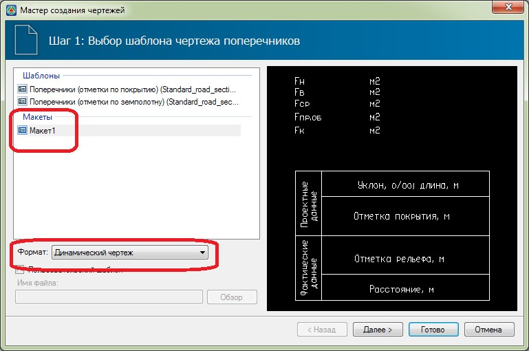
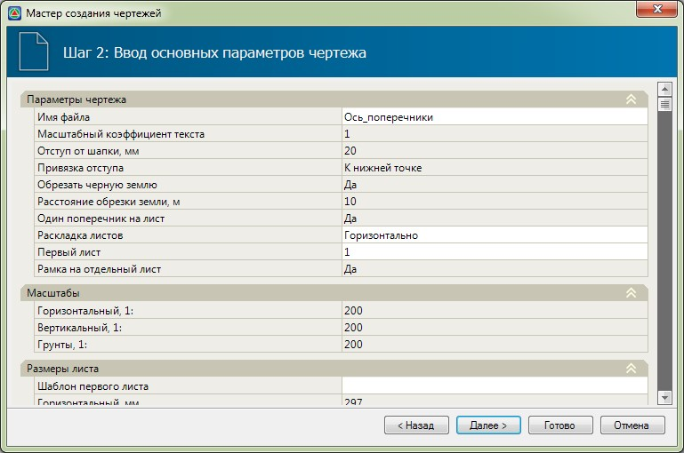
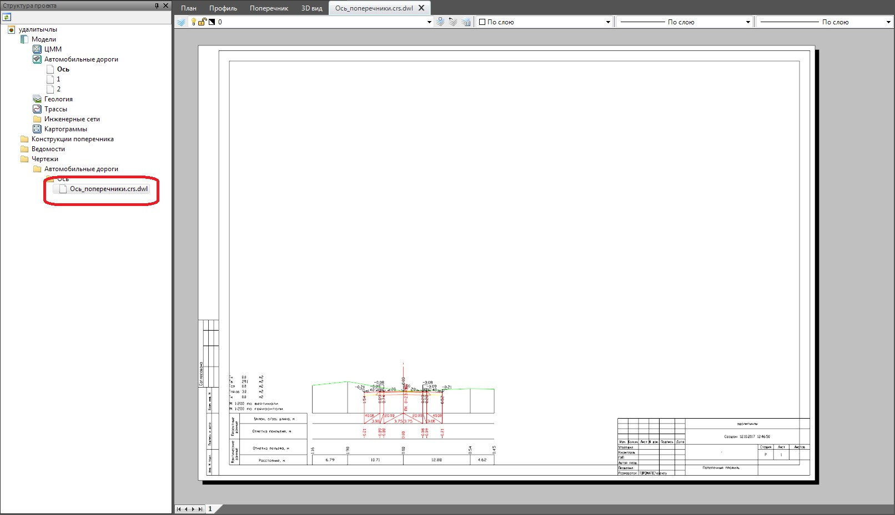

# Создание чертежа поперечного профиля на основе макета

Для создания чертежа поперечников на основе требуемого макета:

1. Выберите меню **Проект – Создать чертеж – Поперечные профили**, откроется диалоговое окно мастера создания чертежа:

   

2. На данном шаге в поле **Макеты** выберите наименование ранее созданного макета чертежа поперечников.

   

   Создание чертежей поперечника по шаблону подробно описано в руководстве пользователя ([Работа с трассой, Создание чертежа поперечных профилей](../../../doc/create_drawing_cross_profiles.md)).

   

   При создании чертежа по макету, используется шаблон, на основе которого данный макет был создан. Также в чертеже сохраняются все доработки, выполненные в режиме редактирования макета.

3. Выберите тип создаваемого чертежа из выпадающего списка поля **Формат**:

   

   В случае выбора формата **Динамический чертеж**, создаваемый выходной файл чертежа будет иметь неразрывную связь с моделью проекта , и в случае каких либо изменений в самой модели или макете , чертеж может быть обновлен. Чертежи других форматов нужно пересоздавать заново, если данные модели проекта были изменены. Подробнее о **Динамических чертежах** и механизмах работы можно ознакомиться в Документации [Динамический чертеж](../../../rb_survey/dtm/planchet/apportion_tablet/dynamic_drawing.md).

   

4. Нажмите **Далее**, откроется следующий шаг формирования чертежа:

   

   Некоторые параметры чертежа, такие как **Масштаб**, **Отступ от шапки** и т.д. закрыты для редактирования и доступны только для просмотра, так как они определяются в соответствии с макетом, который был выбран на первом шаге мастера создания чертежа (см. выше п.1).

5. Задайте необходимые параметры и нажмите **Готово**. В результате сформируется файл чертежа, который будет добавлен в окне **Структура проекта** в соответствующую папку (**Чертежи - Автомобильные дороги – Название чертежа**) и будет автоматически открыт в отдельной вкладке:

   
