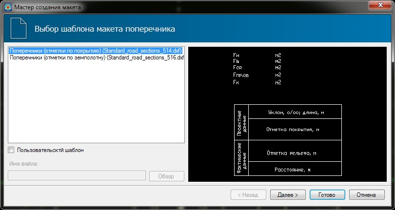
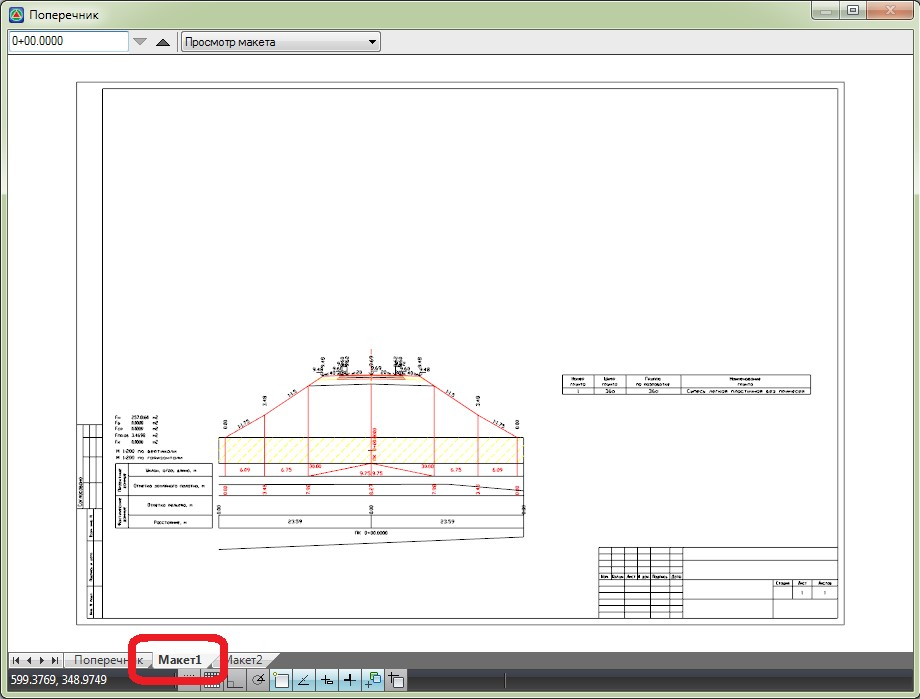

# Создание макета чертежа поперечного профиля

Для создания Макета чертежа поперечников:

1. Выберите меню **Поперечник – Макет – Создать макет**, откроется диалоговое окно мастера создания **Макета**.
2. Аналогично окну создания чертежа здесь представлен набор стандартных шаблонов чертежей, также есть возможность назначить пользовательский шаблон. Выберите шаблон создаваемого макета и нажмите **Далее**:

   

3. На следующем шаге мастера задаются основные параметры формирования макета чертежа (масштабы, размеры отсупов и т.п.):

   

   Задайте их и нажмите **Готово**.

В результате, в нижней части окна **Поперечник** будет создана дополнительная вкладка с наименованием созданного макета, которая по умолчанию станет текущей. Т.е. макет будет создан и открыт в режиме просмотра:



С модели может быть создано произвольное количество макетов. К примеру, с разными масштабами поперечников или это могут быть макеты, созданные по различным шаблонам. Для перехода с одного макета на другой, или в саму модель (т.е. рабочие окно Поперечник), просто выберите соответствующую вкладку, расположенную в нижней части текущего окна.

В макете всегда отображается текущий поперечный профиль. При переходе с одного поперечного профиля на другой автоматически обновляется макет его чертежа. 

