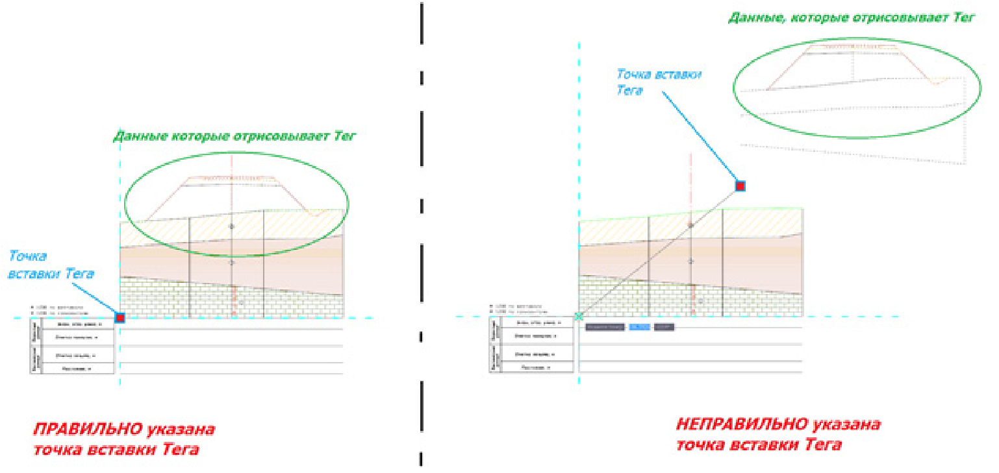
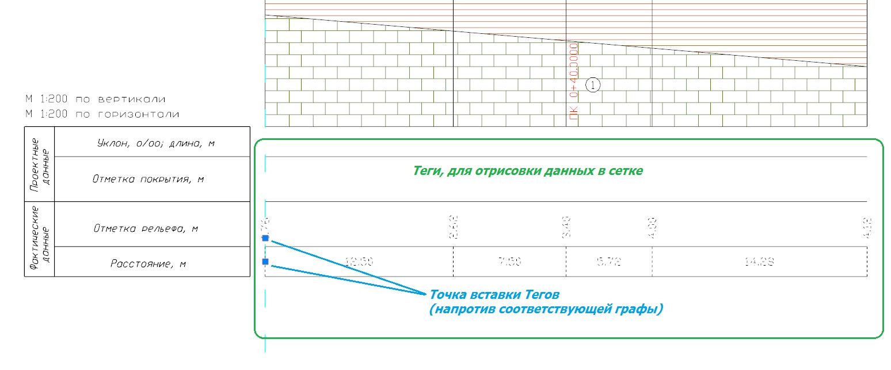
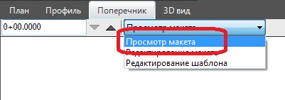

# Добавление\Редактирование данных

Имеется возможность удалять, добавлять новые теги из общего списка тегов реализованных в программе, а также редактировать их свойства.

Для добавления дополнительных тегов в текущий шаблон:

1. Выберите тип тега из меню **Рисовать – теги шаблона - …**

   

   Полный список тегов и их подробное описание будет приведено ниже.

   

2. Визуально левой кнопкой мыши (используя объектную привязку) или задав координаты в строках динамического ввода, укажите точку вставки тега, относительно которой будут формироваться данные.

   

   1. Для тегов, которые рисуют элементы поперечника над сеткой данных (геология, контуры поперечника, рабочие отметки и т.д.), точку вставки для этих тегов необходимо указывать в верхней правой части боковика, иначе, элементы, которые рисует тег, будут расположены не верно:

      

   2. Для тегов, которые подписывают данные в шапке основной надписи, точку вставки необходимо указывать непосредственно напротив той графы, где должны рисоваться эти данные (отметки, расстояния и т.д.):

      

   

3. Для выхода из режима редактирования шаблона и перехода в режим просмотра макета чертежа, в верхней части основной панели окна Поперечник из выпадающего списка выберите соответствующий пункт:

   



Отредактированный шаблон можно сохранить в качестве отдельного файла, для его дальнейшего использования в других макетах или проектах, для этого выберите меню **Поперечник – Макет – Сохранить шаблон макета**. Данная функция описывалась выше в разделе [Основные действия с созданным макетом чертежа](../basic_action.md).


