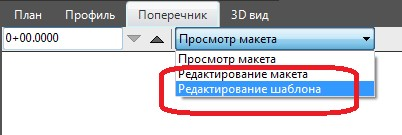
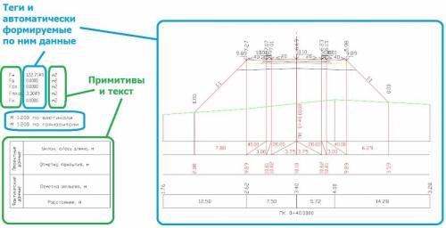

# Общие сведения

В данном режиме, можно наглядно редактировать текущий шаблон, на основе которого был создан макет. Особенность данного режима заключается в том, что редактирование или добавление новых данных может осуществляться на любом текущем поперечнике, а все изменения будут применяться ко всем поперечникам созданного макета, что позволяет в режиме реального времени сразу видеть внесенные изменения. В последствии, отредактированный шаблон может быть сохранен и использован для создания на его основе новых макетов, или непосредственного формированию различных чертежей по заданному шаблону.

Как уже было сказано ранее, по умолчанию при создании макета, текущим является режим его просмотра. Для перехода в режим редактирования шаблона:

1. Сделайте текущим макет, шаблон которого необходимо отредактировать, в случае если макетов было создано несколько.
2. Сделайте текущим режим **Редактирование шаблона**, с помощью селектора, который расположен в верхний части окна макет:

   

В результате, после перехода в данный режим, станут доступны функции редактирования шаблона.

В режиме **Редактирование шаблона**, находящиеся в нем данные, делятся на два типа – примитивы чертежа (текст, отрезки, полилинии и т.д.) и специальные коды (теги).

Примитивы чертежа необходимы для отрисовки шапки чертежа определенного вида, вспомогательных построений и какого либо еще фиксированного набора подписей (например, наименование граф боковика, подпись наименования проекта, размерностей и типов объемов работ и т.д.).



Подробное описание тегов и их свойств см. ниже.



На схеме ниже, зеленным цветом выделена группа данных относящаяся к примитивам, а синим - данные, которые формируются посредством тегов:

