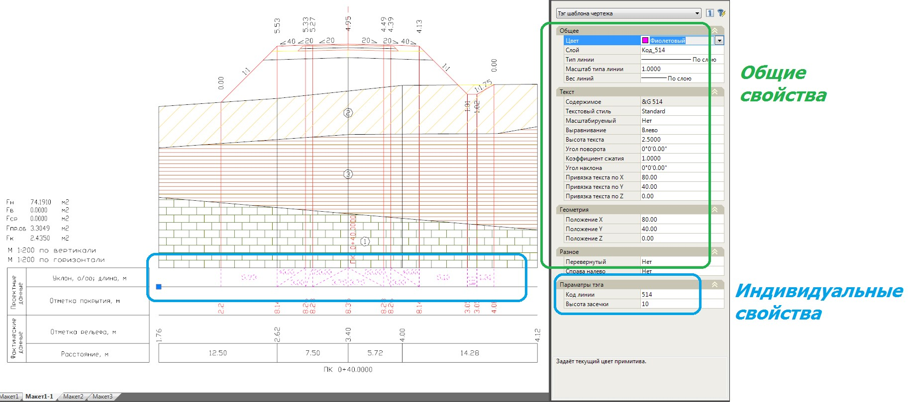
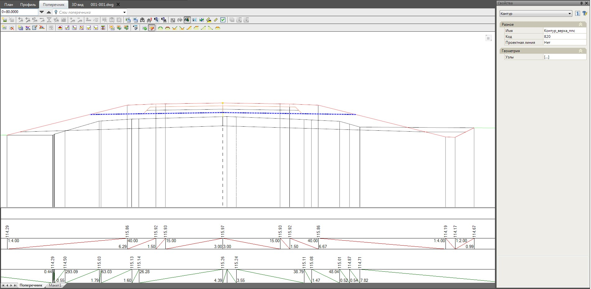
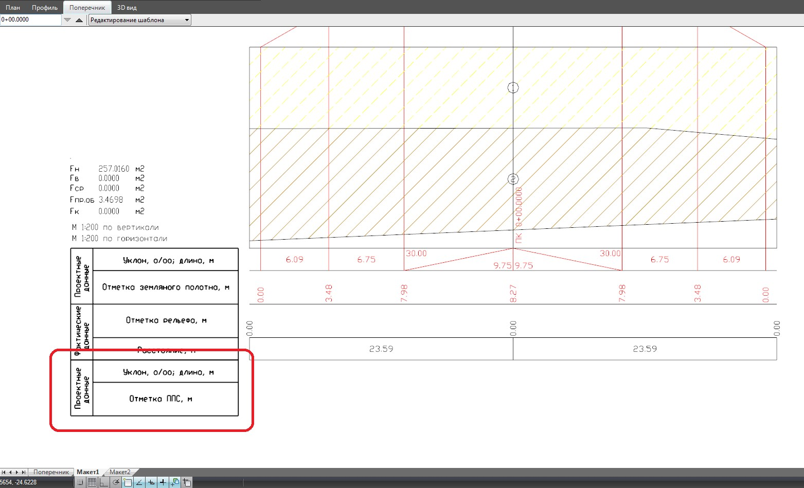
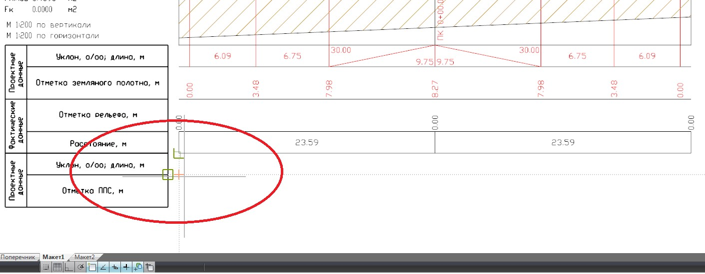
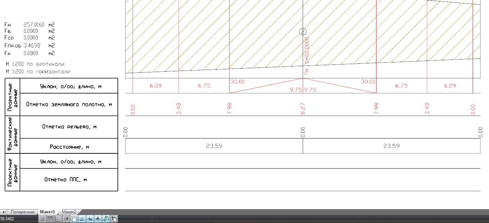
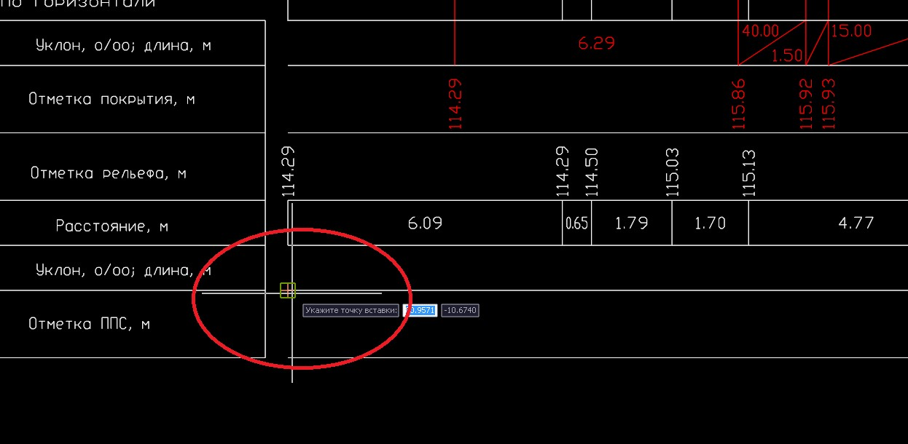
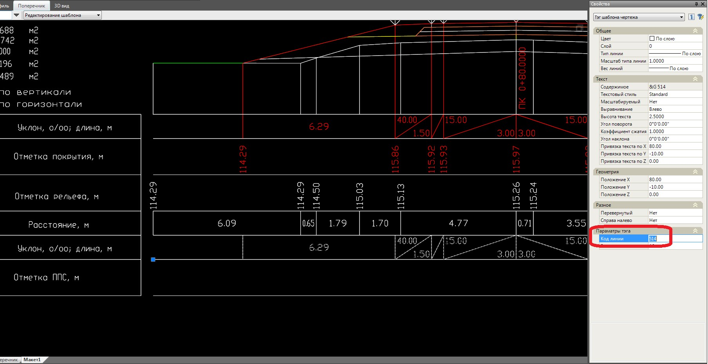
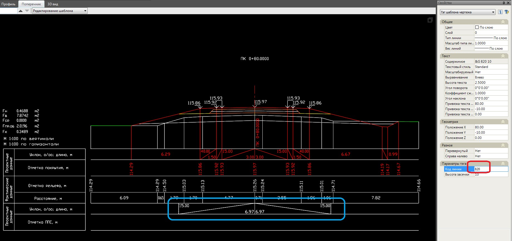
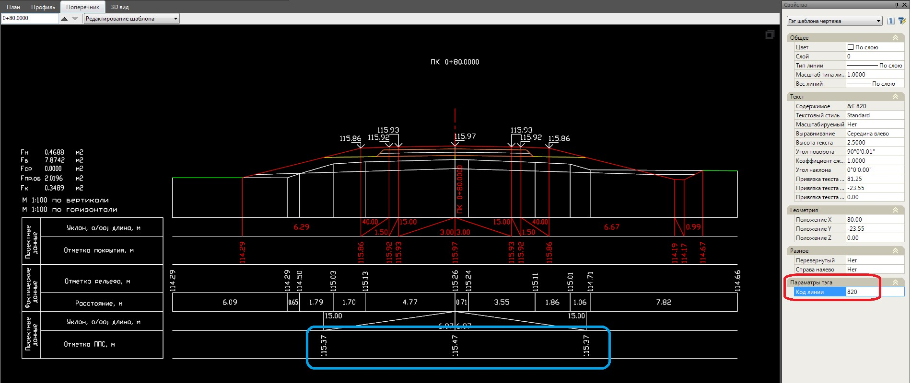

# Свойства тегов

Каждый тег имеет набор общих свойств, которые присутствуют у всех тегов и ряд индивидуальных, которые доступны только у определенного вида тегов.

К общим свойствам можно отнести цвет, слой, шрифт, геометрию (положение) и т.д. К индивидуальным свойствам относятся - код линии, код объема, высота засечки и т.д.

Все заданные свойства для тега автоматически присваиваются тем данным, которые этот тег рисует, т.е. например, задав тегу цвет, он применится и для отрисованных этим тегом данных:

## Пример вставки нового тега

Ниже рассмотрим пример вывода данных (уклоны\расстояния и отметки) по линии верха подстилающего слоя, путем добавления двух новых граф в шаблон и вставки новых тегов.



Линия верха подстилающего слоя была предварительно введена в шаблон конструкции поперечного профиля по имеющимся узлам, с помощью конструкции Контур, которому был задан уникальный код 820. Подробнее проектирование поперечников см. в Документации [Автомобильные дороги, Проектирование поперечных профилей](../../../../rb_survey/alg/track_crossection//createing_and_editing_black_diameters.md).



Для редактирования шаблона макета:

1. Откройте вкладку созданного ранее макета и перейдите в режим **Редактирование шаблона**.

2. С помощью примитивов чертежа (Отрезки, Полилинии и Текст) нарисуем две новые графы в нижней части боковика – **Уклон\длина** и **Отметки**:

   

3. Для автоматического формирования линий нужной длинны в сетке данных, вставим тег – **Линия**, выбрав меню **Рисовать – теги шаблона – Линия**.

4. Точку вставки укажем визуально с привязкой:

   

   * В результате линии будут автоматически отрисованы и иметь необходимую длину:

      

5. Для формирования **Уклонов\Расстоянийпо контуру верха подстилающего слоя** (предварительно на поперечнике был дополнительно отрисован контур с кодом 820) выберем меню **Рисовать – теги шаблона – Уклон\длина**.

   * Точку вставки тега укажем в нижнем краю соответствующей графы:

     

   * В результате вставленный тег отрисует данные по коду линии, который задан в свойствах тега по умолчанию, т.е. по коду 514:

     

   * В окне **Свойств** добавленного тега в поле **Код линии** необходимо задать код 820:

     

   * В результате **Уклоны\Расстояния** отобразятся по необходимой линии верха подстилающего слоя (код 820).

   

    Второй параметр тега «**Высота засечки**» влияет на размер вертикальной линии, которая разграничивает смежные уклоны и задается величиной равной высоте графы, в которую данный тег вставляется. В данном случае высота графы и заданная по умолчанию высота засечки совпадают, поэтому параметр не меняется.

   

6. Для выноса отметок по данной линии необходимо вставить тег – **Отметки**, из меню Рисовать – теги шаблона. Точку вставки и параметры тега задаем по аналогии со вставленным тегом **Уклоны\Расстояния**, который был добавлен в пункте 4 (см. выше):

   

7. В результате выше описанных действий в шаблон будут добавлены две графы, в которые выведена необходимая информация (**Уклоны\Расстояния и Отметки**) по линии с кодом 820 (предварительно созданный контур с кодом 820 по верху подстилающего слоя).



Последовательность действий по добавлению любых других тегов и данных аналогична описанным выше.

