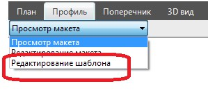

# Работа с макетом чертежа продольного профиля

Выше подробно рассматривалась последовательность действий по созданию макетов чертежей поперечных профилей, редактированию шаблонов макетов, а также формированию на их основе выходных чертежей. Аналогичные приемы используются и при работе с макетом чертежа продольного профиля:

* Для создания и редактирования макета чертежа продольного профиля используется меню **Профиль-Макет-…..**
* Редактирование шаблона макета продольного профиля осуществляется в режиме **Редактирование шаблона**:

  

В последствии, также на основе отредактированного шаблона может быть создан новый макет профиля или выходной чертеж.

При редактировании шаблона макета продольного профиля используется свой набор характерных тегов. Рассмотрим далее их перечень.
