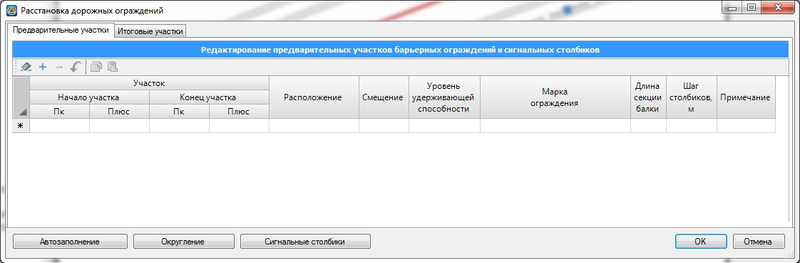
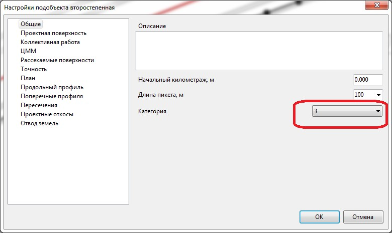
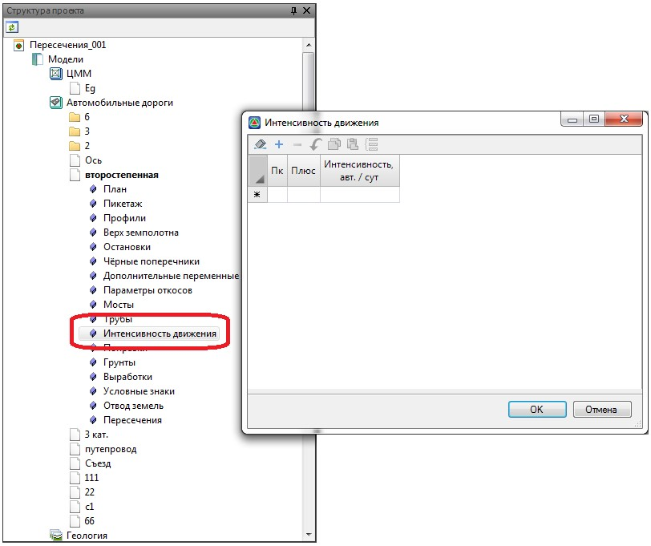
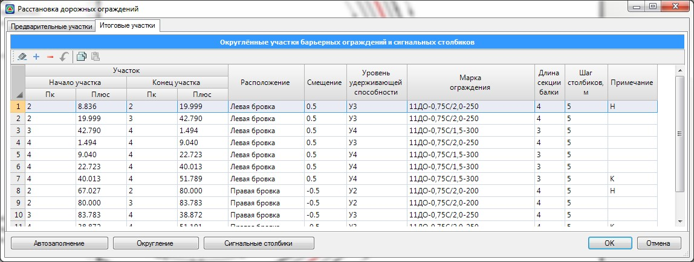

# Автоматическая расстановка дорожных ограждений

Данный блок функций позволяет по определенным параметрам дороги, произвести автоматическую расстановку дорожных ограждений и сигнальных столбиков, подобрать уровень их удерживающей способности на заданных участках и определить точную (округленную до целого количества секций) длину барьерных ограждений. Результаты работы данной функции сводятся в таблицу, где пользователь имеет возможность окончательно корректировать границы участков, уровень удерживающей способности, задавать марку барьерного ограждения и т.д.

Для автоматической расстановки дорожных ограждений:

1. Выберите элемент меню **Задачи – Дорожные ограждения – Расстановка дорожных ограждений**. Откроется диалоговое окно:

   

2. Для автоматической расстановки ограждений нажмите кнопку **Автозаполнение**.

Программа проанализирует поперечники и по параметрам описанным ниже заполнит таблицу **Предварительные участки**. Часть параметров заполненных программой доступны для редактирования пользователем. На данном этапе определяются характерные участки, на которых должны быть ограждения с определенным уровнем удерживающей способностью. **Марка ограждения** для каждого участка назначается пользователем.



 Функция Автозаполнение производит расстановку ТОЛЬКО барьерных ограждений. После того как участки расстановки барьерных ограждений окончательно определены, может быть произведена расстановка сигнальных столбиков. Более подробно процедура расстановки сигнальных столбиков будет описана ниже, в соответствующем разделе.



При автоматической расстановке барьерных ограждений, для определения необходимого уровня удерживающей способности согласно **ГОСТ Р 52289-2004**. учитываются следующие параметры: высота насыпи, техническая категория дороги, радиус кривой в плане, продольный уклон, принадлежность участка к вогнутой кривой, число полос, уклон местности, уклон проектных откосов, принадлежность кромок и бровок к внутренней и внешней стороне кривой в плане. Наличие мостов, труб и интенсивность движения учитывается программой при заполнении соответствующих таблиц в окне **Настройка параметров расчета ограждений**, принцип заполнения данных таблиц будет описан далее.

Границы рабочих участков ограждений определяются на основе информации по поперечным профилям. Соответственно, для более точной расстановки ограждений поперечные профили должны быть корректно законструированы (должны быть запроектированы откосы), располагаться в характерных (переходных) местах и с приемлемым шагом друг от друга.



 Для получения информации о параметрах, которые были использованы для автоматического определения участков расстановки ограждений может быть сформирована соответствующая таблица. Для ее создания воспользуйтесь элементом меню Задачи-Дорожные ограждения - Ведомости-Рабочая ведомость расстановки ограждений.



При отсутствии данных по технической категории дороги и интенсивности движения программа не выполнит расчет и выдаст соответствующие предупреждение:

* Техническая категория автомобильной дороги задается в настройках текущей модели:

  

* Интенсивность движения задается в соответствующей таблице структуры проекта:

  

После выполнения процедуры автозаполнения, при необходимости границы участков дорожных ограждений могут быть подкорректированы.



Если в столбце Примечание данной таблицы стоит надпись Мост (это означает, что участок ограждения установлен в зоне действия мостового перехода), то пикетажные границы данного участка не будут доступны для редактирования.



Для выхода из данного окна нажмите **ОК**.

В результате участки ограждений рассчитанные программой автоматически будут отрисованы на плане. Они по умолчанию находятся в слое **Предварительные участки дорожных ограждений**. Как уже было сказано выше данные участки являются информационными и не учитываются при формировании выходных ведомостей и спецификаций.

На вкладке **Итоговые участки** программа выводит окончательные (округленные по длине секции балки) участков ограждений:

В этой таблице расположены все участки дорожных ограждений и сигнальных столбиков, которые содержит текущая модель автомобильной дороги, каким бы способом они не создавались.

В эту таблицу также попадают предварительные участки, после их округления. Округление происходит по длине секций исходя из выбранной марки ограждения. Более подробно процедура и особенности округления участков будут описаны [ниже](rounding_sections_barrier_fencing.md) в соответствующем разделе.

Рекомендуется работать с таблицей **Итоговые участки** в следующей последовательности:

1. Автоматическое определение участков, где должны быть установлены ограждения с помощью процедуры **Автозаполнения**.
2. Корректировка и дополнение списка предварительных участков (при необходимости), а также назначение марок ограждений.
3. Заполнение таблицы итоговых участков, путем округления предварительных участков или их копирования без выполнения процедуры округления.
4. Окончательное редактирование таблицы **Итоговые участки**, добавление дополнительных участков дорожных ограждений.
5. После того как участки расстановки дорожных ограждений окончательно определены выполняется расстановка сигнальных столбиков (автоматически или ручным способом).
