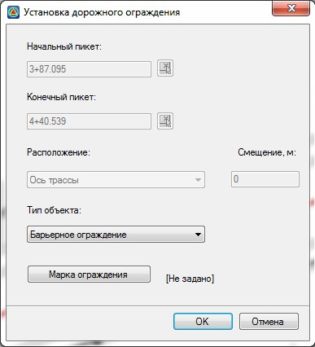

# Назначение дорожного ограждения из полилинии

Функция создания ограждения из полилинии или иного линейного объекта, используется в тех случаях, когда невозможно (некорректно) задавать ограждения по пикетажу. Например: на примыкании когда ограждение стоит по кромке закругления.

Для того, чтобы назначить ограждение из полилинии:

1. Выберите элемент меню **Задачи – Дорожные ограждения – Задать ограждение из полилинии**. Курсор примет форму прицела.
2. Укажите левой кнопкой мыши исходную полилинию или иной линейный объект, геометрия которого будет использована для создания ограждения. Откроется диалоговое окно:

   

3. В группе полей **Тип объекта** задайте марку ограждения или шаг расстановки сигнальных столбиков. Процедура задания данных параметров была описана ранее в предыдущем разделе. Нажмите **ОК**.

В результате, на основе выбранного контура на плане будет создано дорожное ограждение или сигнальные столбики, расставленные с заданным шагом.



Для ограждений созданных данным способом длина определяется по фактической длине исходной полилинии и не округляется до целого количества секций, исходя из заданной марки ограждения.

