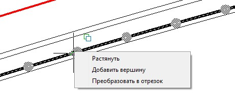
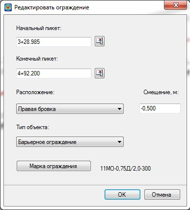
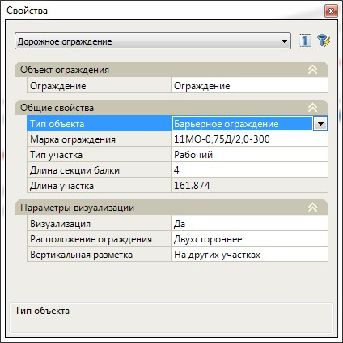
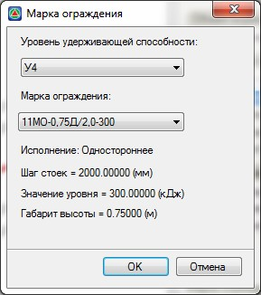
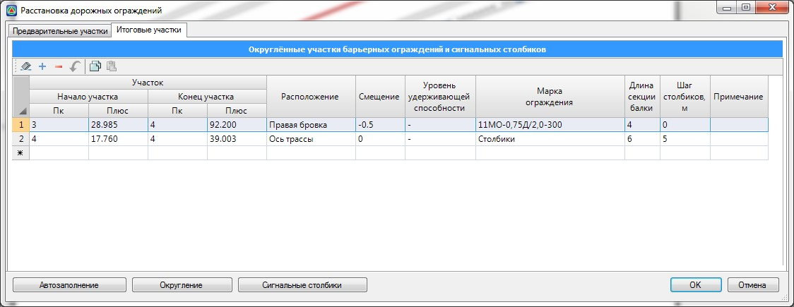
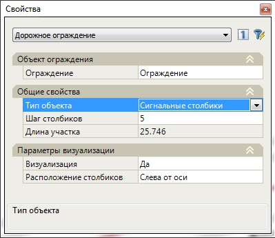

# Редактирование дорожных ограждений

В данном разделе рассмотрим основные способы и особенности редактирования дорожных ограждений:

* Положение дорожных ограждений можно редактировать на плане визуально путем перемещения его характерных точек (грипов). Для этого, выделите ограждение на плане щелкнув по нему левой кнопкой мыши и переместите узловую точку ограждения (грип) в требуемое место.

  При необходимости добавления в данный объект дополнительных узловых точек:

  1. Щелкните по центральному гриппу сегмента ограждения, где требуется добавить новую узловую точку.
  2. Выберите из появившегося меню пункт **Добавить вершину**:

     

  3. Визуально укажите на плане положение дополнительной узловой точки.

  

  1. При необходимости скругления сегмента ограждения или выполнения его плоско-параллельного переноса, выберите соответствующую команду из выше описанного меню.
  2. При изменении таких параметров ограждений как пикетаж или смещение относительно какой-либо полосы, ограждение будет пересоздано на основе ее и выше описанные коррективы узловых точек будут отменены.
  3. Принципы редактирования участков расстановки сигнальных столбиков аналогичны описанным выше.
  4. Для ограждений относящихся к группе Предварительные недоступна большая часть функционала по редактированию положения узловых точек. Исходя из того что эти объекты носят преимущественно информационный характер и нужны для выделения участков, на которых требуется устройство дорожных ограждений. Их расстановка и дальнейшее редактирование за узловые точки происходит параллельно оси трассы или другой характерной полосы дороги (кромка, бровка, разделительная полоса и т.п.). Создание предварительных дорожных ограждений будет описано далее.

  

* Редактирование выбранного на плане участка дорожного ограждение или сигнальных столбиков может производиться с помощью диалога аналогичного созданию нового ограждения.

  Для этого:

  1. Выделите левой кнопкой мыши участок ограждения, который необходимо отредактировать и щелкните правой кнопкой мыши.
  2. Из появившегося контекстного меню выберите пункт **Редактировать ограждение**.
  3. В открывшемся окне измените параметры ограждения и нажмите **ОК**:
   
     

* Редактирование параметров участка расстановки дорожных ограждений или сигнальных столбиков может производиться с помощью окна свойств выбранного объекта.

  Для этого, выберите на плане один или несколько объектов типа **Дорожное ограждение** или **Сигнальные столбики**. Параметры выбранных объектов отобразятся в окне **Свойства**. Ниже представлено окно свойств дорожного ограждения:

  

  **Тип объекта** – в данном поле с помощью выпадающего списка можно назначить выбранным объектам требуемый тип: барьерное ограждение или сигнальные столбики.

  **Марка ограждения** - в данном поле задается марка ограждения для выбранного объекта или группы объектов. Для этого, сделайте данное поле текущим и нажмите кнопку

  Появится следующее окно:

  

  Выберите в данном окне уровень удерживающей способности ограждения, соответствующую ему марку и нажмите **ОК**.

  **Тип участка** - выбирается из выпадающего списка и учитывается при формировании ведомостей и спецификаций дорожных ограждений. Возможные типы участков: начальный, конечный, рабочий, сопрягающий и мост.

  **Длина секции балки** - в данном поле задается соответствующие значение ее длины, данный параметр учитывается при формировании выходных ведомостей и спецификаций, а также при визуализации дорожных ограждений. Округление предварительных участков до итоговых, происходит по длине секции балки.

  **Длина участка** – в данном информационном поле отображается длина выбранного дорожного ограждение. Это значение не доступно для редактирования.

  В группе полей **Параметры визуализации** отображаются характеристики, влияющие исключительно на отображение ограждений при построении трехмерных сцен, они не учитываются при формировании выходных ведомостей и спецификаций.

  Для редактирования ограждения через их стандартную таблицу сделайте активным поле ограждение и нажмите кнопку.Откроется общая таблица ограждений:

  

  В данной таблице отображаются все участки ограждений, которые содержит текущая модель автомобильной дороги. Отредактируйте при необходимости параметры ограждений и нажмите **ОК**.

  

  Работа с данной таблицей будет описана далее в соответствующем разделе.

  

  При редактировании участка расстановки сигнальных столбиков в окне **Свойства** отображаются следующие параметры:

  

  **Тип объекта** - в данном поле с помощью выпадающего списка можно назначить выбранным объектам требуемый тип: барьерное ограждение или сигнальные столбики.

  **Шаг расстановки столбиков** - в данном поле задается расстояние между сигнальными столбиками. Учитывается при формировании ведомостей и спецификаций, а также при визуализации проекта.

  **Длина участка** – в данном информационном поле отображается длина выбранного участка расстановки сигнальных столбиков. Это значение не доступно для редактирования.

  В группе полей **Параметры визуализации** отображаются характеристики, влияющие исключительно на отображение сигнальных столбиков при построении трехмерных сцен, они не учитываются при формировании выходных ведомостей и спецификаций.

* Задание участков дорожных ограждений, расстановки сигнальных столбиков, а также редактирование их параметров может осуществляться табличным способом. Для открытия сводной таблицы дорожных ограждений:

  1. Выберите элемент меню **Задачи - Дорожные ограждения - Расстановка дорожных ограждений**. Откроется следующая таблица:

     

     Каждый участок расстановки ограждений или сигнальных столбиков задается в отдельной строке таблицы. Пикет начала или конца участка может быть задан графически с помощью кнопки , которая появляется при выделении соответствующего поля.

     

     1. Все параметры ограждений и столбиков задаваемые в данной таблице были описаны выше (**см. Редактирование ограждений с помощью окна свойств выбранного объекта**).
     2. Самостоятельное создание и редактирование участков ограждений производится преимущественно на вкладке **Итоговые участки**. Именно эти данные используются при формировании выходных ведомостей. На вкладке предварительные участки, как правило, находятся участки ограждений, рассчитанные программой автоматически. Они носят информационный характер, но также могут быть использованы для расчета округленных участков. Особенности расчета округленных участков будут описаны [далее](rounding_sections_barrier_fencing.md).
     3. На вкладке **Итоговые участки** располагаются все участи дорожных ограждений и сигнальных столбиков, каким бы способом они не создавались.


