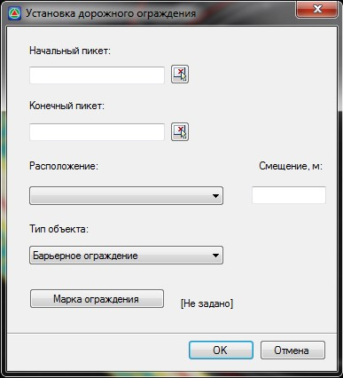
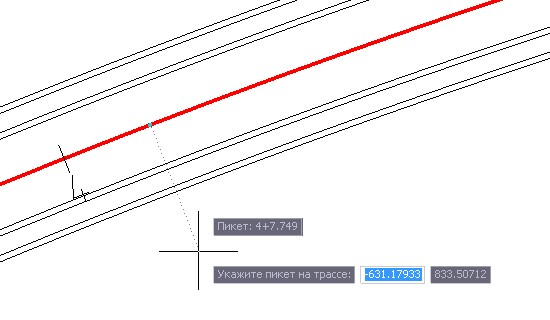
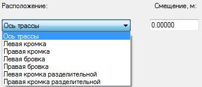
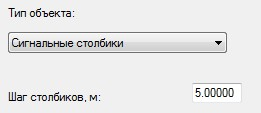
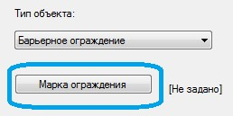
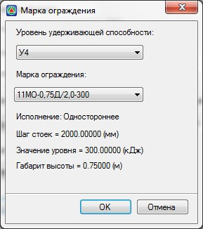
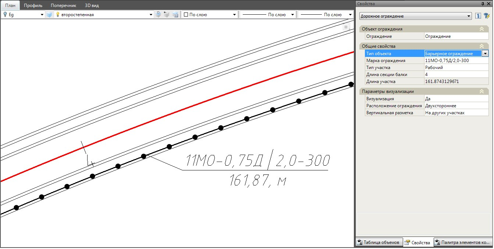

# Ввод дорожных ограждений

Рассматриваемый ниже способ позволяет последовательно и попикетно создавать участки дорожных ограждений, с помощью специального диалогового окна. Для этого выберите элемент меню **Задачи – Дорожные ограждения – Добавить дорожное ограждение**. Откроется диалоговое окно:

В поле **Начальный** и **Конечный пикет** задаются начало и конец участка дорожного ограждения. Пикетажное положение границ участка можно ввести вручную или указать графически на плане нажав пиктограмму  возле соответствующего поля. В данном случае курсор примет форму прицела и будет перемещаться вдоль текущей модели автомобильной дороги:

Левой кнопкой мыши укажите положение границы дорожного ограждения, его пикетажное значение автоматически отобразится в соответствующем поле диалогового окна.

В поле **Расположение** из выпадающего списка выберите элемент дороги, на котором будет располагаться дорожное ограждение, а в поле **Смещение** задайте смещение относительно выбранного элемента. Смещение со знаком “+” откладывается вправо от выбранного элемента по ходу пикетажа, смещение со знаком “-“ откладывается влево:

Далее укажите **Тип объекта**. В программе предусмотрены два типа объектов: Барьерные ограждения и Сигнальные столбики.

* Если в поле **Тип объекта** задать тип **Сигнальные столбики**, то необходимо указать шаг расстановки сигнальных столбиков в соответствующем поле:
  
  

* Если в поле **Тип объекта** задан тип **Барьерные ограждения**, то необходимо указать марку ограждений. Для этого нажмите кнопку **Марка ограждения**:

  

  Откроется диалоговое окно:

  

  В данном окне задайте вначале необходимый уровень удерживающей способности для создаваемого участка ограждения, а затем выберите соответствующую данному уровню марку барьерного ограждения.

  

  При выборе марки барьерного ограждения программа предлагает только те варианты, которые удовлетворяют заданному уровню удерживающей способности.

  

После задания всех параметров в окне **Установка дорожного ограждения** нажмите **ОК**.

В результате, созданный объект дорожного ограждения отобразится на плане:



Для ограждений созданных данных способом длина определяется по фактической длине лилии ограждения на плане и не округляется до целого количества секций, исходя из заданной марки ограждения.


