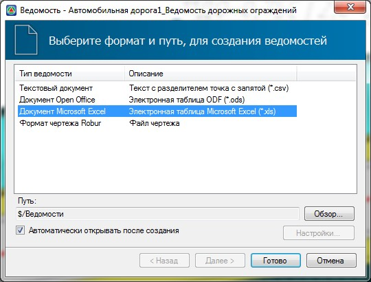
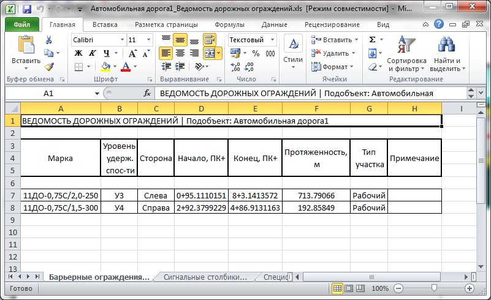

# Формирование ведомостей

Результирующими для подсчета объемов работ являются данные расположенные в таблице **Расстановка дорожных ограждений**, на вкладке **Итоговые участки**.

Для формирования ведомости расстановки дорожных ограждений:

1. Выберите элемент меню **Задачи - Дорожные ограждения - Ведомости - Ведомость ограждений**. Откроется мастер формирования ведомостей:

   

2. Выберите формат формируемой ведомости и нажмите **Готово**.

Программа создаст ведомость и откроет ее в соответствующем редакторе:

