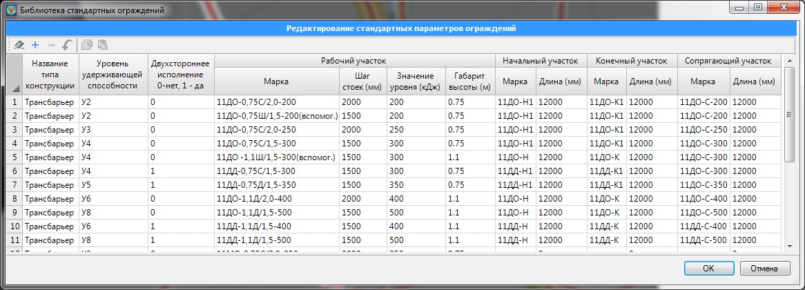

# Библиотека ограждений

В программе имеется встроенная библиотека стандартных ограждений. Данная библиотека может модифицироваться или дополняться пользователями. Для того, чтобы открыть библиотеку стандартных ограждений выберите элемент меню **Задачи – Дорожные ограждения – Библиотека стандартных параметров ограждений**. Откроется следующие окно:

При необходимости, дополните библиотеку новыми параметрами ограждений и нажмите **ОК**.