# Настройка параметров автоматического расчета дорожных ограждений

Для настройки параметров расчета при автоматической расстановки дорожных ограждений выберите элемент меню: **Задачи – Дорожные ограждения – Настройка параметров расчета**. Откроется диалоговое окно:

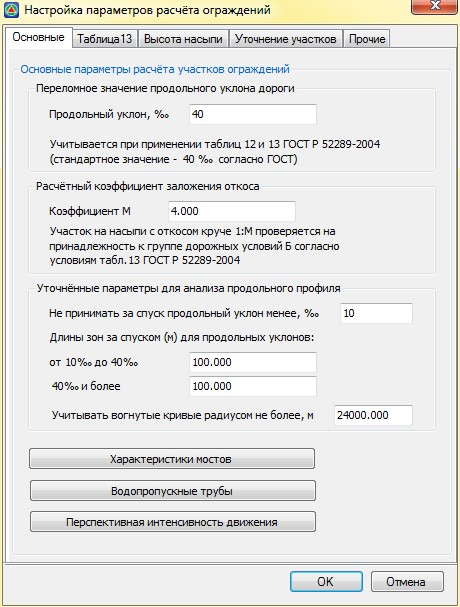

* На вкладке **Основные** пользователь имеет возможность поменять значения параметров используемых в таблицах 12 и 13 **ГОСТ Р 52289-2004**.

  В поле **Уточненные параметры для анализа продольного профиля** пользователь может уточнить ряд значений (понятий) из **ГОСТ Р 52289-2004**, которые используются при анализе продольного профиля трассы и могут быть неправильно истолкованы. Например, какой уклон принимать за спуск, учитывать ли вогнутые кривые больших радиусов (по геометрии вогнутая кривая большого радиуса схожа с прямой). Дополнительные параметры необходимые для расстановки дорожных ограждений и сигнальных столбиков пользователь может задать, нажав одну из кнопок в нижней части вкладки **Основные**.

   Для задания мостовых переходов, положение которых учитывается при автоматической расстановки ограждений, нажмите кнопку **Характеристики мостов**. Откроется диалоговое окно:

   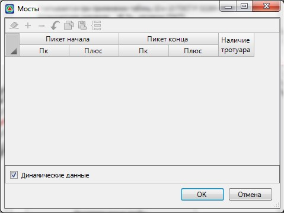

  По умолчанию данная таблица не доступна для редактирования, т.к. все параметры мостов задаются в соответствующей таблицы структуры проекта:

  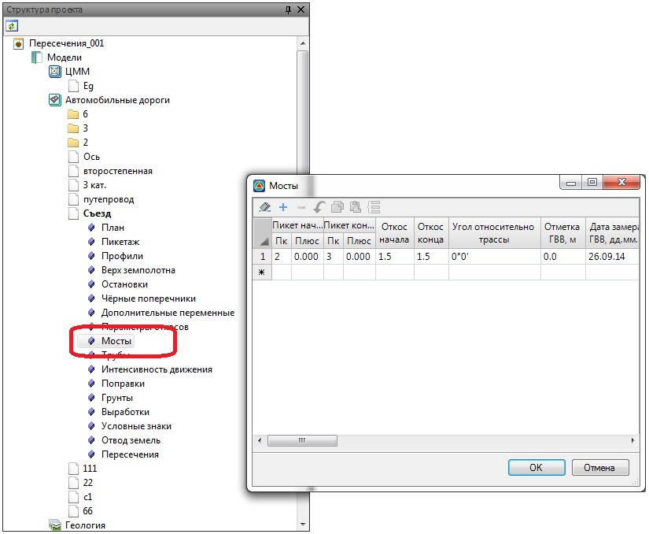

  Параметры задаваемые в общей таблице мостов учитываются также при их визуализации и отображении на профилях и сечениях. Изменение данных в этой таблице приводит к автоматическому обновлению локальной таблице мостов, которая используется исключительно для автоматической расстановки ограждений. Если же необходимо внести изменения именно в локальную таблицу, к примеру, если основная таблица не была изначально заполнена и нет необходимости задавать лишние параметры, которые не учитываются при расстановке ограждений снимите опцию **Динамические данные**:

  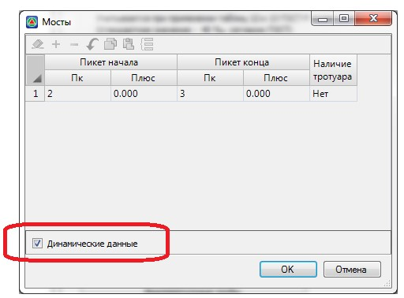

  Если опция **Динамические данные** снята, то данная таблица, влияющая исключительно на автоматический расчет ограждений, станет доступна для редактирования и не будет автоматически обновляться при изменении общей таблицы мостов.

  

  Наличие тротуара учитывается при назначении удерживающей способности ограждений. Если в поле наличие тротуара не задано ни одно значение, то программа считает что на данном мостовом переходе тротуар отсутствует.

  

  Для задания водопропускных труб, положение оголовков которых учитывается при автоматической расстановки ограждений, нажмите кнопку **Водопропускные трубы**. Откроется следующее окно:

  

  Аналогично мостовым сооружениям параметры водопропускных труб хранятся в основной таблице расположенной в структуре проекта:

  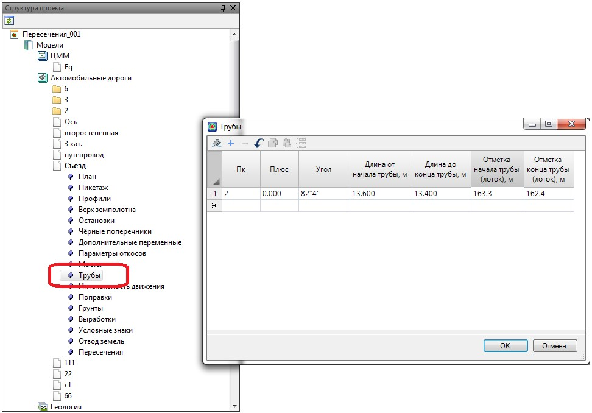

  

  Положение водопропускных труб может задаваться графически непосредственно в окнах План и Профиль, с автоматическим сохранением всех данных в вышеуказанную таблицу. Процедура создания и редактирования водопропускных труб описана в Томе9 Общие задачи, см.раздел [Создание водопропускных труб.](../../../commons_tasks/general_culverts/culverts.md)

  

  Аналогично таблицам мостовых сооружений, изменение данных в этой таблице приводит к автоматическому обновлению локальной таблице труб, которая используется исключительно для автоматической расстановки ограждений. Если же необходимо внести изменения именно в локальную таблицу, к примеру, если основная таблица не была изначально заполнена и нет необходимости задавать лишние параметры, которые не учитываются при расстановке ограждений снимите опцию **Динамические данные**:

  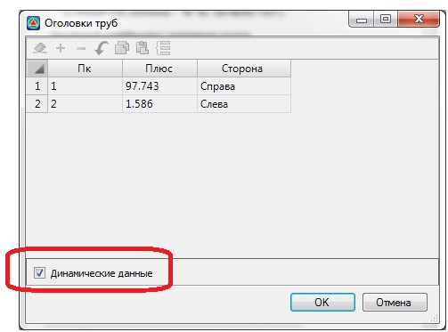

  Если опция **Динамические данные** снята, то данная таблица, влияющая исключительно на автоматический расчет ограждений, станет доступна для редактирования и не будет автоматически обновляться при изменении общей таблицы труб.

  Для задания интенсивности движения нажмите кнопку **Перспективная интенсивность движения**. Откроется следующее окно:

  

  Аналогично таблицам **Мосты** и **Трубы** данные по интенсивности движения в этой таблице по умолчанию не доступны для редактирования, т.к. рекомендуется их назначать в основной таблице расположенной в структуре проекта:

  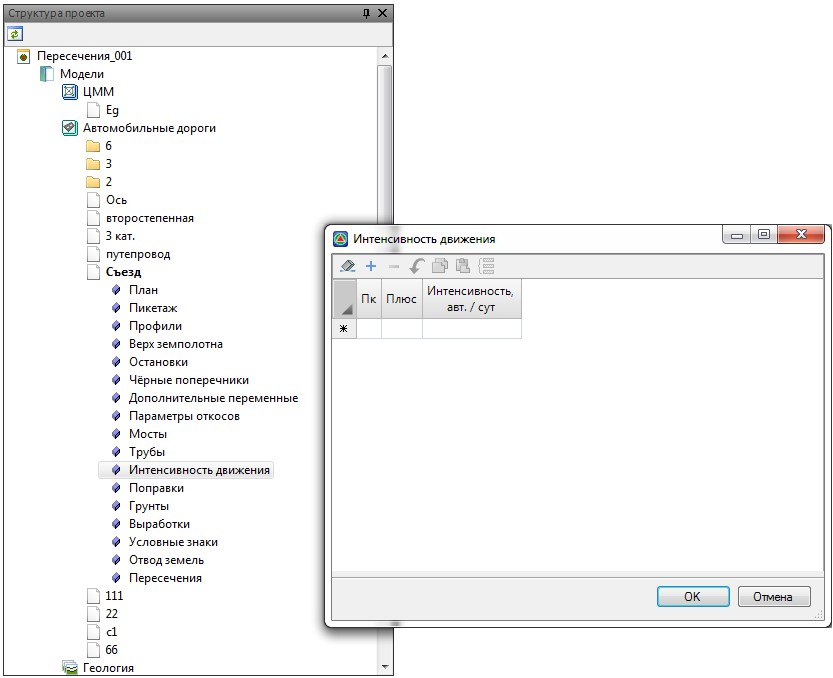

  Если же опция **Динамические данные** снята, то данная локальная таблица, влияющая исключительно на автоматическую расстановку ограждений станет доступна для редактирования и не будет автоматически обновляться при изменении основной таблицы интенсивности.

  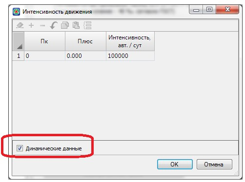

  

  Программа использует введенное значение интенсивности на участке до тех пор, пока не начнется следующий участок. Программа НЕ интерполирует значения из таблицы.

  

* На вкладке **Таблица 13** по аналогии с таблицей 13 ГОСТ Р 52289-2004 пользователь может с учетом интенсивности задать минимальную высоту насыпи для отнесения участков автомобильных дорог к группе Б.

  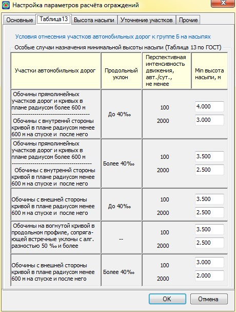

* На вкладке **Высота насыпи** в поле Параметры определения высоты насыпи задаются параметры, с которыми сравнивается фактическая высота насыпи для соответствующей стороны (слева или справа) с целью проверить принадлежность к группе Б.

  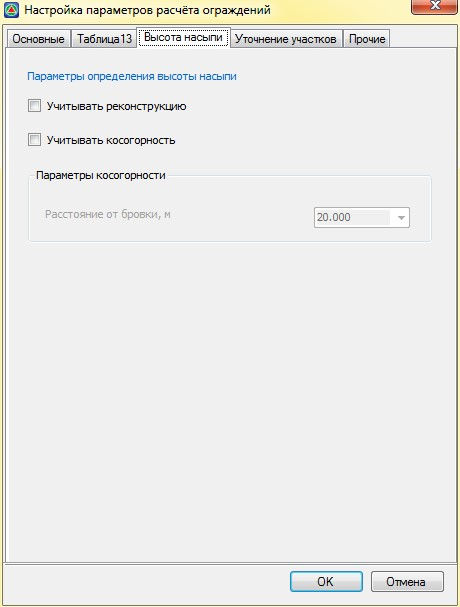

  Например, если на поперечнике фактическая высота насыпи слева больше указанной в таблице и откос слева круче 1:4, то тогда участок будет относиться к группе Б.

  * В зависимости от комбинации установленных опций возможны несколько схем расчета высоты насыпи. Если опции **Учитывать реконструкцию** и **Учитывать косогорность** не установлены, то высота насыпи считается как разность между отметками проектной бровки и подошвы (Нбр - Нпод.). Если на поперечнике запроектирован кювет, то высота насыпи считается как разность между отметками проектной бровки и дна кювета (Нбр - Ндна.к.):

    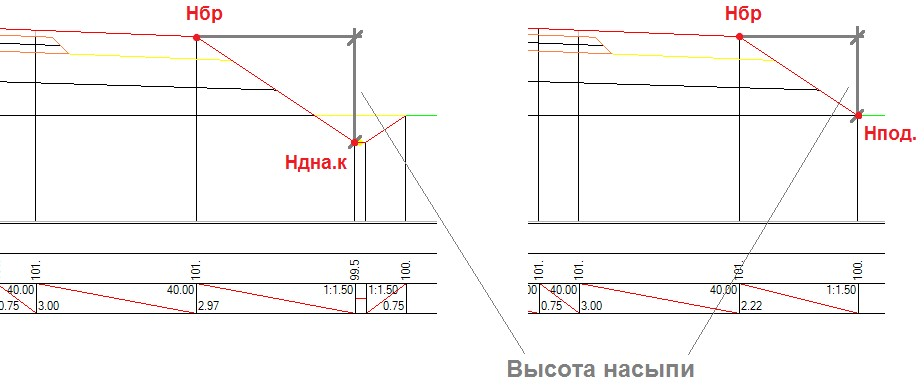

  * **Учитывать косогорность** - при этом режиме необходимо задать расстояние от бровки до точки Hм (точка на местности до которой рассчитывается уклон рельефа). В результате высота насыпи считается как разность отметок между проектной бровкой и точкой на местности (Нбр - Нм):

    

  

  1. Если значение Расстояния от бровки задано больше чем имеющаяся ширина полосы съемки поперечника, то в качестве расчетной точки Hм принимается самая крайняя точка линии черного поперечника.
  2. Если рассчитанная отметка точки Нм получится меньше чем отметка точек Нпод или Ндна.к. (отметки подошвы или отметки дна канавы\кювета), то высота насыпи рассчитывается как разность между бровкой и подошвой или дном кювета\канавы (Нбр - Нпод или Нбр - Ндна.к)

  

  Если установлена опция **Учитывать реконструкцию**, а опция **Учитывать косогорность** не установлена и проектный откос упирается в откос существующей насыпи (подошва существующего откоса должна иметь код 1), то высота насыпи рассчитывается как разность между проектной бровкой и подошвой существующей насыпи:

  

  

  1. Если опции Учитывать косогорность и Учитывать реконструкцию установлены одновременно, то в качестве итоговой высоты насыпи, берётся максимальное из рассчитанных значений.
  2. Если рассчитанная отметка точки существующей подошвы насыпи (точки с кодом 1) получится меньше чем отметка точек Нпод или Ндна.к. (отметки подошвы или отметки дна канавы\кювета), то высота насыпи рассчитывается как разность между бровкой и подошвой или дном кювета\канавы (Нбр - Нпод или Нбр - Ндна.к).

  

* На вкладке **Уточнение участков** в поле **Отступы** ограждений от определяющих линий положения задаются значения отступов от основных элементов дороги, принимаемые программой по умолчанию при их расстановке:

  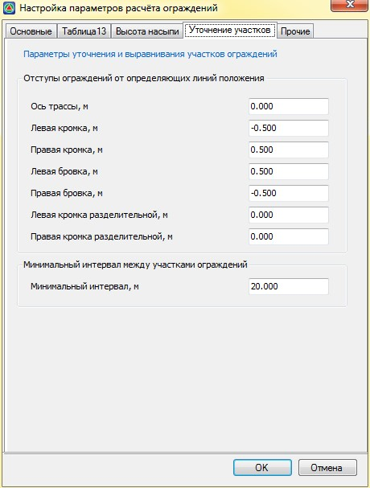

  В поле **Минимальный интервал между участками ограждения** задается минимальное расстояние между двумя участками барьерного ограждения, включая начальные и конечные участки. Если в процессе установки ограждения интервал между двумя участками ограждения с учетом начального и конечного участка составит менее заданного значения, то программа соединит два участка ограждений продлив участок с большей удерживающей способностью. Данный параметр учитывается на этапе округления длин участков барьерных ограждений, который описан [ниже](rounding_sections_barrier_fencing.md).

* На вкладке **Прочее** выбирается нормативный документ, согласно которого будет производиться автоматическая расстановка дорожных ограждений:

  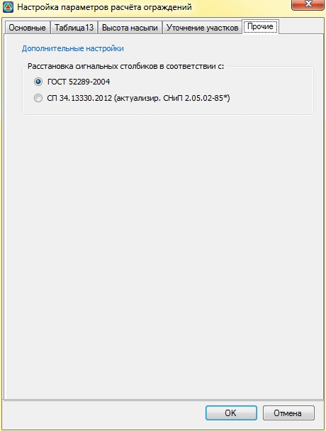
