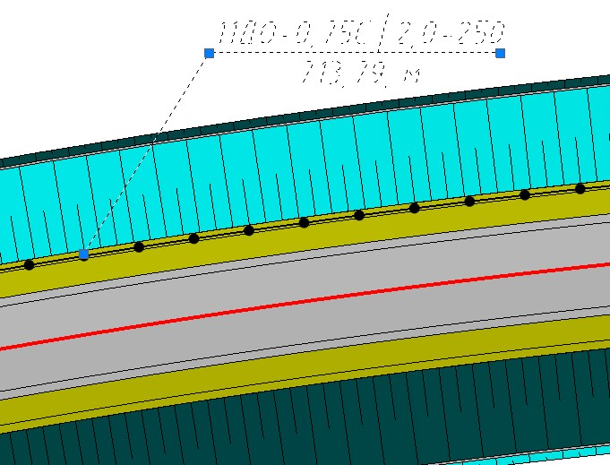
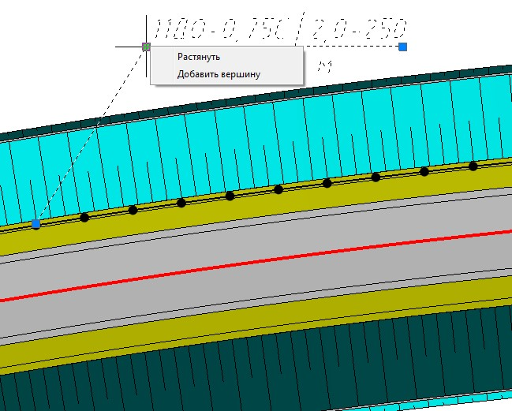
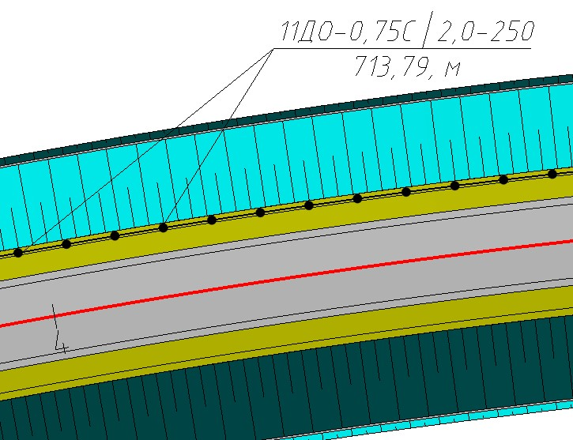
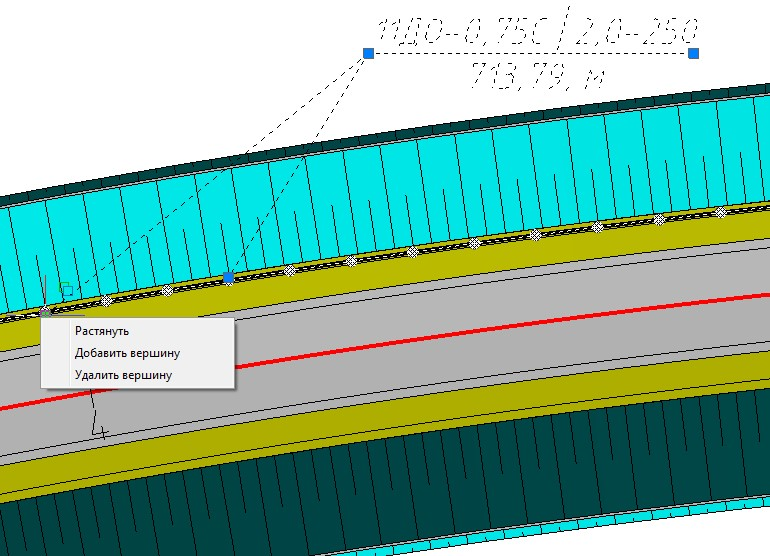

# Подпись ограждений и сигнальных столбиков

* Для того, чтобы подписать на плане ограждения или сигнальные столбики:

  1. Выберите элемент меню **Задачи – Дорожные ограждения – Подписать дорожные ограждения**. Курсор примет форму прицела.
  2. Укажите элемент **Дорожное ограждение** или **Сигнальные столбики** и место положения сноски на плане.

* Выделив выноску имеется возможность изменить ее положение а также повернуть полку выноски на нужный угол, для этого воспользуйтесь соответствующими синими ручками (грипами).

  

* При необходимости подписи одной выноской нескольких элементов дорожной разметки имеющих одинаковый номер, нажмите правой кнопкой мыши на соответствующем грипе:

  

  Выберите пункт **Добавить вершину**, далее укажите место вставки новой выноски:

  

  Для удаления сноски нажмите правой кнопкой мыши на соответствующем грипе, выбрав пункт **Удалить вершину**:

  