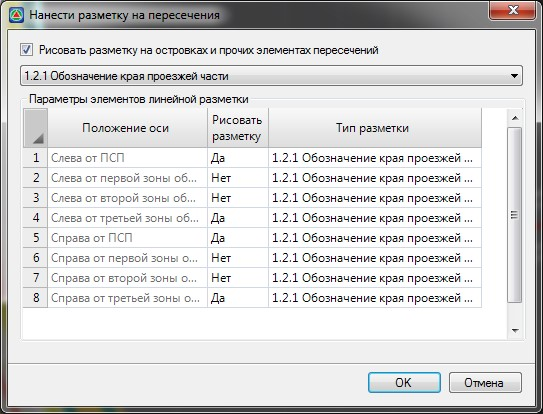

# Автоматическое создание разметки по границам полос

Данная функция позволяет выполнить групповую отрисовку линий разметок различных типов по границам полос проезжей части, а также контурам направляющих островков на пересечениях и примыканиях.

Для этого:

1. Воспользуйтесь функцией **Задачи - Обустройство - Дорожная разметка (архив) - Создать дорожную разметку по полосам**. Откроется следующие окно:

   

   В данном окне каждой границе какой-либо полосы может быть присвоен определенный тип разметки, который выбирается из выпадающего списка. Также, в верхней части данного окна из выпадающего списка может быть выбран тип разметки, которым будут отрисованы контуры островков на пересечениях развязках или съездах.

2. Задайте необходимые параметры создания разметки по полосам и нажмите **ОК**.

В результате программа создаст по заданным полосам текущей трассы разметки соответствующих типов.
