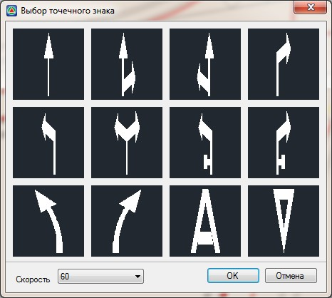
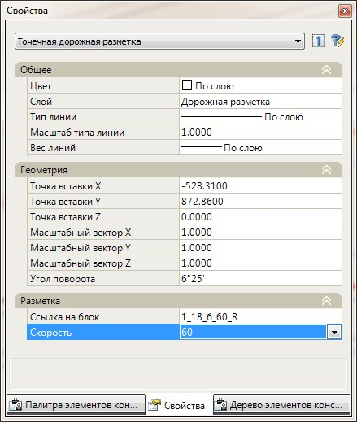
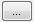

# Создание и редактирование точечной разметки

Для того, чтобы ввести объект точечной разметки:

1. Выберите элемент меню: **Задачи - Обустройство – Дорожная разметка (архив) – Ввести точечный знак дорожной разметки**. Откроется диалоговое окно:

   

2. Выберите в данном окне один из предложенных точечных знаков дорожной разметки и нажмите **ОК**.

3. Левой кнопкой мыши визуально укажите в графическом поле окна План точку вставки знака и его направление. В поле **Скоростной режим участка** задается предполагаемая скорость на данном участке.

   

   Параметры некоторых типов точечной разметки зависят от скоростного режима участка дороги.

   

В результате объект точечной разметки будет создан и отрисован в окне **План**.

Для изменения свойств предварительно созданного объекта точечной разметки, выделите его левой кнопкой мыши. Его основные параметры отобразятся в стандартном окне свойства:

В группе полей с наименованием **Геометрия** могут быть изменены:координаты базовой точки объекта, его масштабный коэффициент по каждой из координатной оси, а также угол поворота относительно оси X. Данные параметры могут задаваться визуально с помощью специальной кнопки, которая отображается при выборе соответствующего поля.

**Ссылка на блок** - при необходимости замены объекта точечной разметки на другой, выделите данное поле и нажмите кнопку  . В открывшемся окне Выбор точечного знака выберите требуемый точечный объект и нажмите ОК.

**Скорость** - в данном поле может быть изменено значение скоростного режима на участке где расположен выбранный объект точечной разметки.
