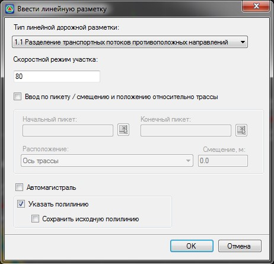

# Создание дорожной разметки

Дорожная разметка представляет собой набор линейных объектов. Они могут задаваться табличным способом, а также с помощью специальных диалоговых окон, с последующим сохранением их в таблицу дорожной разметки. Рассмотрим эти процедуры более подробно:

Для создания линейной разметки:

1. Выберите элемент меню **Задачи - Обустройство - Дорожная разметка(архив) - Ввести линейную разметку**. Откроется следующее диалоговое окно:

   

   **Тип линейной дорожной разметки** - из выпадающего списка выберите соответствующий тип разметки, который необходимо создать или назначить уже имеющемуся линейному объекту.

   **Скоростной режим участка** - в данном поле задайте предполагаемую скорость движения на данном участке.

   

   Параметры некоторых типов разметки зависят от скоростного режима участка дороги.

   

   **Автомагистраль** - установите данную опцию, если участок проектируемой дороги является автомагистралью.

   

   Параметры некоторых типов разметки (например, тип 1.8 Обозначение границы между полосой разгона или торможения и основной полосой проезжей части) зависят от того, является ли автомобильная дорога магистралью или нет.

   

   Ввод дорожной линейной разметки может осуществляться следующими взаимоисключающими способами:

   * По пикету/смещению относительно трассы.
   * Путём выбора линейного объекта, на основе которого требуется создать разметку (или путём непосредственного поточечного ввода полилинии).

   **Указать полилинию** - установите данную опцию, если необходимо назначить разметку из уже существующего линейного объекта (трассы, границы полосы, полилинии и т.п.). При этом, если после создания объекта разметки исходный контур полилинии необходимо сохранить, дополнительно установите опцию Сохранять исходную полилинию. Если сняты обе эти опции, то будет осуществляться последовательный поточечный ввод линейной разметки.

   **Ввод по пикету/смещению и положению относительно трассы** - если данная опция установлена, то группа опций Указать полилинию и Сохранять исходную полилинию станет неактивной, а для ввода станут доступны следующие дополнительные поля:

   **Начальный и Конечный пикет** - задается начальный и конечный пикет участка, на котором будет отрисована разметка. При условии, что линейный объект, на котором назначается разметка, является границей полосы проезжей части, полосы обочины или краем разделительной полосы.

   

   Начальный и конечный пикет можно задать графически. Для этого щелкните по кнопке  расположенной рядом с соответствующим полем. Курсор примет форму прицела и будет перемещаться вдоль текущей трассы, объектам которой назначается разметка. Щелкните левой кнопкой мыши в той точке, которая будет являться начальной или конечной для создаваемого участка разметки. Программа автоматически определит пикетажное положение указанной точки и отобразит его в соответствующем поле.

   

   **Расположение** - из выпадающего списка выберите наименование границы полосы, по которой будет создана разметка.

   **Смещение** - в данном поле задайте значение расстояния, если необходимо чтобы разметка отрисовывалась параллельно выбранной полосе, но была смещена относительно нее на определенное расстояние.

2. Задайте необходимые параметры создания разметки и нажмите **Ок**.

3. Далее в зависимости от установленных параметров создания линейной разметки будет необходимо:

   * Левой кнопкой мыши укажите в графическом поле окна **План** линейный объект, по которому будет назначаться разметка (если при ее создании была установлена опция указать полилинию ).
   * Самостоятельно отрисуйте линейную разметку на плане, указывая левой кнопкой мыши на плане ее характерные точки (если при ее создании была снята опция указать полилинию ).
   * Если при создании разметки была установлена опция **Ввод по пикету смещению и положению трассы** и заданы все необходимые параметры, то на данном этапе никаких дополнительных действий не требуется.

В результате на заданном участке будет создан объект линейной разметки.
