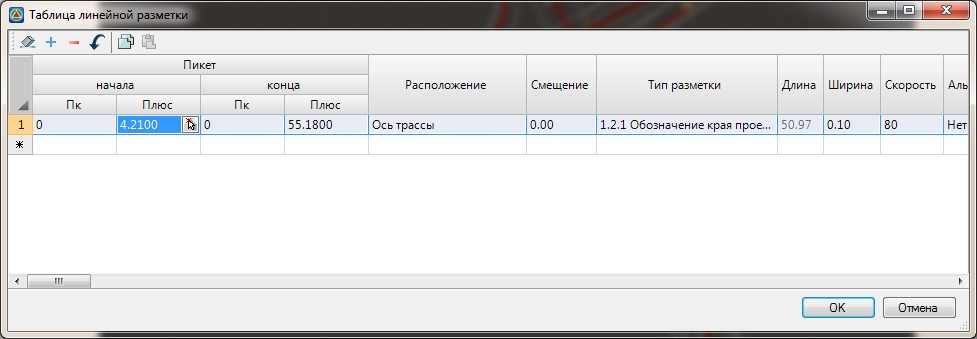

# Создание и редактирование разметки табличным способом

Для того чтобы создать новый участок линейной разметки или отредактировать существующий табличным способом:

1. Выберите элемент меню **Задачи - Обустройство - Дорожная разметка (архив) - Таблица линейной разметки**. Откроется следующая таблица:

   

   Каждая строка этой таблицы описывает один объект линейной дорожной разметки. В эту таблицу автоматически попадают все объекты линейной разметки , независимо от того каким способом они создавались. Визуальное удаление объекта разметки на плане, приводит к удалению соответствующей записи из таблицы и наоборот.

   Все основные параметры, задаваемые в столбцах данной таблицы, были описаны ранее в разделе [Создание линейной разметки](create_road_marking.md).

   

   В столбце Альтернативный вид выбирается способ отрисовки разметки. К примеру, у разметки двойного типа в зависимости от установленного данного признака будет определяться с какой стороны от сплошной линии необходимо отрисовать штриховую линию.

  

   Для группового изменения, какого либо параметра, например типа разметки, у нескольких объектов одновременно, выделите эти участки в таблице и измените требуемые параметры.

2. Задайте или измените в таблице линейной разметки необходимые параметры и нажмите **ОК**.

В результате, программа пересоздаст те объекты линейной разметки, параметры которых были изменены в выше описанной таблице.
