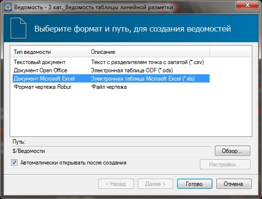

# Создание ведомости объемов по дорожной разметке

Программа позволяет формировать ведомости дорожной разметки следующих типов:

* **Общая ведомость разметки** – в нее входят суммарные объемы, а именно: длины участков и площади окрашиваемых поверхностей, по всем типам разметки, которые присутствуют на заданном участке.
* **Ведомость линейной разметки** - в нее входит подробное описание всех участков линейной разметки каждого типа, такие как: начальный и конечный пикет участка, его положение и длина.

Для создания ведомости по дорожной разметке:

1. Выберите элемент меню **Задачи – Дорожная разметка – Ведомости-…**.

2. В открывшемся мастере выберите необходимый формат формируемой ведомости:

   

   

   При формировании ведомостей определенного типа необходимо будет дополнительно указать на плане область участка, в пределах которого будет формироваться ведомость разметки.

   

3. Нажмите **Готово**

В результате программа сформирует ведомость разметки и откроет ее в соответствующем редакторе.
