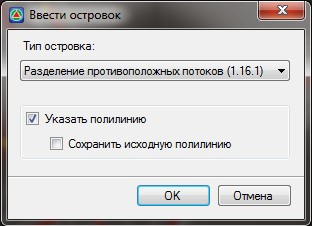
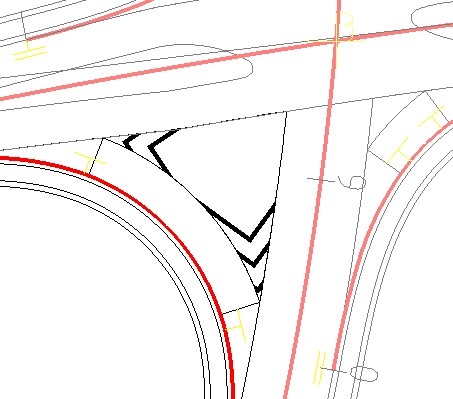

# Создание площадной разметки

Для площадной разметки внутри островка безопасности, необходимо указать контур островка, как правило, изначально он представлен в виде полилинии и положение направляющей, относительно которой будут ориентироваться линии разметки.



До использования данной функции рекомендуется предварительно отрисовать контуры островков на пересечениях. Для этого может быть использована функция [Создать дорожную разметку по полосам](automatic_creating_markup_on_limits_bands.md), которая была описана ранее.



Для создания площадной разметки:

1. Выберите элемент меню **Задачи - Обустройство – Дорожная разметка (архив) – Добавить островок**. Откроется следующие диалоговое окно:

   

   **Тип островка** - из выпадающего списка выберите тип разметки, которая будет отрисована внутри выбранного контура.

   **Указать полилинию** – если данная опция установлена, то после выхода из данного диалогового окна необходимо будет указать исходный контур островка. В противном случае, контур необходимо будет нарисовать самостоятельно.

   **Сохранить исходную полилинию** - если данная опция не установлена, то после создания контура островка и его штриховки исходная полилиния будет удалена.

2. Задайте необходимые параметры создания островка и нажмите **ОК**.

3. Далее в зависимости от установленных параметров создания островка будет необходимо:

   * Левой кнопкой мыши укажите в графическом поле окна **План** контур полилинии или островка, внутри которого будет строиться разметка (если при ее создании была установлена опция указать полилинию).
   * Самостоятельно отрисуйте контур островка на плане, указывая левой кнопкой мыши его характерные точки (если при ее создании была снята опция указать полилинию).

4. Далее, левой кнопкой мыши укажите внутри островка начальную и конечную точку направляющей, относительно которой будет рисоваться площадная разметка.

В результате, внутри заданного контура будет создана площадная разметка определенного типа.

При необходимости нанести на островок несколько видов штриховки, несколько раз задайте площадную разметку, указав один контур и несколько направляющих.

