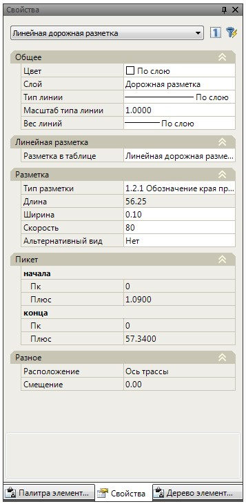
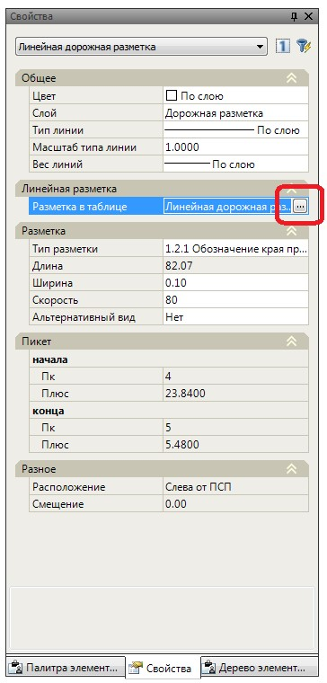
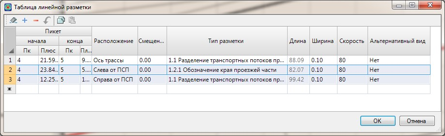

# Редактирование линейной разметки через стандартное окно Свойства

Для быстрого изменения параметров дорожной разметки:

1. Выделите на плане объект или группу объектов линейной разметки, свойства которых необходимо изменить. Их параметры отобразятся в окне **Свойства**:

   

2. Измените в данном окне требуемые параметры выбранного объекта.

Часть данных в этих полях является информационными и недоступными для редактирования. Т.к. при изменении определенных базовых свойств разметки, таких как: начальный/конечный пикет, расположение, её геометрия будет полностью пересоздана на основе определяющей линии положения (т.е. кромки разделительной, полосы пр. части, зоны обочины и т.п.). При этом часть корректив, которые могли быть произведены над линией разметки после ее создания, будут утеряны (к примеру, редактирование геометрии разметки с помощью грипов).

Если все же необходимо изменить такие параметры разметки как ее начальный/конечный пикет или расположение, то для этого воспользуйтесь одним из следующих способов:

1. Выделите левой кнопкой мыши на плане объект линейной разметки, который необходимо изменить.
2. Щелкните правой кнопкой мыши и выберите из появившегося контекстного меню пункт **Редактировать разметку**.
3. В открывшемся окне измените параметры разметки и нажмите **ОК**.

В результате объект линейной разметки будет полностью пересоздан с учетом измененных параметров.

* Выделите в окне **Свойства** поле **Разметка** в таблице и нажмите соответствующую кнопку:

  

Откроется базовая **Таблица линейной разметки**, в которой занесены все объекты линейной дорожной разметки, которые содержит текущая модель.

При этом редактируемый объект или группа объектов линейной дорожной разметки будут выделены в общем списке таблицы:



1. Таблицу линейной разметки можно также открыть через контекстное меню, нажав правой кнопкой мыши после того как объект дорожной разметки будет выделен левой кнопкой мыши.
2. Основные принципы работы с данной таблицей будут описаны далее в разделе [Создание и редактирование разметки табличным способом](creating_and_editing_tabular_markup_method.md).



Измените необходимые параметры разметки и нажмите **Ок**.

В результате объекты линейной разметки, параметры которых были изменены в выше описанной таблице, будут пересозданы.

Для модификации контуров разметки с плана могут использоваться все базовые функции редактирования объектов (меню Редактировать),

Однако, как уже было сказано выше, при пересоздании линейной разметки табличным способом или через диалоговое окно Ввести линейную разметку, эти коррективы могут быть утеряны.