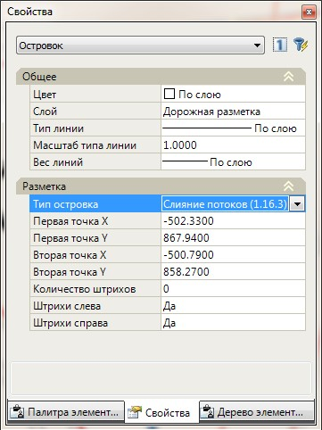
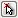

# Редактирование площадной разметки

При редактировании параметров площадной разметки также может быть использовано стандартное окно свойств выбранного объекта:

**Тип островка** - при необходимости из выпадающего списка выберите другой тип площадной разметки, который необходимо назначить выбранному площадному объекту.

**Первая точка X,Y и Вторая точка X,Y** - в данных полях задаются координаты направляющей, относительно которой рисуются линии разметки. При необходимости они могут быть изменены, в том числе графическим способом, с помощью кнопок  , которые отображаются при выделении соответствующего поля или за грипы с плана.

**Количество штрихов** - по умолчанию штрихи площадной разметки рисуются на протяжении всей длины направляющей. Задайте в данном поле необходимое значение, если нужно чтобы у островка отрисовывалось определенное количество штрихов.

**Штрихи слева и Штрихи справа** - по умолчанию штрихи площадной разметки рисуются с обеих сторон направляющей. Если же в данном поле установить признак нет, то для разметки 1.16.2 или 1.16.3 штрихи не будут отрисовываться с соответствующей стороны относительно направляющей.