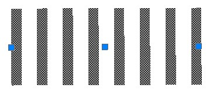
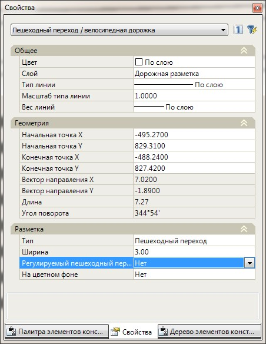
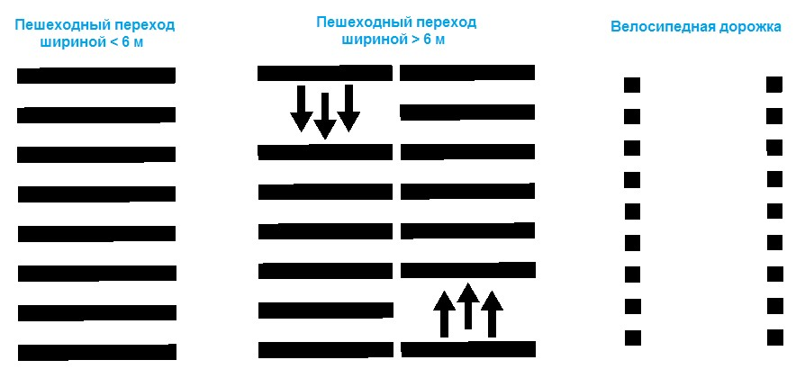
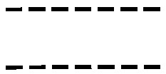
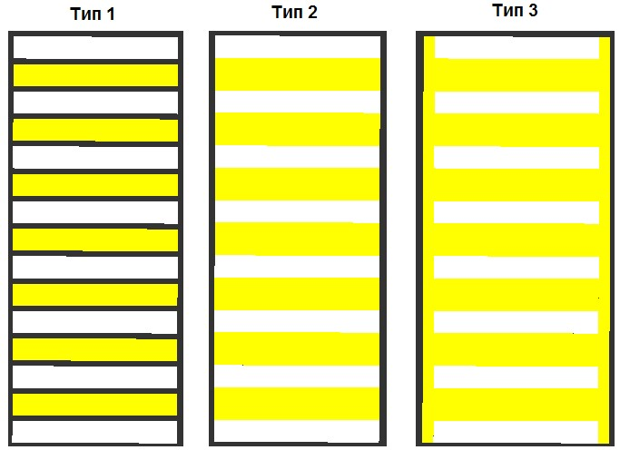
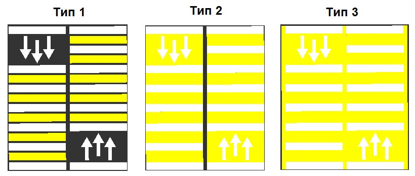

# Разметка пешеходных переходов и велосипедных дорожек

Для того, чтобы задать пешеходный переход:

1. Выберите элемент меню **Задачи - Обустройство – Дорожная разметка (архив) – Добавить пешеходный переход**. Курсор примет форму прицела.

2. Укажите левой кнопкой мыши на плане начальную и конечную точку оси пешеходного перехода.

В результате, пешеходный переход будет отрисован на плане.

При необходимости изменения его длины или положения выделите пешеходный переход на плане левой кнопкой мыши. На нем отобразятся характерные точки синего цвета (грипы), их положение можно менять визуально на плане. Перемещение крайних грипов позволяет менять длину и ориентацию пешеходного перехода, а перемещение центрального грипа приводит к параллельному смещению самого перехода.

Для изменения свойств предварительно созданного объекта пешеходного перехода, выделите его левой кнопкой мыши. Его основные параметры отобразятся в стандартном окне свойства:

В группе полей с наименованием **Геометрия** могут быть изменены: координаты начальной и конечной точки объекта.

**Тип и Ширина** - в зависимости от параметров заданных в данных полях имеется возможность отрисовать дорожную разметку «**велосипедная дорожка**», а также различные типы пешеходного перехода:



Для того, чтобы задать велосипедную дорожку, в поле Тип установите параметр Велосипедная дорожка. В зависимости от заданного значение ширины пешеходного перехода, он также будет иметь различное изображение.



**Регулируемый пешеходный переход** - выберите параметр «**Да**» если необходимо отрисовать тип дорожной разметки «**регулируемый пешеходный переход**»:

**На цветном фоне, Тип фона, Цвет фона** - возможность отрисовки типа дорожной разметки «**Пешеходный переход**» на цветном фоне (например на желтом), с возможностью использования различных вариантов заливки выбранным цветом:

