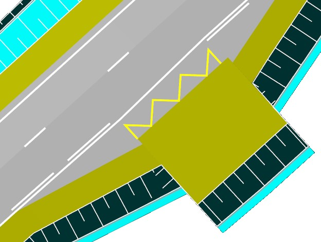

# Дорожная разметка (Место остановки)

Для того чтобы отрисовать разметку **Место остановки**:

1. Выберите элемент меню **Задачи - Обустройство – Дорожная разметка (архив) – Добавить место остановки**. Курсор примет форму прицела.
2. Укажите левой кнопкой мыши на плане начальную и конечную точку разметки.

В результате дорожная разметка будет отрисована на плане:

