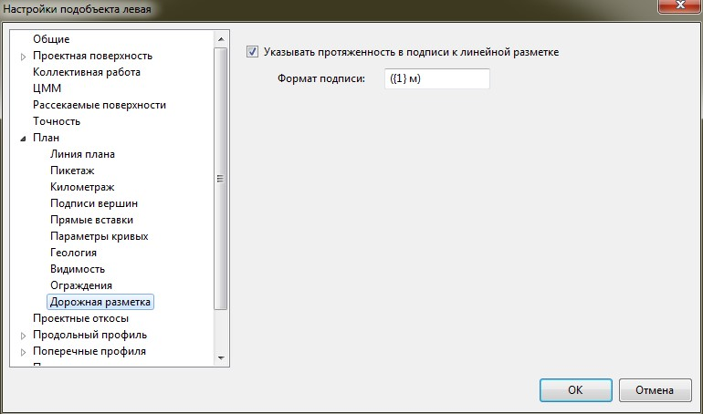
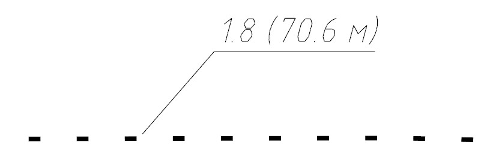

# Настройка подписи дорожной разметки

Для настройки подписи дорожной разметки:

1. В **Структуре проекта** нажмите правой кнопкой мыши на текущем подобъекте **Автомобильной дороги**, выберите пункт **Настройки**.
2. В открывшемся окне **Настроек** перейдите в раздел **Дорожная разметка**:

   

   При необходимости указания протяженности в подписи линейной разметки включите соответствующую опцию.

   В строке **Формат подписи** параметр **{1}** – выносит данные по длине линейной разметки.

   При необходимости можно добавить префиксы, суффиксы или заключить параметр в скобки.

В результате подпись линейной разметки будет иметь вид:

