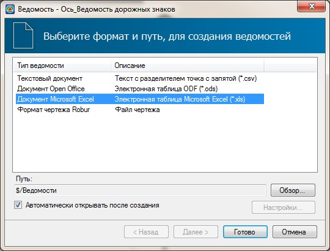
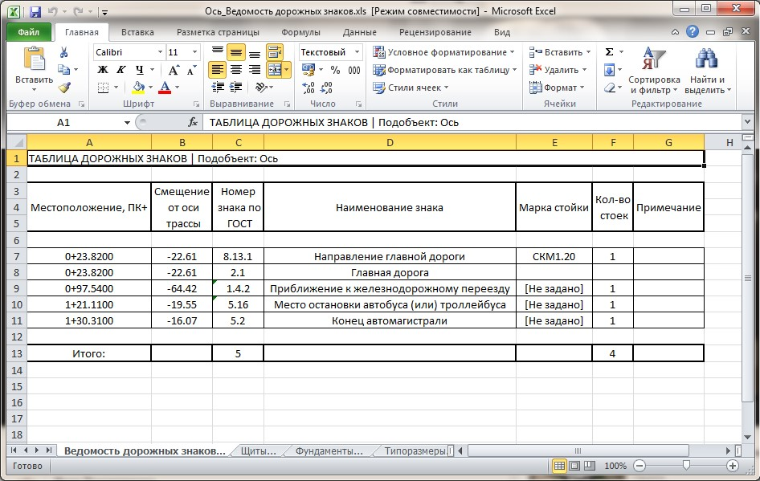

# Создание выходных ведомостей

Для формирования ведомости содержащей информацию по всем основным характеристикам дорожных знаков, которые относятся к текущей трассе выполните следующие действия:

1. Выберите элемент меню **Задачи - Дорожные знаки - Ведомость дорожных знаков**.

   Откроется мастер формирования ведомости:

   

   Выберите формат формируемой ведомости и нажмите **Готово**.

В итоге программа сформирует ведомость дорожных знаков и откроет ее в соответствующем редакторе:

Данная ведомость содержит несколько вкладок, на которых находится информация о параметрах таких элементов знаков как: щиты, стойки и фундаменты. На основной вкладке ведомости представлена информация о местоположении знаков, их наименовании и их количестве.
