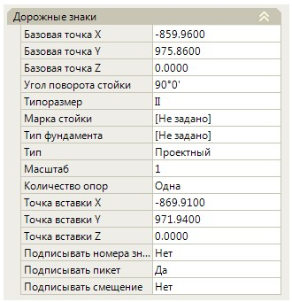
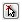
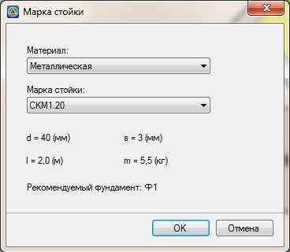
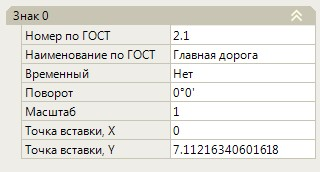

# Редактирование параметров дорожного знака через окно Свойства

Часть выше описанных параметров дорожного знака, а также дополнительные информационные характеристики, можно редактировать в окне свойств выбранного объекта.

Для этого, выберите левой кнопкой мыши знак или группу знаков, параметры которых необходимо изменить, его (их) характеристики отобразятся в окне **Свойства**:

В группе **Дорожные знаки** могут задаваться следующие параметры:

**Базовая точка X,Y,Z** - координаты базовой точки знака. Ее изменение приводит к изменению местоположения условного обозначения знака на плане, но не к изменению фактических координат или пикетажного положения самого объекта. Координаты базовой точки могут задаваться графически. Для этого выделите поле с соответствующей координатой и нажмите кнопку  , курсор примет форму прицела, укажите в окне План требуемое положение базовой точки.

**Угол поворота стойки** - в данном поле задается значение угла поворота стойки знака относительно горизонтальной оси. Угол поворота также может задаваться визуально.

**Типоразмер** - из выпадающего списка выберите необходимый типоразмер знака по изготовлению. Данный параметр влияет на размер изображения знака на плане, а также учитывается при формировании выходных ведомостей и спецификаций.

**Марка стойки** - выбирается из встроенной библиотеки и учитывается при формировании выходных ведомостей и спецификаций. Для задания марки стойки:

1. Выделите данное поле и нажмите кнопку  .Откроется следующие окно:

   

2. Из выпадающих списков последовательно выберите материал стойки и соответствующую ему марку.
3. Нажмите **ОК**.

**Тип фундамента** - данный параметр выбирается из выпадающего списка. Он учитывается при формировании выходных ведомостей и спецификаций.

**Тип** - данный параметр выбирается из выпадающего списка. Он учитывается при формировании выходных ведомостей и спецификаций.

**Масштаб**- в данном поле задается значение масштабного коэффициента дорожного знака. Влияет на его размер при отображении на плане.

**Количество опор** - данный параметр выбирается из выпадающего списка. Влияет на отображение знака на плане, при визуализации, а также учитывается при формировании выходных ведомостей и спецификаций.

**Точка вставки X,Y,Z** - координаты точки вставки объекта дорожного знака. Изменение положения этой точки может приводить к изменению координат или пикетажного положения знака в модели. При этом положение условного обозначения дорожного знака на плане может оставаться неизменным, для этого используются параметры, задаваемые в полях **Базовая точка X,Y,Z**.

**Подписывать номера знаков, пикеты, смещения** - при установлении в данных полях параметра Да, данные элементы будут подписываться на плане, рядом с дорожным знаком.

В группе **Параметры визуализации** задаются характеристики знака, которые учитываются исключительно при визуализации проектного решения. Они не учитываются при формировании выходных документов.

В группах **Знак№** задаются параметры всех щитов, которые содержит выбранный знак.

Эти характеристики влияют на отображения щитов на плане или участвуют при формировании выходных ведомостей или спецификаций:

**Номер по ГОСТ, Наименование по ГОСТ** - имеется возможность изменить номер и наименование знака. Данные поля ввода заполняются на этапе добавления знака.

**Временный** - данный параметр учитывается при формировании выходных ведомостей.

**Поворот** - задается угол поворота щита относительно стойки знака.

**Масштаб** - задается масштаб щита.

**Точка вставки Х и У** - задаются координаты расположения щита относительно стойки знака.
