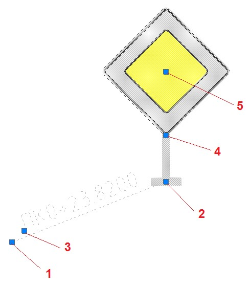
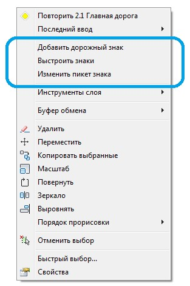
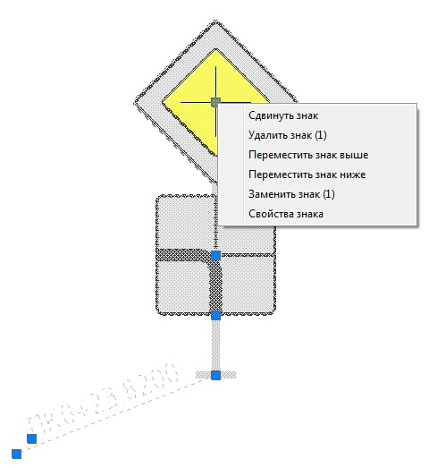
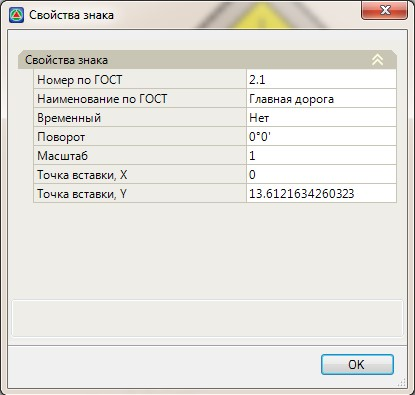

# Редактирование дорожных знаков

Положение дорожного знака на плане можно редактировать визуально.

Для этого, выделите объект левой кнопкой мыши, на нем отобразятся характерные точки (грипы):

С помощью данных грипов можно выполнять следующие действия над знаками:

* 1 - Изменение пикетажного положения и смещения стойки со знаком относительно текущей трассы, а также его координат. Т.е. перемещение данной точки вставки приводит к изменению положения самого объекта в текущей модели.
* 2 - Изменение расположения условного знака на чертеже. При наложении на ситуационном плане нескольких знаков, они могут быть смещены друг относительно друга с помощью данного грипа.

   

   При этом реальное местоположение знака в модели (координаты, пикетаж и смещения) останутся неизменными.

   

* 3 - Изменение местоположение подписи пикетажного положения знака.
* 4 - Изменение угла поворота условного знака на плане.
* 5 - Изменение местоположения знака (щита) относительно стойки на плане.

Местоположение знака, а также добавление дополнительных щитов на стойку можно осуществлять следующим способом:

* Левой кнопкой мыши выделите объект дорожного знака на плане и щелкните правой кнопкой мыши.

  Из появившегося контекстного меню выберите необходимую команду:

  

* **Добавить дорожный знак** - используется для добавления дополнительных щитов знаков на выбранную стойку.

  При этом открывается стандартная библиотека дорожных знаков, из которой можно выбрать требуемую марку знака. Основные способы выбора знаков из библиотеки были описаны ранее в разделе вставка дорожных знаков.

  

  Также, для добавления дополнительного щита на стойку можно воспользоваться функцией вставки нового дорожного знака, после чего, на этапе указания его местоположения щелкните правой кнопкой мыши и выберите из появившегося контекстного меню пункт Добавить на стойку. 

  

* **Выстроить знаки** – как уже было сказано ранее, знаки (щиты) можно располагать произвольным образом относительно друг друга и стойки. Например, в несколько уровней или несколько знаков в одном уровне. Данная функция позволяет расположить знаки на стойке строго вертикально друг под другом. В том порядке, в котором они создавались.
* **Изменить пикет знака** - функция позволяет задать другое пикетажное положение и смещение стойки дорожного знака относительно текущей трассы. При выборе данной функции, курсор принимает форму прицела, после чего предлагается указать ее новое положение визуально или задать пикетажное положение и смещение в строке динамического ввода. Основные способы задания положения знака на плане описаны ранее в разделе вставка дорожных знаков.

Местоположение знаков (щитов) помимо визуального способа, можно изменять следующим образом:

1. Выделите левой кнопкой мыши объект дорожного знака на плане.
2. Щелкните правой кнопкой мыши по центральной точке щита, появится следующее контекстное меню:

   

**Сдвинуть знак** - визуальное перемещение знака, относительно стойки и других знаков на ней.

**Удалить знак** – удаление выбранного знака. Функция доступна при условии расположения нескольких знаков на стойке.

**Переместить знак выше/ниже** – перемещение знака на один уровень вверх или вниз. Функция доступна при условии расположения нескольких знаков на стойке.

**Заменить знак** - при выборе данной опции открывается библиотека стандартных знаков, из которой можно выбрать другую марку знака. Основные способы выбора знаков из библиотеки были описаны ранее в разделе вставка дорожных знаков.

**Свойства знака** - при выборе данной опции открывается окно основных параметров знака, при необходимости они могут быть изменены:

