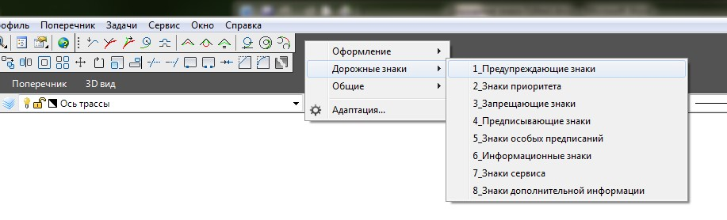
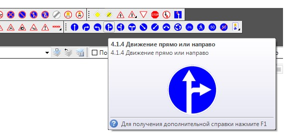
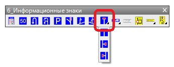
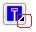

# Вставка дорожных знаков с помощью панелей ввода

Дорожные знаки удобно вводить с помощью специальных панелей.

Для открытия панели дорожных знаков определенной группы:

1. Щелкните правой кнопкой мыши на панели инструментов, откроется контекстное меню:

   

2. Каждая панель содержит в себе набор дорожных знаков определенной категории. Левой кнопкой мыши установите опции напротив тех панелей, которые необходимо открыть. В результате данные панели отобразятся, расположите их удобным для работы образом:

   

3. Для вставки дорожного знака с панели нажмите левой кнопкой мыши соответствующую пиктограмму. 

   

   

   Некоторые знаки одного типа, выбираются из выпадающего списка, появляющегося при нажатии левой кнопкой мыши и удержания ее короткий промежуток времени, на пиктограмме у которой имеется в нижней правой части треугольный значок

   

4. Укажите положение дорожного знака на плане одним из способов, которые были описаны ранее.
