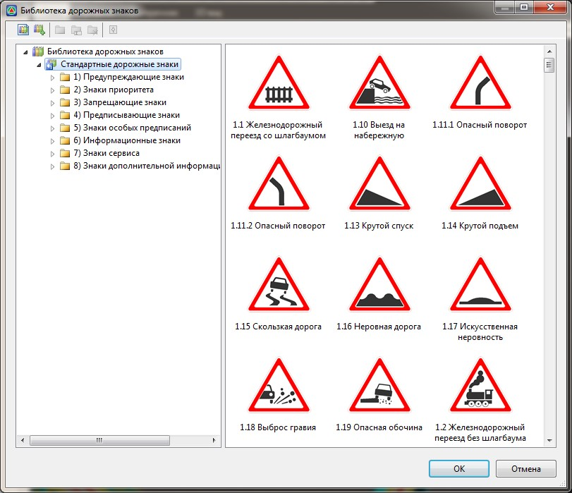
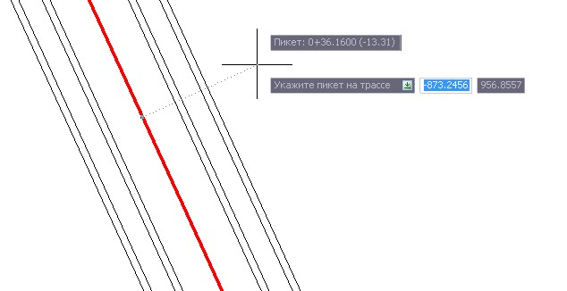
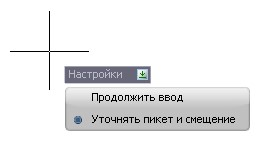
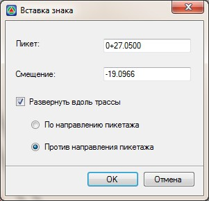
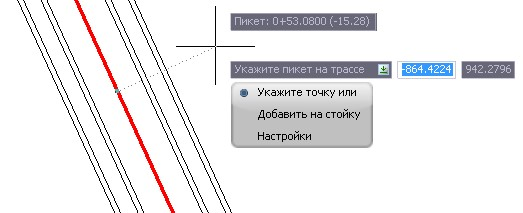

# Вставка стандартных дорожных знаков через стандартную библиотеку

В программе предусмотрена специальная библиотека, которая содержит основной набор стандартных дорожных знаков. При необходимости содержимое данной библиотеки может дополняться. Последовательность редактирования библиотеки знаков будет описана далее.

Для того чтобы вставить дорожный знак на план:

1. Выберите элемент меню **Задачи - Дорожные знаки - Вставить дорожный знак**. Откроется следующая библиотека:

   

	В левой стороне окна представлен полный набор дорожных знаков библиотеки, в виде древовидной структуры. При выборе какой-либо группы или подгруппы из списка, все входящие в нее знаки отображаются в графическом поле данного окна.

2. Для вставки дорожного знака в ситуационный план воспользуйтесь одним из следующих способов:

   * Выберите необходимую группу или подгруппу дорожных знаков. Далее, в графическом поле окна щелкните дважды левой кнопкой мыши по изображению соответствующего знака.
   * Полностью раскройте дерево дорожных знаков для заданной группы и выберите необходимый дорожный знак из списка, затем нажмите кнопку **Выбрать**.
   * В поле поиска, которое расположено в левой верхней части окна введите номер дорожного знака либо его наименование. Все знаки соответствующие критерию поиска отобразятся в графическом поле. Двойным щелчком мыши выберите дорожный знак, который необходимо вставить на ситуационный план.

3. Укажите положение знака визуально, щелкнув левой кнопкой мыши в соответствующем месте на ситуационном плане.

Ввод знака может быть осуществлен следующим способом:

* По пикету/смещению.
* Визуальным указанием заданной точки.
* Добавлением знака на уже существующую стойку.

По умолчанию ввод знака производится **По пикету/смещению,** за исключением случаев когда в проекте не создана ни одна трасса:

Пикет и смещение знака запрашивается в динамической строке. Для перемещения между полями ввода используйте клавишу **Tab**. Для подтверждения введенных значений в строках динамического ввода нажмите клавишу **Еnter**.

Положение знака также может задаваться по пикету и смещению относительно трассы, как в строке динамического ввода, так и в специальном диалоговом окне. Для того чтобы установить режим задания (уточнения) пикетажного положения и смещения знака через диалоговое окно, дополнительно в вышеуказанном меню выберите пункт **Настройки**. Появится меню выбора:

Выберите в данном меню пункт **Уточнять пикет и смещение**.

В этом случае, всегда после задания положения знака визуально или через строку динамического ввода, дополнительно будет выдаваться следующее диалоговое окно:

Помимо уточнения пикетажного положения и смещения знака в данном окне можно задать режим его автоматической ориентации по трассе:

**По направлению пикетажа** - вставляемый знак при вставке всегда будет повернут параллельно текущей трассе, по направлению ее пикетажа.

**Против направления пикетажа** - вставляемый знак при вставке всегда будет повернут параллельно текущей трассе, против направления ее пикетажа.

Кроме того, на этапе задания положения дорожного знака можно выбрать режимы **Укажите точку** или **Добавить на стойку**:

При выборе режима **Укажите точку** происходит вставка знака по абсолютным координатам. Знак при этом не разворачивается автоматически вдоль трассы, а вставляется под углом 90 градусов.

При выборе режима **Добавить на стойку** можно последовательно один или несколько раз добавить выбранный знак на одну или несколько уже существующих стоек.

В результате вставленный дорожный знак отобразится в окне **План**.
