# Общие сведения

---

Такие данные как **Условные знаки топографического плана (точечные, линейные и площадные), Шаблоны грунтов, 3D модели, Дорожные знаки** и т.д. хранятся в специализированных контейнерах библиотек. В данном разделе документации описан общий функционал работы с ними, а именно: где хранятся библиотеки, как создавать новые, как структурировать в них данные и т.д.



Специализированный функционал, который относится к конкретному контейнеру библиотек, будет описан в соответствующем разделе: [Работа с библиотеками условных знаков](libraries_of_signs.md), [Работа с библиотекой 3D объектов](library_3d_models.md).



При установке программного комплекса Topomatic Robur стандартный набор библиотек устанавливается по умолчанию в каталог `C:\ProgramData\Topomatic\Robur Road\16.0\Libs`. Сами библиотеки представляют собой файл с расширением `\*.libx`.



Путь хранения может отличаться от приведенного выше в зависимости от установленной конфигурации программы. **Важно!** Стандартный набор библиотек является не редактируемым, добавление и редактирование элементов производится только в библиотеки, которые были созданы пользователем самостоятельно.



Чтобы открыть библиотеку в программе выберите меню **Сервис – Библиотека «...»** или меню **Задачи – «Соответствующий раздел» – Библиотека «...».**

Интерфейс окна **Библиотека 3D объектов**:

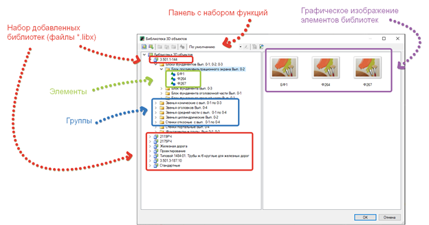

Основные определения:

* **Контейнер библиотек** – отображаемый набор библиотек в одном окне
* **Библиотека** – файл с расширением `*.libx`, в котором хранятся данные с элементами инженерной сети
* **Группы** – папки хранения элементов библиотек, предназначенные для систематизации и удобства их хранения
* **Элемент** – объект, обладающий набором свойств и настроек. Может обладать графическим изображением и 3D моделью.

## Функционал работы с библиотеками

Набор функций основной панели:

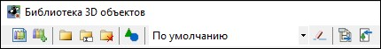



Подробное описание работы с **Наборами условных знаков** 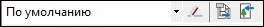 представлено в разделе [Наборы условных знаков](set_of_signs.md).



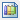 **Создать новую библиотеку** – с помощью данной команды создается новая пользовательская библиотека. Для этого нажмите на пиктограмму, укажите путь сохранения файла библиотеки, введите имя файла библиотеки и нажмите сохранить. Новая библиотека отобразится в левой части окна Библиотеки.

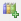 **Подключить библиотеку** – с помощью данной команды подключается существующий файл библиотеки. Для этого нажмите на пиктограмму, выберите необходимую библиотеку и нажмите открыть.

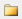 **Добавить новую группу** – с помощью данной команды создается новая структурная группа. Для этого выберите библиотеку или группу, в которую необходимо добавить новую группу, нажмите на пиктограмму, введите имя группы и нажмите **Enter**. В структуру библиотеки будет добавлена новая группа с заданным именем.

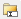 **Переименовать** – с помощью данной команды вводится наименование библиотек, групп и элементов. Для этого выберите необходимую библиотеку, группу или элемент, нажмите на пиктограмму и введите имя.

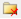 **Удалить** – с помощью данной команды удаляется выбранная пользовательская библиотека, группа или элемент. Для этого выберите необходимую библиотеку, группу или элемент, нажмите на пиктограмму, в открывшемся окне подтверждения удаления, нажмите **Да**:

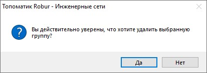

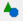 **Добавить новый элемент** – с помощью данной команды добавляется новый элемент в библиотеку. Для этого выберите библиотеку или группу, в которую необходимо добавить элемент, нажмите на пиктограмму, при необходимости выберите 3D модель элемента, для подтверждения выбора нажмите **ОК**. При нажатии **Отмена** в окне выбора, элемент будет добавлен без 3D модели.

Представленные выше функции могут быть также вызваны через контекстное меню, для этого нажмите правой кнопкой мыши на определенном элементе библиотек:

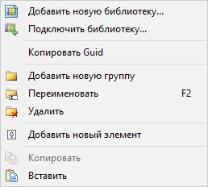

Функции **Копировать  / Вставить ** позволяют сделать копию элемента (например, из стандартной библиотеки) и вставить эту копию в пользовательскую библиотеку.



Так же в контекстном меню представлена функция **Копировать Guid**, предназначенная для копирования уникального GUID идентификатора элемента.

