# Работа с библиотеками условных знаков

В данном разделе приведено описание работы библиотек точечных, линейных и площадных условных знаков. А именно, добавление новых условных знаков в библиотеки и автоматизация использования различного вида условных знаков в зависимости от предъявляемых требований к оформлению топографического плана.

## Пример добавления точечного условного знака

По умолчанию в программе представлен набор библиотек точечных условных знаков. Чтобы открыть библиотеку выберите меню **Сервис - Библиотека точечных условных знаков**, откроется окно:

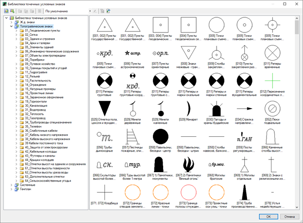

Добавлять точечный условный знак можно несколькими способами:

1. Предварительно нарисовать условный знак в любом графическом редакторе (Топоматик Robur, AutoCAD, nanoCAD и т.д.) и добавить условный знак в Библиотеку в качестве файла.
2. Нарисовать условный знак непосредственно в окне План и добавить его с помощью специального окна Библиотеки.



 Добавление новых элементов производится только в пользовательские библиотеки. Точечный условный знак представляет собой векторный чертеж, состоящий из элементов (отрезков, полилиний, штриховки и т.д.) и текстовых надписей (или определения атрибутов). 



### Добавление условного знака из графического редактора

1. Предварительно создайте условный знак в графическом редакторе.
2. Выберите меню **Сервис – Библиотека точечных условных знаков** откроется окно **Библиотека точечных условных знаков**.
3. В данном окне, в пользовательской библиотеке, нажмите ПКМ на группе, в которую необходимо добавить условный знак и из контекстного меню выберите **Добавить новый элемент**:

   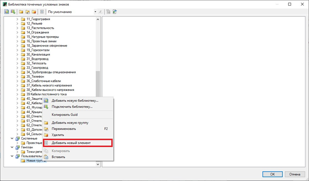

4. В открывшемся окне выберите файл с условным знаком и нажмите **Открыть**. В результате выбранный элемент будет добавлен в указанную библиотеку точечных условных знаков.

### Добавление условного знака из окна План

1. Предварительно необходимо создать новую библиотеку и подготовить структуру групп (папок).

   

   Создание библиотеки и ее групп описано в разделе [Приложение. Библиотеки данных, Общие сведения](libraries_info.md).

   

2. Начертите условный знак в окне **План**.
3. С помощью панели активности откройте окно **Библиотеки**.

   В открывшемся окне заполните необходимые поля:

   * В поле Тип библиотеки из выпадающего списка выберите Точечные условные знаки.
   * В поле Библиотека из выпадающего списка выберите созданную библиотеку.
   * Поле Фильтр предназначено для поиска элемента по его наименованию.

   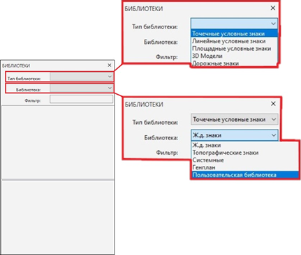

4. В окне отобразится выбранная библиотека с входящими в нее группами. Нажмите ПКМ на группе, в которую необходимо добавить элемент и из контекстного меню выберите **Вставка из окна плана**:

   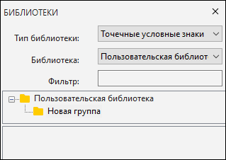

5. На плане выберите необходимый условный знак и нажмите **Enter**, затем укажите точку вставки элемента, далее в строке динамического ввода введите имя условного знака и нажмите **Enter**.

В результате в назначенную библиотеку добавится новый элемент из окна **План**, который отобразится в окнах **Библиотека точечных условных знаков** и разделе панели активностей **Библиотеки**:

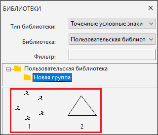

## Пример добавления линейного условного знака

Линейный условный знак состоит из присвоенных типов линий и блоков условному знаку. Чтобы добавить новый линейный условный знак:

1. Выберите меню **Сервис – Библиотека линейных условных знаков** и создайте новый элемент в пользовательской библиотеке.

   

   Создание библиотеки и ее групп описано в разделе [Приложение. Библиотеки данных, Общие сведения](libraries_info.md).

   

2. Выберите созданный элемент, в графической части окна изображения элемента, в поле **«По умолчанию»** нажмите ПКМ и из контекстного меню выберите пункт **Редактировать**:

   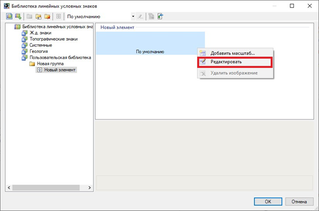

   

   Функция **«Добавить масштаб»** позволяет добавить линейный условный знак, который будет приниматься в зависимости от заданного диапазона действия масштаба. Например, если задан диапазон действия «Больше или равно» масштаба 1:500, то при назначении масштаба в окне **«План** равным 1:500 или более, будет принят назначенный условный знак. Создание условного знака осуществляется аналогично функции **«Редактировать»**, см. описание ниже.

   

3. Откроется окно **Редактор линейных условных знаков**. В данном окне нажмите ПКМ на элементе **Линейный знак** и из контекстного меню выберите необходимый пункт:

   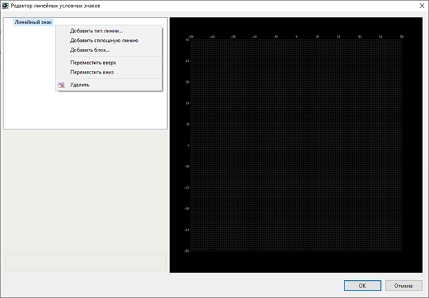

   **Добавить тип линии** – данная функция позволяет загрузить дополнительные типы линий, которые будут представлены как линейный условный знак. Для этого выберите данный пункт, откроется диалоговое окно:

   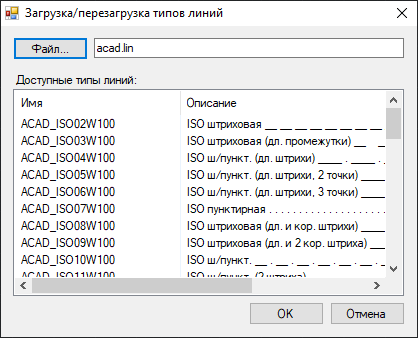

   В окне загрузки отображены стандартные типы линий, имеющиеся в файле **acad.lin**. Выберите необходимую линию и нажмите **ОК**.

   

   Для загрузки других типов линий воспользуйтесь кнопкой **Файл** и укажите подгружаемый файл типов линий в открывшемся диалоговом окне:

   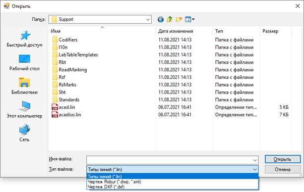 

   

   В результате выбранный тип линий и ее свойства будут отображены в окне **Редактор линейных условных знаков**:

   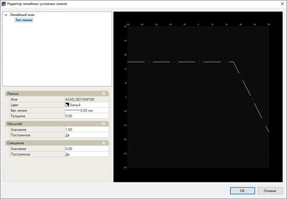

   Редактирование линии осуществляется с помощью **Свойств** этой линии:

   * В группе свойств **Разное** задается **Имя, Цвет, Вес** и **Толщина линии**.
   * В группе свойств **Масштаб** задаётся масштабный коэффициент типа линии относительно её исходного размера.
   * В группе свойств **Смещение** задается смещение линии относительно оси Y.
    

   **Добавить сплошную линию** – при выборе данной функции в качестве условного знака будет добавлен **Тип линии** «Сплошная линия».

   **Добавить блок** – данная функция позволяет присоединить к условному знаку блок из графического редактора. Для этого выберите данный пункт, в открывшемся окне выберите необходимый файл чертежа (блок) и нажмите **Открыть**:

   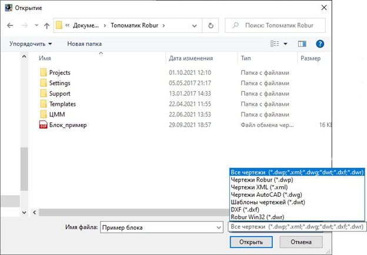

   В окно **Редактор линейных условных знаков** добавится выбранный блок. Редактирование вставленного блока осуществляется с помощью **Свойств** этого блока:

   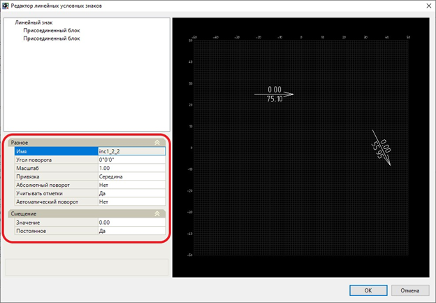

   Группа свойств **Разное**:

   * **Имя** – в данном поле присваивается имя блока, принятое из файла созданного блока.
   * **Угол поворота** – в данном поле задаётся угол поворота вокруг точки вставки блока.
   * **Масштаб** – в данном поле задается масштабный коэффициент, с которым блок будет вставлен на план. Масштабный коэффициент может быть отрицательный, тогда изображение блока будет зеркально отражено.
   * **Привязка** – в данном поле из представленного списка выбирается расположение условного знака относительно оси координат (Начало, Конец, Середина) и видимость условного знака на плане (отображение в начале или в конце линейного условного знака - Первый узел / Последний узел).
   * **Абсолютный поворот** – если выбран пункт **Да**, то при введении условный знак на плане будет развернут по абсолютным координатам оси X и Y.
   * **Учитывать отметки** – при выборе пункта **Да**, вставленный условный знак примет высотное положение (положение Z) текущей модели ЦММ.
   * **Автоматический поворот** - при выборе пункта **Да**, вставленный условный знак развернется в зависимости от принятой ПСК.

     Группа свойств **Смещение** задается смещение блока относительно оси Y.

   * **Переместить вверх / Переместить вниз** – данная функция предназначена для изменения порядка отрисовки добавленных блоков и типов линии.
   * **Удалить** – данная функция предназначена для удаления типа линий и блоков.
 

4. Выполните необходимые настройки и нажмите **ОК**. В результате в пользовательскую библиотеку добавится новый элемент (линейный условный знак).

## Пример добавления площадного условного знака

Площадные условные знаки представляют собой область заполнения замкнутых линейных объектов.

Чтобы добавить новый площадной условный знак:

1. Выберите меню **Сервис – Библиотека площадных условных знаков** и создайте новый элемент в пользовательской библиотеке.

   

   Создание библиотеки и ее групп описано в разделе [Приложение. Библиотеки данных, Общие сведения](libraries_info.md).

   

2. Выберите созданный элемент, в графической части окна изображения элемента, в поле **«По умолчанию»** нажмите ПКМ и из контекстного меню выберите пункт **Редактировать**:

   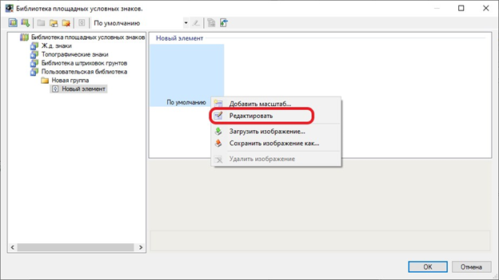

   

   Функция **«Добавить масштаб»** позволяет добавить площадной условный знак, который будет приниматься в зависимости от заданного диапазона действия масштаба. Функция **«Загрузить изображение»** позволяет подгружать элемент в формате **.ХML**. Функция **«Сохранить изображение как»** предназначена для сохранения созданного элемента в формат **.ХML**. 

   

3. Откроется окно **Редактор площадных условных знаков**. Для добавления блока из графического редактора или библиотеки, в левом верхнем углу, нажмите кнопку **Блок** и выберите необходимую функцию:

   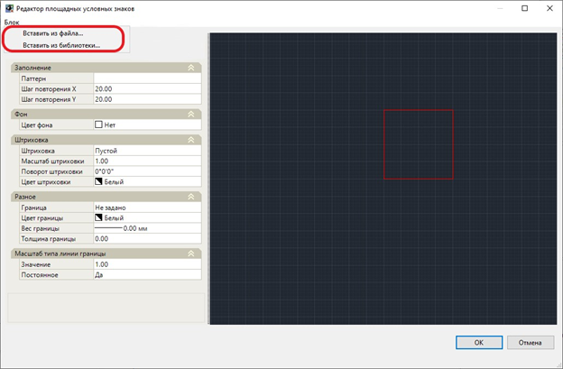

   * Чтобы вставить блок, созданный в графическом редакторе выберите **Вставить из файла**, в открывшемся окне выберите необходимый файл и нажмите **Открыть**:

     

   * Чтобы добавить блок из библиотеки точечных условных знаков выберите пункт **Вставить из библиотеки**, в открывшемся окне выберите необходимый элемент и нажмите **Выбрать**:

     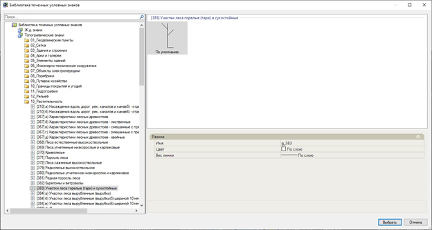

4. В графической части окна **Редактор площадных условных знаков** определите точку вставки выбранного блока и вставьте этот блок, при необходимости задайте свойства этому блоку:

   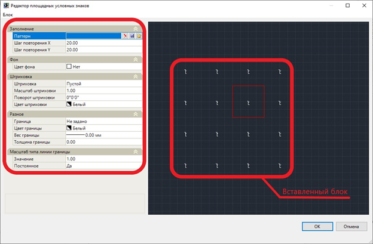

   Группа свойств **Заполнение**:

   * **Паттерн** – данная функция позволяет сохранить или добавить площадной условный знак, созданный в графическом редакторе.

     Для того чтобы сохранить площадной объект нажмите пиктограмму , в открывшемся окне укажите путь и формат сохранения условного знака, и нажмите **Сохранить**.

     Для того чтобы вставить созданный площадной условный знак нажмите пиктограмму 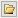, в открывшемся окне выберите необходимый файл и нажмите **Открыть**. Условный знак будет вставлен в исходную точку вставки блока.

     Пиктограмма  предназначена для очистки графического поля в окне **Редактор площадных условных знаков**.

   * **Шаг повторения X, / Шаг повторения Y** – в данном поле задается интервал повторения вставленного паттерна.

     Группа свойств **Фон**:

     * **Цвет фона** – в данном поле задаётся цвет фона графической части данного окна, в пределах границ вставленного блока.
 

   Группа свойств **Штриховка**:

    * **Штриховка** – в данном поле, из представленного списка, задаётся тип штриховки, в пределах границ вставленного блока.
    * **Масштаб** - в данном поле задаётся масштабный коэффициент штриховки относительно её исходного размера.
    * **Поворот штриховки** – в данном поле задаётся значение угла наклона линий штриховки горизонтально к оси.
   * **Цвет штриховки** - в данном поле задаётся цвет выбранной штриховки.
 

   Группа свойств **Разное**:

     * Граница – в данном поле, из представленного списка выбирается тип линии границы, которая определяется в зависимости от шага повторения по оси X и Y. Для этого в данном поле нажмите на пиктограмму , откроется окно **Загрузка / Перезагрузка типов линий**, в данном окне выберите необходимый тип линии границы и нажмите **ОК**:

       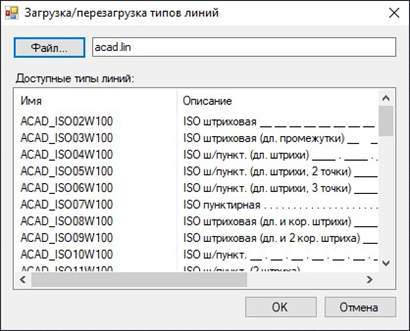

       Для удаления границы нажмите на пиктограмму .

     * **Цвет границы, Вес границы, Толщина границы** – в данных полях задаются параметры выбранного типа линии границы.

     - В группе свойств **Масштаб типа линии границы** задаётся масштабный коэффициент линии границы относительно её исходного размера.
 

5. Задайте необходимые настройки и нажмите **ОК**. В результате созданный площадной условный знак добавится в пользовательскую библиотеку площадных условных знаков.
