# Работа с библиотекой 3D объектов

В данном разделе приведено описание работы библиотеки 3D объектов. А именно: редактирование свойств элементов, добавление 3D моделей и сопроводительных документов элементов и импорт / экспорт библиотек 3D моделей.

По умолчанию в программе представлен набор системных библиотек 3D объектов. Чтобы открыть библиотеку выберите меню **Сервис - Библиотека 3D моделей**, откроется окно:

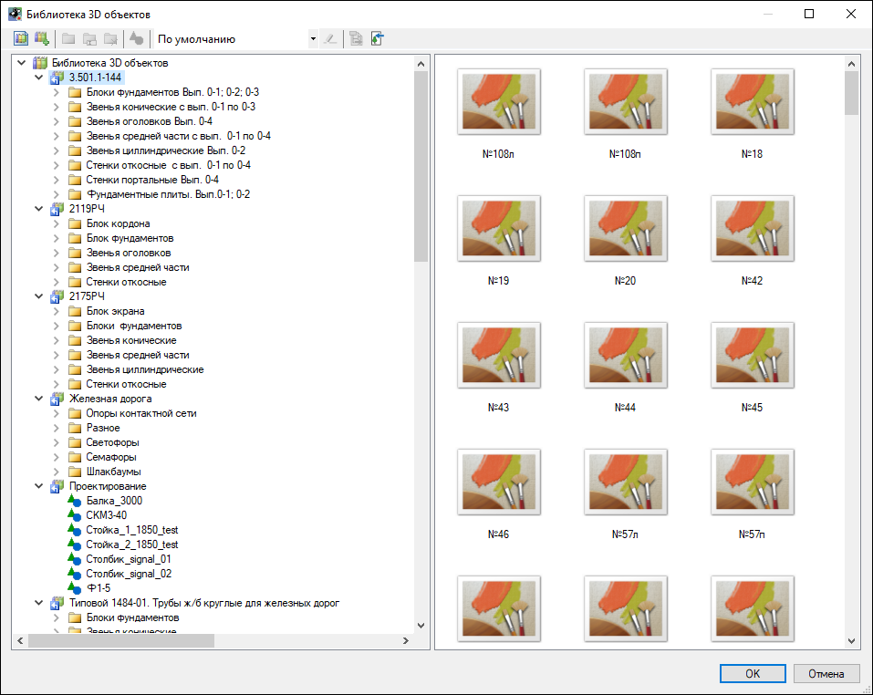



Стандартный набор библиотек является не редактируемым, добавление и редактирование элементов производится только в библиотеки, которые были созданы пользователем самостоятельно. Общие сведения по работе с библиотеками приведены в разделе [Приложение. Библиотеки данных, Общие сведения](libraries_info.md).



При выборе элемента в правой части окна **Библиотека 3D объектов** откроется панель свойств элемента, его 3D вид и список сопроводительных документов. Рассмотрим представленные окна на примере произвольного элемента:

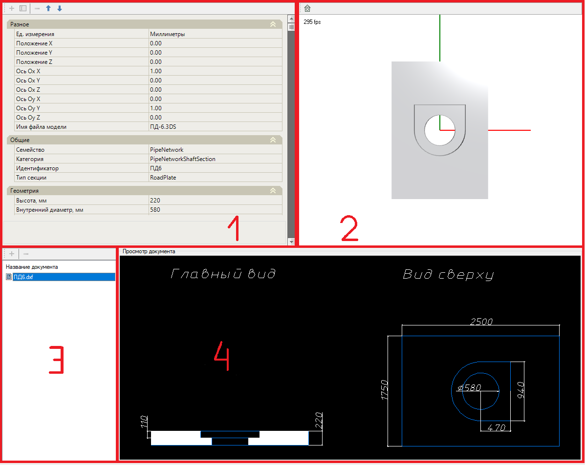

1. Панель свойств выбранного элемента - содержит семантическую информацию об элементе.

2. Окно 3D вида - отображение выбранного элемента библиотеки в трехмерном пространстве относительно оси координат.

3. Список сопроводительных документов элемента (например, документы на основе которых был создан чертеж элемента). В данном случае, документ представлен в качестве чертежа AutoCad в формате \*.dxf, который при необходимости можно открыть. Для этого нажмите правой кнопкой мыши на документ и из контекстного меню выберите **Открыть**, документ будет открыт в соответствующем формате. На панели инструментов данного окна представлены следующие команды:

    (**Добавить документ**) - данная команда позволяет добавить сопроводительный документ.

   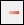 (**Удалить документ**) - данная команда позволяет удалить сопроводительный документ.

4. Окно "Просмотр документа", содержащее данные из сопроводительных документов. Для отображения чертежа элемента в данном окне необходимо выбрать требуемый чертеж в списке сопроводительных документов.

* В левой верхней части окна представлено окно со свойствами выбранного элемента. Рассмотрим подробно свойства элемента, на примере копии произвольного узла инженерной сети, который был добавлен в пользовательскую библиотеку:

  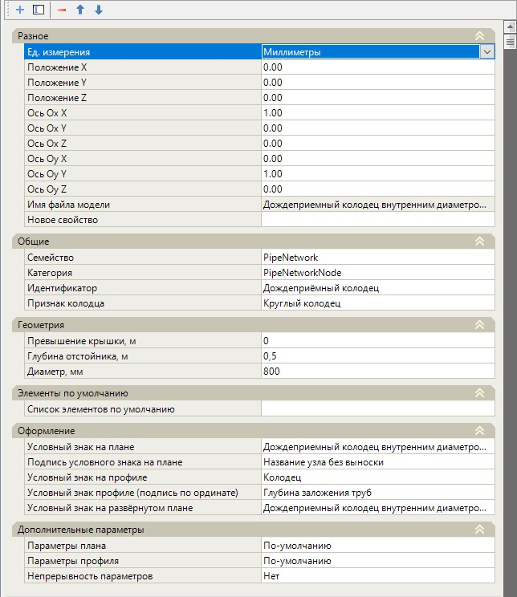

  На панели инструментов данного окна представлены следующие пиктограммы:

  *  (**Добавить свойство**) - данная пиктограмма позволяет добавить новую строку в заданный раздел свойств. Для этого:

  1. Нажмите пиктограмму, откроется дополнительное окно:

     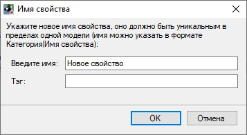

  2. В данном окне введите имя раздела свойств, в который необходимо добавить новую строку, и через символ "**ı**" введите название новой строки. В поле **Тэг** введите тэг соответствующего раздела и нажмите **ОК**:

     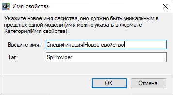

  В результате в заданный раздел будет добавлена строка с введенным названием.

  

  При необходимости добавления ссылки в строке, например, на **Библиотеку точечных условных знаков**, в поле **Тэг** после тэга раздела свойств, через пробел, введите тэг **Библиотеки точечных условных знаков**. В строку свойств будет добавлена ссылка соответствующая введенному тэгу:

  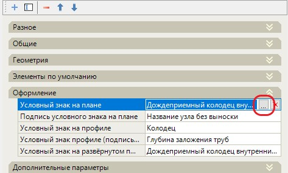

  

  * 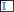 (**Изменить название свойства**) - данная пиктограмма позволяет изменить имя строки свойства и тэг.
  *  (**Удалить свойство**) - данная пиктограмма позволяет удалить выбранную строку со свойствами.
  * 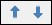 (**Переместить выше / Переместить ниже**) - данная пиктограмма предназначена для перемещения строк в необходимом порядке, в пределах раздела свойств.

**Разное**

В данной группе полей указаны параметры для редактирования 3D модели:

* **Ед. измерения** - данная строка позволяет выбрать из представленного списка единицу измерения элемента.
* **Положение X, Y, Z** - строка, предназначенная для введения положения элемента относительно оси координат.
* **Ось Ox X, Ox Y, Ox Z, Oy X, Oy Y, Oy Z** - поля, предназначенные для введения положения элемента на оси координат.
* **Имя файла модели** - в данном поле отображено имя файла трехмерной модели.

**Общие**

Характеристики, указанные в данной разделе, необходимы для фильтрации элементов.

**Геометрия**

В данном разделе представлены основные геометрические характеристик элемента.

**Оформление**

В данной группе задаются условные обозначения, которые будут отображены на рабочих окнах программы.

**Дополнительные параметры**

В данной группе представлен ряд дополнительных настроек поведения элемента в плане и на профиле.

Рассмотрим набор основных функций окна **Библиотеки 3D объектов**.

Чтобы вызвать контекстною меню нажмите правой кнопкой мыши в левой части окна **Библиотека 3D объектов**, откроется контекстное меню:

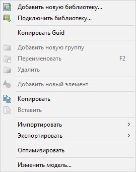

* **Копировать / Вставить** - данная функция позволяет сделать копию элемента (например, из стандартной библиотеки) и вставить эту копию в пользовательскую библиотеку. Для этого нажмите правой кнопкой мыши на элемент, копию которого необходимо сделать, и из контекстного меню выберите **Копировать**. Далее нажмите правой кнопкой мыши на пользовательскую библиотеку или ее группу, в которую необходимо вставить копируемый элемент, и из контекстного меню выберите **Вставить**:

  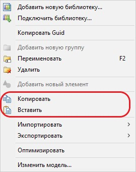

* **Импортировать** - данная функция позволяет импортировать данные библиотек, их группы и элементы из формата `*.CSV` и `*.IFC`. Для этого:

  1. Нажмите правой кнопкой мыши на библиотеку в которую необходимо выполнить импорт данных, в контекстном меню выберите пункт **Импортировать** и в открывшемся меню выберите необходимый формат:

     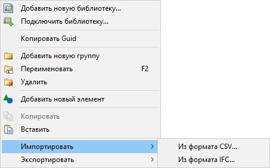

  2. В открывшемся окне выберите файл, который необходимо импортировать и нажмите **Открыть**.

  В результате в **Библиотеку 3D объектов** будут добавлены группы и элементы библиотеки.

  

  Для корректного импорта данных библиотеки из формата \*.CSV необходимо чтобы импортируемый файл был сохранен в формате `*.CSV UTF-8`

  

* **Экспортировать** - данная функция позволяет экспортировать набор добавленных библиотек, а так же их группы и элементы в формат `*.CSV` и `*.IFC`.

  Для примера рассмотрим экспорт библиотеки в формат \*.CSV.

  1. Выберите библиотеку, которую необходимо экспортировать, нажмите правой кнопкой мыши и выберите из контекстного меню пункт **Экспортировать**, в открывшемся меню выберите необходимый формат:

     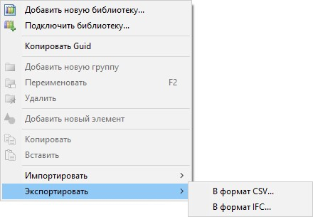

  2. В открывшемся окне введите имя экспортируемого файла, укажите путь сохранения экспортируемой библиотеки, в поле **Тип файла** выберите формат `*.CSV` и нажмите **Сохранить**:

     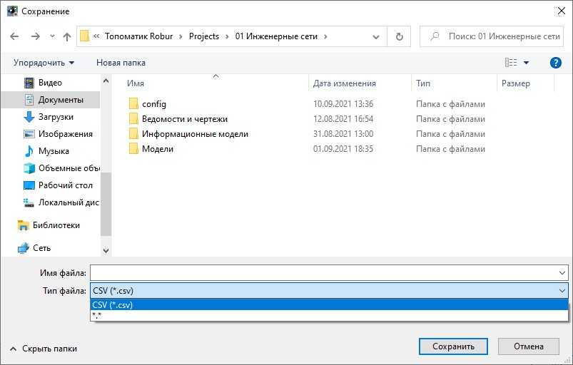

  В результате программа экспортирует все группы (папки), входящие в библиотеку, с элементами инженерной сети и их данными (сопроводительные документы, файлы элементов в трехмерном пространстве). А так же будет создан файл в формате `*.CSV`, с табличными данными элементов, входящими в библиотеку, и их свойствами:

  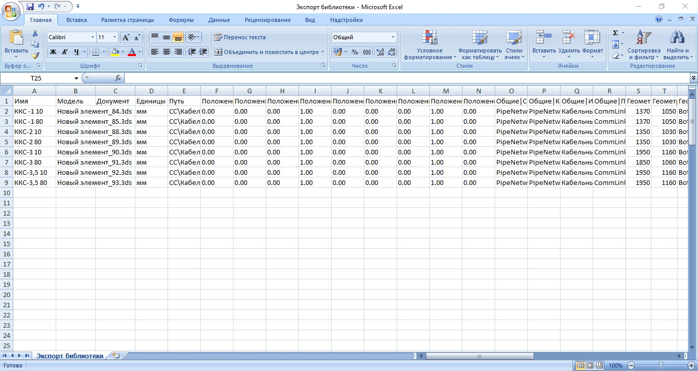

  

  Программа позволяет в данную таблицу вносить пользовательские свойства и данные элемента, затем импортировать эти элементы в библиотеку 3D объектов. Это удобно, например при внесении большого объема каталога с элементами.

  

* **Оптимизировать** -

* **Изменить модель** - данная функция позволяет присвоить выбранному элементу имя файла выбранной модели.

  

  Присвоенное имя файла модели будет отражено в правой части окна **Библиотека 3D объектов**, в свойствах выбранного элемента, в разделе **Разное**:

  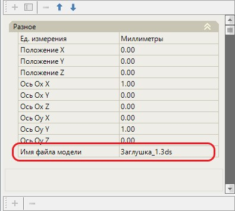

  

## Теги библиотеки 3D объектов

## Назначение условных обозначений узлов

Одной из основных характеристик инженерных сетей является их **Оформление** на плане/профиле и т.д. Стандартная библиотека содержит перечень условных обозначений, недоступных для редактирования. Программа позволяет назначить собственные условные обозначения, отредактировав имеющиеся или создав новые.

Для редактирования условного обозначения узла инженерной сети:

1. Выберите меню **Сервис - Библиотека точечных условных знаков**, откроется следующее окно:

   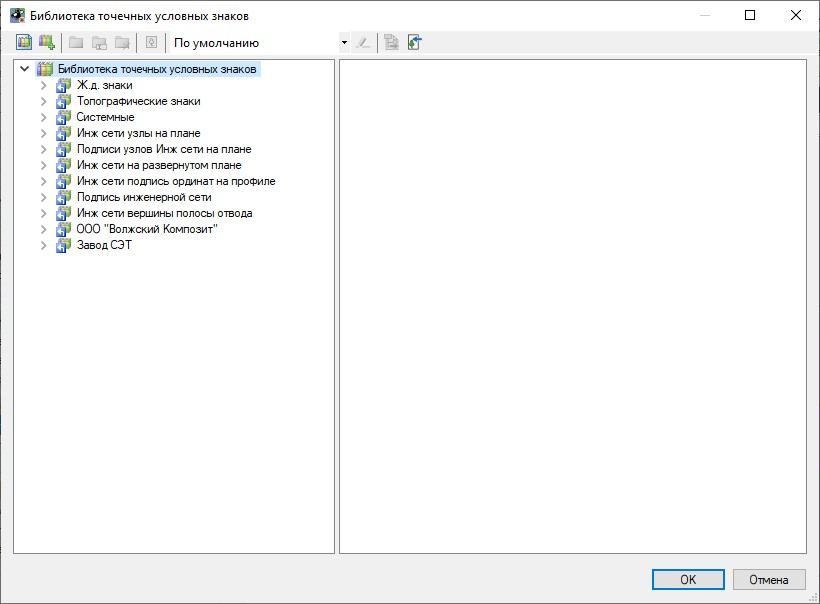

2. Выберите необходимый раздел, раскройте дерево элементов и выберите необходимый условный знак, нажмите на него, в правой части окна появится изображение условного знака, нажмите на него правой кнопкой мыши и из контекстного меню выберите пункт **Сохранить изображение как**:

   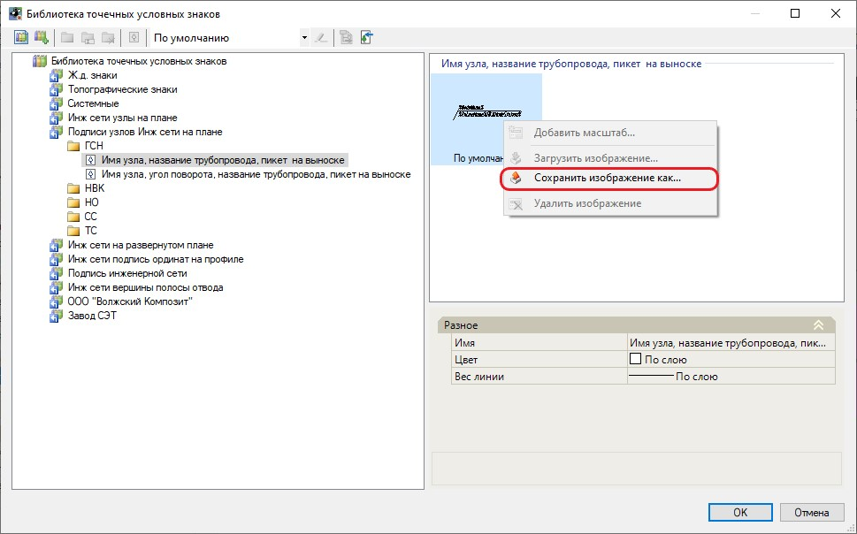

   В открывшемся окне укажите путь сохранения условного знака, необходимый формат и нажмите **Сохранить**.

   

   При дальнейшей необходимости редактирования условного знака сохраните файл в формате `*.dwp`.

   

3. Откройте сохраненный файл в **Robur**, для этого нажмите правой кнопкой мыши в **Структуре проекта** на название проекта, и выберите в выпадающем меню **Добавить - Существующий файл**:

   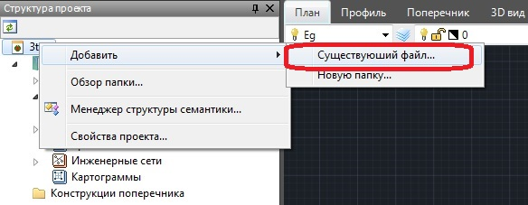

   В открывшемся окне выберите файл, который необходимо добавить и нажмите **Открыть**. Добавленный файл отобразится в папке **Информационные модели** в структуре проекта.

   

   Внести изменения в условное обозначение точечного знака можно и в других графических редакторах. Редактировать выноску можно только внутри программы **Robur**, в файле с разрешением `*.dwp`.

   

4. Откройте подгруженный файл и отредактируйте условное точечное обозначение знака, используя элементы рисования и соответствующие тэги.

5. Чтобы добавить отредактированное условное обозначение, сохраните проект, далее создайте **Пользовательскую библиотеку** в **Библиотеке точечных условных знаков**. После загрузите свое обозначение, для этого нажмите правой кнопкой мыши на пользовательскую библиотеку и из контекстного меню выберите **Добавить новый элемент**:

   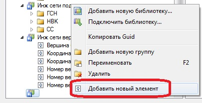

В результате в **Библиотеку точечных условных знаков** будет добавлен измененный условный знак.
