# Наборы условных знаков

## Введение

**Наборы условных знаков** – это возможность пользователю задать для одного объекта топографического плана (условного знака) несколько его отображений или видов. Это необходимо, например, в случае, когда один и тот же изображаемый объект, например дерево, в зависимости от региональных требований может на плане выглядеть по-разному:

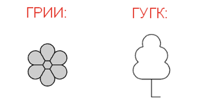

Линейные условные знаки могут изображаться различными цветовыми решениями. На примере ниже приведены различные варианты изображения условного знака ***Водопровод***:

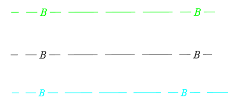

Основная особенность использования наборов заключается в том, что наборы исключают необходимость создавать новые элементы в библиотеке условных знаков (под каждый его вид) и соответствующие им семантические объекты с перечнем необходимых свойств. Также использование наборов позволяет пользоваться стандартным инструментарием ввода условных знаков на плане (Панели, окно Библиотеки и т.д.).

Ниже представлена схема, где показана общая структура семантического объекта с наборами на примере объекта ***Водопровод 1048***:

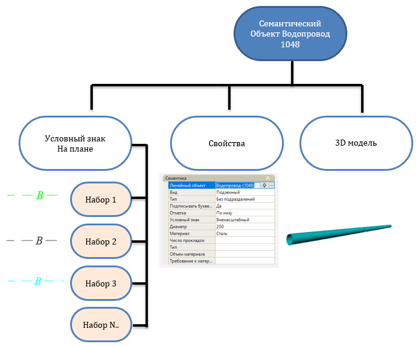



Подробнее о **Библиотеке семантических объектов** см. в разделе [Приложение. Библиотека семантических объектов](../library_semantics/semantics.md).



При этом переключение вида условного знака (набора) осуществляется с помощью специального селектора в любой момент времени.

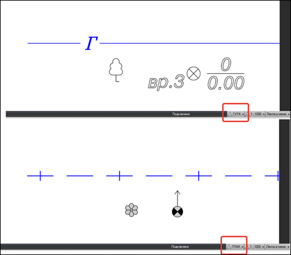



Переключение наборов влияет только на визуальное отображение условного знака, все семантические свойства остаются неизменны.



## Общие сведения

Ниже будет приведено описание механизмов работы наборов, а именно *создание \ удаление \ редактирование и применение* наборов на примере библиотеки линейных условных знаков.

Для открытия библиотеки линейных условных знаков выберите меню **Сервис – Библиотека линейных условных знаков**:

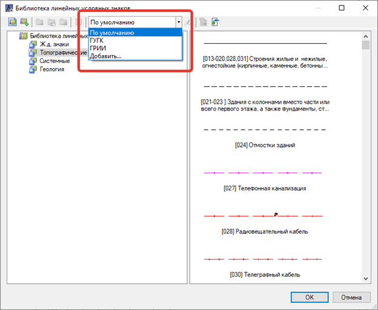

Каждая библиотека для условных знаков имеет три набора с названием: По умолчанию, ГУГК и ГРИИ.

* **Набор ГУГК** содержит вид условных знаков, соответствующих требованиям, которые предъявляются при сдаче объектов в ГАУ "Леноблгосэкспертиза". Фактически, вид условных знаков соответствует утвержденным ГУГК при Совете Министров СССР 25 ноября 1986 г. УСЛОВНЫЕ ЗНАКИ ДЛЯ ТОПОГРАФИЧЕСКИХ ПЛАНОВ МАСШТАБОВ 1:5000 1:2000 1:1000 1:500, но имеются некоторые отличия, например по цветовым решениям для некоторых линейных объектов и текстовым стилям.
* **Набор ГРИИ** содержит вид условных знаков соответствующих требованиям ОАО «Трест ГРИИ»



Вид условных знаков в наборе с названием **«По умолчанию»** соответствуют набору ГУГК.



Выбрав в селекторе какой либо набор, вид условных знаков в библиотеке (графическое изображение) будет соответствовать этому набору.

## Работа с Наборами

**Создание и применение нового набора**

Для создания нового набора выберите **Добавить** в соответствующем выпадающем списке:

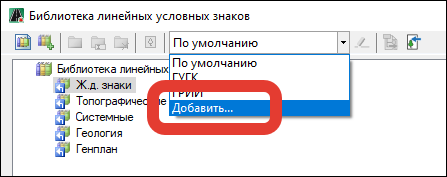

Далее в открывшемся окне задайте наименование и нажмите **ОК**:

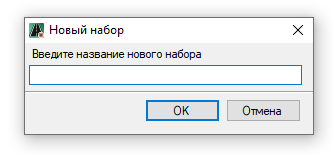

В результате добавится новый элемент в выпадающем списке:

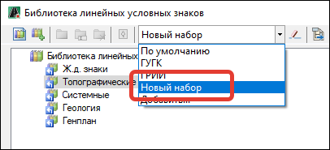

Новый созданный набор является, по сути, копией набора **«По умолчанию»** и соответственно вид условных знаков в нем также соответствует этому набору.

После того как создан пользовательский набор и выбран в секторе, появляется возможность менять вид любого элемента (условного знака) в библиотеке, нажав на нем правой кнопкой мыши и выбрав из контекстного меню **Редактировать**:

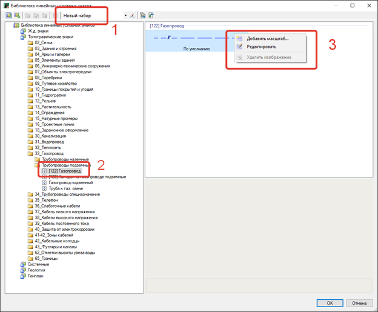



Пример создания\редактирования\добавления нового элемента будет рассмотрен ниже.



В открывшемся окне **Редактора условных знаков**, для примера изменим цвет типа линии:

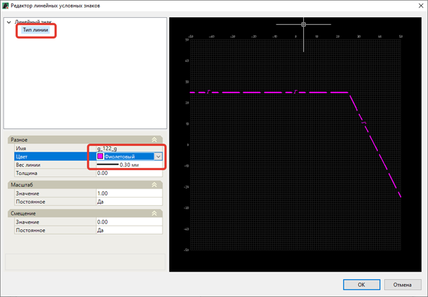

Нажав **ОК**, отображение условного знака в данном наборе изменилось:

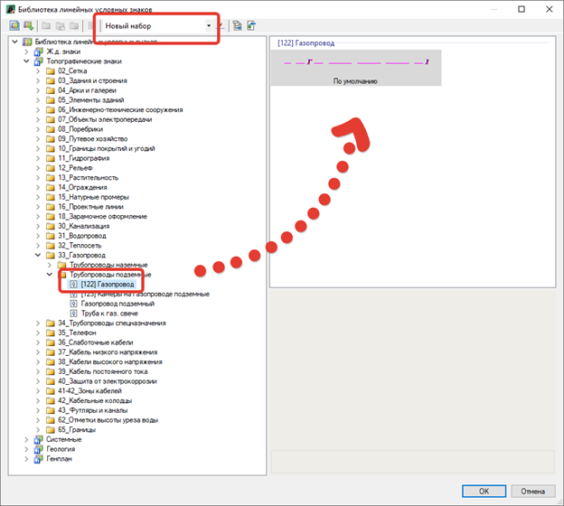

Нажав **ОК** в окне Библиотеки, в нижнем правом углу рабочего окна в соответствующем селекторе появится наименование созданного набора:

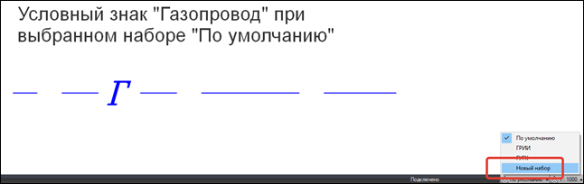

Выбрав **«Новый набор»** вид условного знака сразу изменится:

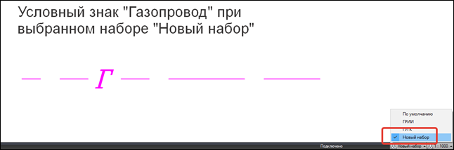



Переключение наборов влияет только на вид (визуальное отображение) условного знака, все семантические свойства остаются неизменны.



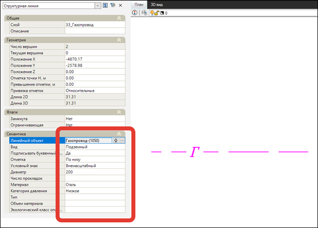

**Удаление набора**

Для удаления набора выберите необходимый набор в выпадающем списке и нажмите кнопку **Удалить** 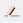 на панели инструментов. В открывшемся окне подтвердите действие:

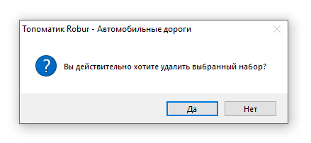

В результате выбранный набор будет удален.

**Импорт\экспорт наборов**

Созданные наборы можно экспортировать и соответственно импортировать на другой компьютер, для этого используются соответствующие кнопки на **Панели управления**.

Нажав кнопку **Экспортировать набор** 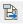, появится окно в котором необходимо указать название и выбрать место сохранения файла, в результате Набор будет сохранен в формате `*.libxset`.

Нажав кнопку **Импортировать набор** 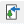, далее необходимо выбрать ранее экспортированный файл с расширением `*.libxset` и нажать **ОК**, в результате выбранный файл Набора импортируется в библиотеку, появится в списке Наборов и будет доступен для выбора.
